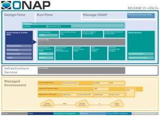

.. This work is licensed under a Creative Commons Attribution
.. 4.0 International License.
.. http://creativecommons.org/licenses/by/4.0
.. Copyright 2017-2018 Huawei Technologies Co., Ltd.
.. Copyright 2019 ONAP Contributors
.. Copyright 2020 ONAP Contributors
.. Copyright 2021 ONAP Contributors
.. Copyright 2022 ONAP Contributors
.. Copyright 2023 ONAP Contributors
.. Copyright 2024 ONAP Contributors
.. Copyright 2025 ONAP Contributors
.. Copyright 2025 ONAP Contributors

.. _ONAP-architecture:

Architecture
============
ONAP is a collection of Network Automation functions, including orchestration,
management, and automation of network and edge computing services for network
operators, cloud providers, and enterprises. Its real-time, policy-driven
orchestration and automation of physical, virtual, and cloud native network
functions enable rapid deployment of new services and comprehensive lifecycle
management. These capabilities are critical for 5G and next-generation networks,
enhanced by GenAI/ML.

The ONAP projects address the growing need for common network automation
functions among telecommunication, cable, and cloud service providers, along
with their solution providers. They enable the delivery of differentiated network
services on demand, profitably and competitively, while maximizing existing
investments.

The challenge that ONAP addresses is helping network operators manage the scale
and cost of manual changes required to implement new service offerings-ranging
from installing new data center equipment to, in some cases, upgrading
on-premises customer equipment. Many operators aim to leverage SDN and NFV to
accelerate service delivery, simplify equipment interoperability and integration,
and reduce overall CapEx and OpEx costs. Furthermore, the highly fragmented
management landscape makes it challenging to monitor and guarantee
service-level agreements (SLAs).

ONAP addresses these challenges by developing global and large-scale (multi-site
and multi-VIM/multi-Cloud) automation capabilities for physical, virtual, and
cloud-native network elements. It enhances service agility by supporting
data models for rapid service and resource deployment, and offering a common
set of northbound REST APIs, enabling model-driven interfaces to the networks.

ONAP's modular and layered architecture improves interoperability and simplifies
integration, allowing it to support multiple VNF environments by integrating with
various and multiple VIMs, VNFMs, SDN Controllers, and legacy equipment (PNF).
The Service Design & Creation (SDC) project further enables seamless orchestration
of CNFs. Additionally, ONAP's consolidated xNF requirements publication facilitates
the commercial development of ONAP-compliant xNFs.

This approach allows network and cloud operators to optimize their physical, virtual
and cloud-native infrastructure for cost and performance. At the same time, ONAP's use
of standard models reduces the integration and deployment costs of heterogeneous
equipment-all while minimizing minimizing management fragmentation.

The ONAP enables end-user organizations and their network or cloud providers to
collaboratively instantiate network elements and services in a rapid and dynamic
manner. It also supports a closed control loop process, enabling real-time response
to actionable events. To design, engineer, plan, bill and assure these dynamic services,
three major requirements must be met:

- A robust design function that enables the comprehensive specification of the service,
  including modeling the resources and relationships that constitute the service,
  defining the policy rules guiding the service behavior, specifying the applications,
  analytics and closed control loop events for the elastic management of the service
- An orchestration and control function (Service Orchestrator and Controllers) that
  operates in a recipe- and policy-driven manner to automate service instantiation
  as needed, while dynamically and elastically managing service demands
- An analytic function that continuously monitors the service behavior throughout the
  service lifecycle, using the specified design, analytics and policies. It enables
  the control framework to respond as needed, addressing situations ranging from
  healing issues to scaling resources to accommodate demand variations

To achieve this, ONAP separates the specifics of individual services and supporting
technologies from the common information models, core orchestration platform,
and generic management engines (e.g., for discovery, provisioning, assurance).

Furthermore, it combines the speed and flexibility of a DevOps/NetOps approach with
the formal models and processes required by operators to introduce new services and
technologies. It leverages cloud-native technologies, including Kubernetes, to
manage and rapidly deploy the ONAP functionalities and related components. This
approach contrasts sharply with traditional OSS/Management software platform
architectures, which relied on hardcoded services and technologies and required
lengthy software development and integration cycles to accommodate changes.

The ONAP network automation provides service- and resource-independent capabilities
for design, creation, and lifecycle management, adhering to the following
foundational principles:

- Ability to dynamically introduce full-service lifecycle orchestration (design,
  provisioning and operation) and service APIs for new services and technologies
  without requiring new platform software releases or disrupting operations for the
  existing services
- Scalability and distribution designed to support a large number of services and
  extensive networks
- A metadata-driven and policy-driven architecture that ensures the flexible and
  automated utilization and delivery of capabilities
- The architecture that facilitates the integration of best-in-class components
- Common capabilities developed once and used many times
- Core capabilities designed to support a wide range of services and
  infrastructure types

Furthermore, ONAP includes a functional architecture with defined component and
interfaces, fostering industry alignment in addition to open source code.

Architecture Overview
---------------------

The ONAP architecture includes design time and run time functions, as well
as functions (OOM) for managing ONAP itself. For updates introduced in the Paris
release and beyond, refer to the ONAP Streamlining Evolution section.

   Note: Use the interactive features of the ONAP Architecture Overview below.
   Click to enlarge the figure, then hover your mouse over an element for a short
   description. Click on an element to access a more detailed description

**Figure 1: Interactive high-level view of the ONAP architecture with its
microservices-based components. Click to enlarge and discover.**

ONAP Streamlining Evolution
---------------------------

Rationale
^^^^^^^^^
Previously, ONAP, as a platform, demonstrated end-to-end (e2e) network
automation to the industry. Operators, vendors and enterprises have learned
how service and network automation (encompassing modeling, orchestration,
policy-based closed loop, optimization, and more) functions in both
VM-based and Cloud-native environments. These capabilities have been applied
to VNF, PNF, CNF, NS, Network/RAN slicing, and end-to-end services thru ONAP.

ONAP provides numerous use cases that leverage and coordinate clusters of ONAP
component functions (e.g., SDC, SO, A&AI, DCAE, SDNC, SDNR, CPS, CDS...) to
achieve objectives, including:

- End-to-End (E2E) Service
- Network Slicing
- RAN Slicing
- Closed-Loop Automation
- ETSI-based NS & VNF Orchestration
- Helm-based CNF Orchestration
- ASD-based (including Helm Charts) CNF Orchestration

Today, operators, vendors and enterprises aim to selectively integrate and apply
specific ONAP functionalities into their portfolios. There is no longer a
requirement to adopt ONAP as a complete monolithic solution.

Goal
^^^^
ONAP Streamlining goals are:

- To continue to support use cases efficiently for deployment in commercial production
  environments and portfolios
- To enable the industry to select desired ONAP component functions, replace certain ONAP
  functions, and seamlessly integrate those functions into their portfolios without requiring
  the full platform
- To streamline ONAP by driving individual components and clusters of components guided
  by use cases, allowing the industry to adopt functions flexibly and dynamically

Directions
^^^^^^^^^^
- Connecting ONAP, O-RAN, Nephio and other communities to achieve larger objectives
- Reusing selected ONAP functions for efficiency and consistency
- Functional delegations to distribute responsibilities effectively

ONAP Streamlining Transformation
^^^^^^^^^^^^^^^^^^^^^^^^^^^^^^^^
Through ONAP Streamlining, ONAP evolves from being a monolithic platform to
providing various network automation functions and security reference
configuration within LFN. ONAP facilitates the independent development of
functions and the deployment of components using Continuous Delivery (CD).
It will support use cases such as repository-based end-to-end (E2E) services,
network services (NS), Containerized network function (CNF), and cloud-native
application (CNA) onboarding. Additionally, ONAP will enable CD-based triggering
mechanisms for components with abstracted interfaces to support orchestration
and choreography.

The transformation emphasizes standard-based abstracted interfaces with
declarative APIs. Each component will become autonomous and capable of being
invoked from any level of network automation, leveraging CD mechanisms like
GitOps and CD readiness.

ONAP will adopt a more intent-based and declarative approach, integrating
genAI/ML technologies while adhering to industry standards such as 3GPP,
TMForum, ETSI, IETF, and O-RAN. For example, it will include user intent
support via the UUI, AI-driven natural language translation, and the application
of forthcoming 3GPP and TMForum models and APIs. Additionally, ONAP will
delegate resource-level orchestration to external community functions, such as
those from O-RAN SC and Nephio.

In terms of security, ONAP will continue to support features like Service Mesh,
Ingress, OAuth2, and IdAM-based authentication and authorization. It will also
explore sidecar-less solutions for network function (NF) security.

|image2|

**Figure 2. ONAP Streamlining Transformation**

Obstacles, Observations, Challenges
^^^^^^^^^^^^^^^^^^^^^^^^^^^^^^^^^^^
- ONAP components were primarily designed for ONAP-specific consumption.
  - If a component is not utilized by ONAP use cases, it risks becoming obsolete
  or unmaintained rather than being graduated.
  - ONAP component-specific features may be overlooked if they are not utilized
  by other ONAP components.
- Component dependencies and couplings to other ONAP components are structured in
  an ONAP-specific manner
  - Those dependencies and couplings can be both syntactic and semantic.
  - Many intra-ONAP component interfaces and communications are ONAP-specific
  - Limited APIs standardization efforts are in place, such ETSI MANO APIs,
  ASD, 3GPP.
- Deviating from standards complicates integration with other systems, particularly
  non-ONAP systems.
- CI build and integration processes for vendors/operators might be less compatible
  with ONAP's. Some vendor/operators do not use OOM. In certain cases, a vendor
  maintains an entirely separate set of Helm charts for ONAP components.
- Vendor- or operator-specific security and logging requirements may vary, leading to
  integration challenges.
- The timelines and cadence of ONAP releases are inflexible, making it challenging to
  accommodate different release strategies
  - It is not possible to create a 'Release' in JIRA for individual component releases
  - Branching strategies are not aligned with ONAP's CMO (Current Mode of Operation)
  - This misalignment results in an artificial split in functionality between releases
  - Resolutions:

ONAP Component Design Requirements
^^^^^^^^^^^^^^^^^^^^^^^^^^^^^^^^^^
- ONAP components should be designed for both ONAP and non-ONAP consumption.
  - Component design should be generic and extensible in a way that would enable
  it to be used in non-ONAP.
  - If components are more generally applicable, there is the potential to gain
  more traction.
- Dependencies and couplings between ONAP components should be implemented in
  a way that is not specific to ONAP.
  - Making each ONAP component 'stand-alone' emphasizes to potential users that they
  can adopt individual components without committing to the entire ONAP.
- Aligning with standards where possible should be a global requirement.
  - If deviations are necessary, they should be implemented in an extensible manner
  that supports a standard-based approach.
- Each ONAP component should function as a standard module, enabling potential
  users to adopt individual components without requiring the entire ONAP system.
- Interactions between ONAP components should adhere to industry standards and
  be extensible to ensure seamless integration with non-ONAP systems.
- Helm charts for ONAP components in OOM should be structured to allow for
  independent component build and deployment.
  - Component Helm charts in OOM have been rewritten to support the
  individual build and deployment of components, leveraging LFN-compliant CI/CD
- ONAP security mechanisms should align with industry standards or widely
  adopted practices to ensure compatibility with vendor and operator security
  and logging systems.
  - The ONAP security framework, based on Service Mesh, Ingress, and Keycloack,
  supports vendor- and operator-neutral security
- The timelines and cadence of ONAP releases should be flexible to accommodate
  diverse release strategies.
  - The ONAP Streamlining release management supports agile and dynamic component
  lifecycles.

ONAP Streamlining Target Architecture
^^^^^^^^^^^^^^^^^^^^^^^^^^^^^^^^^^^^^
The target architecture is as following:

- Modularity & independent management: Support for stand-alone components
- Interface abstraction & loose coupling: Including standardization wherever possible
- Extensibility & interchangeability: Design for adaptability and flexibility
- Scalability: Allowing the addition, update and deletion of components without disruption
- Autonomous self management: Components manage themselves independently
- Design for general use: Suitable for both ONAP and non-ONAP consumers
- Conformance to industry standards: Adhering to security and logging best practices
- Clustering components by use cases: Grouping components based on specific use case
  requirements
  - Best component selection: Choosing the optimal components for specific tasks
  - Responsive integration and delivery: Ensuring seamless integration and timely delivery
  - Reference automation: ONAP can still provide reference automation for coordination

See the Resources page on '<https://lf-onap.atlassian.net/wiki/spaces/DW/pages/16554594/ONAP+Streamlining+Evolution>'-

ONAP Transformation Target
^^^^^^^^^^^^^^^^^^^^^^^^^^
No longer a single platform! ONAP is a collection of network automation functions,
that orchestrate and automate network and edge computing services.

- Offers semi-standalone network automation functions within LFN
- Supports building and deploying ONAP components using CI/CD
- Uses standard, API-based interfaces for easier integration
- Allows ONAP components to run independently via GitOps and CD tools
- Moves toward intent-driven architecture aligned with key industry standards (3GPP, ETSI, TMForum, O-RAN, IETF)
- Shifts resource-level orchestration to external tools like O-RAN SC SMO and Nephio
- Maintains strong security support (Service Mesh, Ingress, OAuth2, IdAM)
- Use Git-based onboarding and runtime automation to trigger ONAP functions

|image3|

**Figure 3. ONAP Transformation Target**

Semi-Standalone ONAP Projects
^^^^^^^^^^^^^^^^^^^^^^^^^^^^^
- ONAP projects are now semi-standalone, managed independently from build to runtime
- Governance teams (TSC, ARCCOM, SECCOM) and common services (OOM, Document) continue to
  provide guidance to projects
  - ONAP governance keeps its own consultation and oversight cycles to ensure best practices,
  architectural consistency, and strong security
  - OOM team provides common services such as Istio, Keycloak, argoCD, Flux CD, secure CI/CD,
  Helm support and testing
  - Documentation team provides the official documentation for ONAP projects
- Each project defines its own release schedule, no longer tied to half-year ONAP cadence
  (ending after the Paris release)
  - Projects must report key updates to ONAP governance to ensure interoperability
  - Modularization allows flexible selection of ONAP sub-components at or after build time

See the Resource page on '<https://lf-onap.atlassian.net/wiki/spaces/DW/pages/153059629/ONAP+Semi-Standalone+Project+Evolution>'

|image4|

**Figure 4. ONAP Semi-Standalone Projects**

ONAP Organization Chart for Semi-Standalone Projects
^^^^^^^^^^^^^^^^^^^^^^^^^^^^^^^^^^^^^^^^^^^^^^^^^^^^
- A new ONAP organization chart is in place
- Governance and common services teams continue to guide projects
- ONAP functions will be exposed individually and directly to consumers
- Each ONAP project must report key updates to ONAP governance committees

|image5|

**Figure 5. ONAP Organization Chart**

- Project with PTLs:
  - Projects are active, with new features continuously being added
  - Project PTLs control the project release cycles in an agile manner
  - Projects will have their own versions (e.g., Helm Chart versions, release versions) based on features
  and development cycles
  - Documentation will be updated actively
- Projects without PTLs:
  - Projects are not deprecated yet because other ONAP projects still use them
  - There are no active feature enhancements, but software packages are updated to mitigate software
  vulnerabilities
  - DT volunteers to handle software package upgrades for SDC, AAI, DCAE and MultiCloud, for the time being
  - Once each project decouples its dependencies from projects without PTLs, these projects could become
  candidates for deprecation
  - documentation will be officially managed by the Documentation team

ONAP Component Value Propositions & Why
^^^^^^^^^^^^^^^^^^^^^^^^^^^^^^^^^^^^^^^
Value Proposition
- Comprehensive Network Automation
- Industry Adoption
- Evolving from Complexity to Modularity
- Security & Compliance
- AI and Intent-based Automation
- Open-Source and Community-Driven

Why Choose Components from ONAP and What We can Do with Them?
- Scalability: Handles large-scale network automation and orchestration
- Flexibility: Supports multi-vendor interoperability
- Efficiency: Reduces operational complexity and costs
- Security: Adheres to industry best practices and security protocols
- Future-Ready: Supports 5G, edge computing, AI-driven automation

ONAP Component Design, Build & Deployment
^^^^^^^^^^^^^^^^^^^^^^^^^^^^^^^^^^^^^^^^^
ONAP components are independently deployable pieces of software, built out of
one more microservices:
- Modular
- Autonomous
- Extensible and Substitutional

ONAP Network Automation processes will manage more intent-based operations
using AI/ML.
- Manage use and other intents and translations
- Study on TMForum and 3GPP intent models and APIs

ONAP components conform to the standards and de facto specifications to enable
plug- and-play and pick-and-choose facilitation.

ONAP repository-based SW management enables smaller imperative actions that
can be triggered by different events in the orchestration and SW LCM flow.
Events can trigger different types of deployment automation jobs or chains of
automation jobs (pipelines).

In Jenkins ONAP OOM build scripts will be used for ONAP component builds and
will store built ONAP components into the Artifact Repository (e.g., Nexus).
This can be changed. CD (e.g., ArgoCD, Flux, others) will be used to
pick-and-choose ONAP components.

|image6|

**Figure 6. ONAP Streamlining Component Build and Deployment**

For more details of ONAP streamlining, see the ONAP Streamlining - The Process
page, https://wiki.onap.org/display/DW/ONAP+Streamlining+-+The+Process

Component Function Summary
--------------------------
ONAP individual component functions are as follows:

- SDC (Service Design and Creation): Service/NS/VNF/CNF onboarding, distribution of service models
- SO (Service Orchestrator): Executes workflows for service instantiation, scaling, and healing;
  interacts with Multi-Cloud, SDNC and A&AI
- SDNC (Software Defined Network Controller): Handles network-level orchestration, coordinates with
  SO to apply configurations
- Multi-Cloud (Infrastructure Abstraction): Supports virtual and containerized workload and deployments,
  plugin-based support for different VIMs and K8s distributions
- DCAE (Data Collection, Analytics, and Events): Streamlining data ingestions, hosting analytics apps,
  supports runtime policy triggering
- Policy Framework: Execute rules, triggers actions in SO/SDNC, supports guard policies and runtime
  policy evaluation
- CPS (Configuration Persistence Service): Provides a lightweight, scalable, model-driven platform to
  store, retrieve, and manage configuration data for network functions and services
- A&AI (Active and Available Inventory): Real-time topology awareness, source of truth for orchestration,
  tracks lifecycle state of deployed services
- Portal NG: Central access point for ONAP GUIs
- UUI (User Usecase Interfaces): User-centric graphical interface for service order, monitoring, closed-loop
  actions, and NLP & GenAI

|image7|

**Figure 7: ONAP Architecture Overall Function Descriptions**

Simplified and Individual Functional Overview of the Architecture
-----------------------------------------------------------------

The figure below provides a simplified functional view of the architecture,
highlighting the role of key components:

#. ONAP Design time environment: Used for onboarding services and resources
   into ONAP and designing required services
#. External API (this is deprecated): Previously provided northbound
   interoperability for ONAP
#. ONAP Runtime environment: Model- and policy-driven orchestration
   and control functions enabling the automated instantiation and configuration
   of services and resources. Multi-VIM/Cloud ensures cloud interoperability for
   ONAP workloads. It also includes an Analytic framework that closely monitors
   service behavior and handles closed-loop control for dynamic handling healing,
   scaling and updates
#. OOM (ONAP Operations Manager): Manages cloud-native installation and
   deployments in Kubernetes-managed cloud environments
#. ONAP Shared Services: Provides shared capabilities for ONAP modules. The ONAP
   Optimization Framework (OOF) (this is deprecated) previously provided a
   declarative, policy-driven approach for creating and running optimization
   applications like homing/placement and change management scheduling. The Security
   Framework uses open-source security tools and patterns, such as Istio, Ingress
   Gateway, oauth2-proxy, and Keycloak, to secure external and inter-component
   communications, as well as authentication and authorization. Logging Framework
   (reference implementation PoC) supports open-source- and standard-based logging.
   It separates application log generation from log collection/aggregation/persistence/
   visualization/analysis. ONAP applications handle log generation only, while the
   Logging Framework stack manages the rest. This design enables operators to
   leverage or extend their existing logging stacks
#. ONAP shared utilities provide utility tools to support ONAP components

The information Model and framework utilities continue to evolve to harmonize
topology, workflow, and policy models from various SDOs, including ETSI NFV MANO,
TM Forum SID, 3GPP, ONF Core, OASIS TOSCA, IETF, and MEF.

|image8|

**Figure 8. Simplified Functional View of the ONAP Architecture**

Oslo Release Key Development
----------------------------
- Security Enhancements: ONAP projects have addressed critical security concerns by
  converting ports to HTTPS, removing hard-coded passwords, enabling Kubernetes pods
  to operate with non-root privileges, and mitigating Common Vulnerabilities and
  Exposures (CVEs). These measures have significantly bolstered the platform's security.
  Additionally, by leveraging industry-standard/de facto security security protocol and
  mechanisms such as Istio Service Mesh and Ingress Gateway, ONAP ensures secure
  inter- and intra-component communications.
- Platform Modernization: Components such as the Common Controller Software Development
  Kit (CCSDK), Configuration Persistence Service (CPS), Usecase User Interface (UUI),
  Portal-NG and Policy Framework were upgraded to Java 17. Additionally, various software
  versions updates ensure that ONAP leverages the latest software development
  frameworks.
- ONAP Streamlining Evolution: This initiative makes ONAP components modular and
  independent through interface abstraction,loose coupling and CI/CD. As a result,
  ONAP has evolved into a collection of individual network orchestration functions,
  allowing the industry to pick and choose specific components and enabling flexible
  and dynamic function adoption.
- Intent-based Declarative and GenAI Solutions: Supports generative AI solutions powered
  by large language models (LLMs), and includes data service enhancements (domain-specific
  datasets) of Intent-driven networks.
- Industry Standard-Based Network Interface Upgrade: CCSDK/SDNC now supports an
  RFC8040-compliant network interface.
- OpenSSF Gold Standard Achievement: The CPS and Policy Framework projects have achieved
  the Open Source Security Foundation (OpenSSF) Gold Badging standard, demonstrating
  ONAP's commitment to high-quality, secure, and reliable open-source software
  development.

ONAP Projects Enhancements for Paris
------------------------------------
- ONAP Development and Manageability Improvement
  - Individual ONAP projects use ArgoCD (or Flux CD, targeted for Quebec), for faster,
  automated deployment and management across multi-clusters and multi-cloud environments
  - Use cases and documentation on how to use and integrate components to lower barriers
  to ONAP adoption
  - ONAP project chart with its own Git repo or subfolders (plan for now)
- Exploring Agentic Framework in ONAP
  - Model-As-A-Service (MAAS) to manage and deliver GenAI artifacts
  - Enhancing intelligent component operations, feedback and decision-making
  - ONAP GenAI capabilities and use cases (potentially leveraging open-source AI framework
  in the future)
- Policy-OPA-PDP solution to the ONAP Policy Framework
  - Integrating OPA (Open Policy Agent) PDP support for centralizing, automating, and
  standardizing decision-making
  - Enabling decoupling from code, fine-grained control, dynamic decision and cloud-native
  ready

Microservices Support
---------------------
As a cloud-native application that consists of numerous services, ONAP requires
sophisticated initial deployment as well as post-deployment management.

ONAP is no longer a monolithic platform but rather it provides network automation
functions, and security reference configuration in the LFN ecosystem.

Through the evolution of ONAP Streamlining, the ONAP deployment methodology has
been significantly enhanced, enabling individual ONAP components to be selected
and deployed using a chosen Continuous Deployment (CD) tool. This flexibility
is designed to accommodate diverse scenarios and requirements across various
operator environments. Users can also integrate specific ONAP components into
their own systems. For more details on the ONAP Streamlining evolution, see
the ONAP Streamlining evolution session.

The ONAP functions are highly reliable, scalable, extensible, secure and easy
to manage. To meet these goals, ONAP has been designed as a microservices-based
system, with all components packaged as Docker containers, adhering to best
practices to optimize image size. Numerous optimizations such as shared databases
and the adoption ff standardized, lightweight container operating systems, have
further reduced ONAP's overall footprint.

Building on microservice capabilities, ONAP has taken additional steps toward
greater modularity. For instance, the Service Orchestrator (SO) and controllers
have been further modularized, aligning with microservices architecture principles.
In the spirit of leveraging the microservice capabilities, further steps towards
increased modularity have been taken. Service Orchestrator (SO) and the controllers
have increased its level of modularity, by following Microservices.

ONAP Operations Manager (OOM)
^^^^^^^^^^^^^^^^^^^^^^^^^^^^^
The ONAP Operations Manager (OOM) is responsible for orchestrating the end-to-end
lifecycle management and monitoring of ONAP components. OOM leverages Kubernetes
with IPv4 and IPv6 support to ensure efficient CPU usage and streamlined ONAP
component deployment. Additionally, OOM enhances ONAP maturity by providing
scalability and resiliency improvements to the components it manages.

As the lifecycle manager for ONAP, OOM utilizes Kubernetes container management
and Consul to deliver the following key functionalities:

#. Deployment: Built-in component dependency management, including support
   for multiple clusters, federated deployments across sites, and anti-affinity
   rules
#. Configuration: Unified configuration across all ONAP components
#. Monitoring: Real-time health monitoring integrated with a Consul GUI and
   Kubernetes
#. Restart: Automatic restart of failed ONAP components
#. Clustering and Scaling: Enables clustering of ONAP services for seamless scaling
#. Upgrade: Facilitates containers or configuration updates with minimal or no service
   disruption
#. Deletion: - Allows for clean up of individual containers or entire deployments

OOM supports a wide variety of cloud infrastructures to meet diverse requirements,
making it a versatile and robust solution for managing the ONAP functions.

Security Framework
^^^^^^^^^^^^^^^^^^
Starting with the Istanbul-R9 release, OOM provides Service Mesh-based mTLS
(mutual TLS) to secure communication between ONAP components, by leveraging Istio.
This new security mechanism, implemented under the Security Framework, replaces
the previously unmaintained AAF functionalities, resulting in AAF is deprecated.

In addition to Service Mesh-based mTLS, Security Framework provides inter-component
authentication and authorization using Istio Authorization Policy. For external secure
communication, including authentication (with SSO) and authorization, OOM configures
Ingress, oauth2-proxy, IAM (realized by KeyCloak) and IdP.

OOM provides Service Mesh-based mTLS (mutual TLS) between ONAP components to
secure component communications, by leveraging Istio.

As the result, unmaintained AAF functionalities have become obsolete and have been
replaced by Istio-based Service Mesh and Ingress starting with the Montreal release.

Security Framework including Service Mesh has also replaced the deprecated MSB functions.
Consequently, MSB becomes an obsolete ONAP component.

|image9|

**Figure 9. Security Framework component architecture**

For OOM enhancements for ONAP Streamlining evolution, see the ONAP Streamlining
evolution section.

Design Time Components
----------------------
The design time components serve as comprehensive development environments,
providing tools, techniques, and repositories for defining and describing
resources, services, and products. These components enable the reuse of
models, improving efficiently as more models become available over time.

Resources, services, products, and their management and control functions can
all be modeled using a common set of specifications and policies (e.g., rule
sets) to control behavior and process execution. Process specifications
automatically handle the sequencing of instantiation, delivery and lifecycle
management for resources, services, products and the ONAP components.

Some process specifications (i.e., recipes™) and policies are geographically
distributed to optimize performance and enhance autonomous behavior in
federated cloud environments.

Service Design and Creation (SDC)
^^^^^^^^^^^^^^^^^^^^^^^^^^^^^^^^^
Service Design and Creation (SDC) provides tools, techniques, and repositories
for defining, simulating, and certifying system assets along with their associated
processes and policies. Each asset is categorized into one of four asset groups:
Resources, Services, Products, or Offers.

SDC supports the onboarding of various package types, including:
- Network Services packages (ETSI SOL007 with ETSI SOL001)
- ONAP proprietary CNF packages (embedding Helm Chart)
- ASD-based CNF packages (ETSI SOL004 and embedding Helm Chart)
- VNF packages (Heat or ETSI SOL004)
- PNF packages (ETSI SOL004)

SDC also includes capabilities for modeling 5G network slicing using the standard
properties such as the Slice Profile and Service Template.

Since Kohn-R11 release, SDC supports onboarding of additional CNF-Modeling
package: the Application Service Description (ASD) package. ASD serves as a
deployment descriptor for cloud-native applications and functions. It minimizes
the information required by referencing most resource descriptions directly to
the cloud-native artifacts (e.g., Helm Charts). Its CSAR package adheres to
ETSI SOL004.

The SDC environment supports a diverse range of users through common services
and utilities. Using the design studio, product and service designers onboard,
extend, or retire resources, services and products. Operations teams, engineers,
customer experience managers, and security experts create workflows, policies
and methods to implement closed loop automation and manage elastic scalability.

Vendors can integrate these tools into their CI/CD environments to package VNFs,
CNFs and PNFs, and upload them to the validation engine. Once tested, the VNFs,
CNFs and PNFs can be onboarded through SDC.

The Policy Creation component handles policies, which include rules, conditions,
requirements, constraints, attributes, or needs that must be provided,
maintained, or enforced. At a technical level, policies consist of machine-readable
rules that enable actions to be triggered based on specific conditions or requests.
Policies often consider the conditions in effect, both in triggering specific
policies and in selecting the appropriate outcomes based on those conditions.

Policies enable rapid modification by allowing rules to be updated easily, thus
altering the technical behaviors of the components using those policies without
requiring software code rewrites. This abstraction simplifies the management
and control of complex systems.

Portal-NG
^^^^^^^^^
ONAP had a portal project but this project was terminated and archived.
Portal-NG is a GUI platform function that enables the integration of various ONAP
GUIs into a centralized portal. It offers the following features:

- The ability for ONAP components to run within their own infrastructure while
  providing centralized management services and capabilities
- Common functionalities such as application onboarding and management,
  centralized access management, hosting application widgets, context-aware
  UI controls, and a visualization and reporting engine
- SDK capabilities for accessing portal functionalities
- Multi-language support

Portal-NG supports administrative roles for managing the Portal-NG itself and
the on-boarded applications. From the ONAP Portal-NG, administration can:

- Access all functionalities available to regular users
- Manage users and application administrators
- Onboard applications and widgets
- Edit the functional menu

Runtime Components
------------------
The runtime execution components execute the rules, policies and other
models distributed by the design and creation environment.

This enables for the distribution of models and policies across various ONAP
modules, including the Service Orchestrator (SO), Controllers, Data Collection,
Analytics, and Events (DCAE), CPS, Policy Framework and Active and Available
Inventory (A&AI). These ONAP components rely on common services for security
(access control, secure communication), and logging.

Orchestration
^^^^^^^^^^^^^
The Service Orchestrator (SO) component automates processes by executing of
activities, tasks, rules and policies necessary for the on-demand creation,
modification or removal of network, application or infrastructure services
and resources. This includes VNFs, CNFs and PNFs, while adhering to industry
standards such as ETSI, 3GPP, TMF and others.

The SO provides high-level orchestration with an end-to-end perspective on
infrastructure, network, and applications. Examples include BroadBand Service
(BBS) and Cross Domain and Cross Layer VPN (CCVPN).

The SO is modular and hierarchical, designed to manage services and multi-level
resources, and network slicing. It achieves this by leveraging pluggable adapters
and delegating orchestration operations to components such as NFVO (e.g., SO NFVO,
VFC - deprecated), VNFM, CNF Manager, MSMF (Network Slice Management Function),
and NSSMF (Network Slice Subnet Management Function).

Starting from the Guilin release, the SO provides CNF orchestration support
through the integration of a CNF adapter in ONAP SO. Key features included:

- Support for provisioning CNFs using an external Kubernetes Manager
- Helm-based orchestration support
- Utilization of the CNF Adapter to interact with the Kubernetes (K8S) plugin
  in MultiCloud
- Leveraging the capabilities of the K8S orchestrator
- Preparing the groundwork for cloud-native scenarios

In the London release, ONAP SO introduced ASD-based CNF orchestration support
to simplify CNF orchestration and eliminate redundancies in CNF resource attributes
and orchestration process. Key features include:

- Support for ASD-based CNF models and packages
- Introduction of the 'SO CNFM' sub-component for dedicated ASD-based CNF orchestration,
  ensuring separation of concerns by isolating ASD management from other SO components
- Use of ASD for Application Service Lifecycle Management (AS LCM) and associated
  Helm Charts for CNF deployment to selected external Kubernetes (K8S) clusters
- Use of the Helm Client for communicating with external K8S clusters during
  deployment
- Monitoring of deployed K8S resources via Kubernetes APIs

3GPP (TS 28.801) defines a three-layer slice management function consisting of:

- CSMF (Communication Service Management Function)
- NSMF (Network Slice Management Function)
- NSSMF (Network Slice Subnet Management Function)

These three layers can be implemented within ONAP or through external CSMF, NSMF,
or NSSMF components. For ONAP-based network slice management, different
implementation options are available. Currently, ONAP orchestration supports
options #1 and #4.

|image10|

**Figure 10: ONAP Network Slicing Support Options**

Controllers
^^^^^^^^^^^
Controllers are applications coupled with cloud and network services that
execute configurations, enforce real-time policies, and manage the state of
distributed components and services. Instead of relying on a single monolithic
control layer, operators can use multiple distinct controller types to
manage resources in their specific execution domains, such as cloud computing
resources (SDN-C).

.. warning:: The ONAP :strong:'appc' project is :strong:'deprecated'.
.. warning:: The ONAP :strong:'VF-C' project is :strong:'deprecated'.

The Virtual Function Controller (VF-C) and SO NFVO previously provided an
ETSI NFV-compliant NFV-O function responsible for the lifecycle management of
virtual services and the associated physical COTS server infrastructure. VF-C
previously offered generic VNFM capabilities, and both VF-C and SO NFVO integrate
with external VNFMs and VIMs as part of the NFV MANO stack.

ONAP includes an application-level configuration and lifecycle management module
called SDN-C. SDN-C provides services for application-level configuration (using
tools like NetConf, Chef, Ansible, RestConf, etc.) and lifecycle management
functions (e.g., Stop, resume, health check). SDN-C shares leverages common code
from the CCSDK repository.

However, there are key differences between these two modules. SDN-C uses CDS
exclusively for onboarding and configuration/LCM flow design.

SDN-C has been used for Layer1-7 network elements. This distinction is somewhat
loose, and over time, better alignment is expected, leading to a common repository
for controller code that supports application-level configuration and lifecycle
management of all network elements (physical or virtual, layer 1-7).

The ONAP Controller Family (SDN-C) configures and maintains the health of L1-7
Network Function (VNF, PNF, CNF) and network services throughout their lifecycle.
Key capabilities include:

- Configure Network Functions (VNF/CNF/PNF)
- Provides programmable network application management platform:
  - Behavior patterns defined via models and policies
  - Standards-based models and protocols for multi-vendor implementations
  - Extensible southbound adapters, such as Netconf, Ansible, Rest API, etc.
  - Operational control, version management, software updates, and more
- Local source of truth
  - Manages inventory within its scope
  - Tracks and stores the state of network functions
  - Supports for configuration audits

Controller Design Studio (CDS)
^^^^^^^^^^^^^^^^^^^^^^^^^^^^^^
The Controller Design Studio (CDS) community in ONAP has contributed a
framework to automate resource resolution for instantiation and configuration
provisioning operations, such as Day-0, Day-1 or Day-2 configurations. The
core function of CDS is to create and populate a controller blueprint,
generate a configuration file from this blueprint, and associate this
configuration file (configlet) with a PNF, VNF, or CNF during the
design phase.

CDS eliminates dependence on code releases and the delays they introduce,
empowering service providers to have greater control over their services.
Users can modify models and their parameters with flexibility, allowing
them to retrieve data from external systems (e.g., IPAM) required for
real-world deployments. This approach enables service providers to be more
responsive to their customers' needs and deliver tailored solutions that
better meet customer expectations.

Inventory
^^^^^^^^^
Active and Available Inventory (A&AI) provides real-time views of a system's
resources, services, products, and their relationships, while also maintaining
a historical view. A&AI integrates data managed by multiple ONAP instances,
Business Support Systems (BSS), Operation Support Systems (OSS), and network
applications to create a comprehensive 'top to bottom' view. This view spans
from the products purchased by end users to the underlying resources that serve
as the building blocks for those products.

A&AI serves not only as a registry for products, services, and resources but
also as a dynamic database that maintains up-to-date relationships between
these inventory items. To support the agility required by SDN/NFV, A&AI is
updated in real-time by controllers as changes occur in the network
environment. Additionally, A&AI is metadata-driven, enabling the dynamic and rapid addition
of new inventory types via SDC catalog definitions. This approach eliminates
the need for lengthy development cycles, allowing for faster adaptation to
evolving network and service requirements.

Policy Framework
^^^^^^^^^^^^^^^^
The ONAP Policy Framework is a comprehensive function for policy design,
deployment, and execution. It serves as the decision-making component within
an ONAP system, enabling the specification, deployment, and governance of
features and functions. These can include closed-loop automation, orchestration,
or traditional open-loop use case implementations. The Policy Framework acts
as the single source of truth for all policy decisions.

Since the Istanbul release, the CLAMP was officially integrated into the
Policy component. CLAMP's role in provisioning policies has been expanded to
include support for policy provisioning outside the context of a control loop,
effectively functioning as a Policy UI. For more details, refer to the
Policy - CLAMP section below.

It supports multiple policy engines and can distribute policies through policy
design capabilities in SDC, simplifying the design process. In the Paris release,
it will offer the Policy-OPA-PDP capabilities.

Closed Control Loop Automation Management Platform in Policy (Policy - CLAMP)
^^^^^^^^^^^^^^^^^^^^^^^^^^^^^^^^^^^^^^^^^^^^^^^^^^^^^^^^^^^^^^^^^^^^^^^^^^^^^
.. warning:: The ONAP :strong:`CLAMP` function is now part of :strong:`Policy`.

Closed-loop control in ONAP is achieved through the collaboration of various
design-time and run-time elements. The runtime loop begins with data collectors
from the Data Collection, Analytics and Events (DCAE) module. ONAP provides the
following collectors:

- VES (VNF Event Streaming) for events
- HV-VES for high-volume events
- SNMP Collector for SNMP traps
- File Collector for file-based data ingestion
- Restconf Collector for receiving notifications

After the data collection and verification phase, the data flows through a
series of microservices, such as Homes for event detection, Policy for
determining appropriate actions, and controllers and orchestrators for
implementing those actions. The Policy framework also monitors these loops
and manages their lifecycle.

DCAE includes specialized microservices for specific use cases, such as
Slice Analysis and the SON-Handler. Dedicated event processor modules transform
collected data (e.g., SNMP, 3GPP XML, RESTCONF) into VES format and push it into
the data lake.

At the design stage, CLAMP, Policy, and DCAE provide tools to support the
creation of closed-loop processes, ensuring seamless integration and execution.
This automation pattern is referred to as 'Closed Control Loop Automation'
as it provides the necessary automation to proactively respond to network and service
conditions without human intervention. A high-level schematic of 'Closed Control Loop
Automation' and its various phases within the service lifecycle is shown in Figure 5.
Closed control loop functionality is enabled by Data Collection, Analytics, and
Events (DCAE) in conjunction with other ONAP runtime components. Together, they
deliver FCAPS (Fault Configuration Accounting Performance Security) functionality.
DCAE collects performance, usage, and configuration data; computes analytics;
aids in troubleshooting; and publishes events, data and analytics to components
such as Policy, Orchestration, and the Data Lake.
Additionally, the Holmes component connects to DCAE to provide alarm correlation
for ONAP, enhanced data collection capabilities with High Volume VES, and bulk
performance management support. Working with the Policy Framework (and the embedded CLAMP),
these components detect network issues and determine the appropriate remediation.
In some cases, actions are executed automatically by notifying the Service Orchestrator
or a controller. In other cases, as configured by the operator, an alarm is raised
to require human intervention before executing changes. The policy Framework
has been extended with adaptive policy execution to enhance its decision-
making capabilities.

From the Honolulu-R8 release to the Istanbul-R9 release, the CLAMP component was
successfully integrated into the Policy Framework component. Initially introduced
as a proof of concept in the Honolulu-R8 release, it became a fully integrated
component within the Policy Framework component in the Istanbul-R9 release.

CLAMP's role in policy provisioning has been expanded to support policies outside
the context of a Control Loop, effectively serving as a Policy UI. The integration
of CLAMP into the Policy Framework was officially completed in the Istanbul
release.

|image11|

**Figure 11: ONAP Closed Control Loop Automation**

Multi Cloud Adaptation
^^^^^^^^^^^^^^^^^^^^^^
Multi-VIM/Cloud provides an infrastructure adaptation layer for VIMs/Clouds
and Kubernetes (K8s) clusters. It exposes advanced cloud-agnostic intent
capabilities, in addition to standard capabilities, which are utilized by OOF
(deprecated) and other components for enhanced cloud selection, as well as
SO and/or VF-C (deprecated) for cloud-agnostic workload deployment.

The K8s plugin is responsible for deploying CNFs on Kubernetes clusters using
Kubernetes APIs.

Data Collection Analytics and Events (DCAE)
^^^^^^^^^^^^^^^^^^^^^^^^^^^^^^^^^^^^^^^^^^^
DCAE provides capabilities for event collection and hosting analytics applications
(DCAE Services). It collects performance, usage, and configuration data from
the managed environment. This data is processed by various analytic applications,
and when anomalies or significant events are detected, the results trigger appropriate
actions, such as publishing to other ONAP components such as Policy, SO, or
Controllers.

Key capabilities include:

- Collecting, ingesting, transforming and storing data as needed for analysis
- Providing a framework for the development of analytics applications

Strimzi / Kafka
^^^^^^^^^^^^^^^
 .. warning:: The ONAP :strong:'DMaaP' project is :strong:'deprecated'.

DMaaP previously provided data movement services for transporting and processing
data from any source to any target. Its message routing functionality was deprecated
in New Delhi release, with Strimzi and Kafka replacing it. In the Oslo release,
the remaining DMaaP sub-component, Data Routing, was also deprecated.

Use Case UI (UUI)
^^^^^^^^^^^^^^^^^
UUI provides the capability to instantiate blueprint use cases and visualize
their state. It serves as an application portal that enables the management of
ONAP service instances. Customers can create, delete and update service instances,
as well as to monitor their alarms and performance.

The component supports the following functionalities:

- Customer Interaction Management
- Package Management (includes IBN packages)
- Service Instance Management (includes CCVPN, 5G Slicing, Intent-based automation)
- Blueprint Instantiation, handling blueprint use cases instantiation
- Model As A Service (MaaS) for dynamic generative AI modeling services to enhance
  ONAP's genAI; for more details, see <Large Model Capability Exposure and Application Development Based on MaaS (Model as a Service) v2.1 (1).pdf>'-
- Monitoring and Visualization (includes 5G slicing monitor and other events)
- Network Topology Visualization

UUI contains the following sub-components:

- UUI GUI
- UUI Server
- UUI NLP Server (since Istanbul release)
- UUI INTENT ANALYSIS Server (since Kohn release)
- LLM-Adaptation
- Database

See UUI Component Architecture,

|image12|

**Figure 12. UUI Component Architecture**

Configuration Persistence Service (CPS)
^^^^^^^^^^^^^^^^^^^^^^^^^^^^^^^^^^^^^^^
The Configuration Persistence Service (CPS) provides storage for real-time
run-time configuration and operational parameters that need to be used by ONAP.
Several services ranging from SDN-C, DCAE and the network slicing use case
utilize CPS for these purposes.

Its details in
:ref:'CPS - Configuration Persistence Service<onap-cps:architecture>'.

Shared Services
---------------
.. warning:: The ONAP :strong:'Logging Framework' project is a reference
   implementation PoC.

ONAP offers a set of operational services for all ONAP components, including
activity logging, reporting, common data layer, configuration, data persistence,
access control, secret and credential management, resiliency, and software
lifecycle management.

ONAP Shared Services provide shared capabilities for ONAP modules, such as
access management, security enforcement, and logging.

Security Framework
^^^^^^^^^^^^^^^^^^
The Security Framework utilizes open-source security patterns and tools, including
Istio, Ingress Gateway, oauth2-proxy, and Keycloak. It ensures secure external and
inter-component communications, as well as authentication and authorization.

See the Figure 8. Security Framework component architecture for its architecture.

Logging Framework (PoC)
^^^^^^^^^^^^^^^^^^^^^^^
.. warning:: The ONAP :strong:`Logging Framework` project is a reference
   implementation :strong:`PoC`.

The Logging Framework supports open-source- and standard-based logging. It separates
application log generation from log collection, aggregation, persistence,
visualization, and analysis. In this setup, ONAP applications focus solely on
log generation, while the Logging Framework stack manages the remaining processes.
This approach allows operators to leverage or extend their own logging stacks.

Industry Alignment
------------------
ONAP's support for and collaboration with other standards and open-source communities
is evident in its architecture: - MEF and TMF Interfaces: Utilization in the External
APIs - ETSI-NFV Models: In addition to the VNFD and NSD models defined by ETSI-NFV, ONAP
supports NFVO interfaces, including: - SOL 005: Between the SO and VFC/SO-NFVO

- SOL 003: From either the SO (thru SOL003 Adapter) or VFC to an external VNFM
- Application Service Descriptor (ASD): The ASD v1.0 specification for CNF is approved,
  and promoted as an O-RAN standard
- 3GPP Interfaces and LLM services: These are utilized in the UUI and other genAI
  capable components Read this white paper for more information:

'The Progress of ONAP: Harmonizing Open Source and Standards <https://www.onap.org/wp-content/uploads/sites/20/2019/04/ONAP_HarmonizingOpenSourceStandards_032719.pdf>'-

ONAP Blueprints
---------------
ONAP can support an unlimited number of use cases, within reason. To provide
concrete examples of how ONAP can solve real-world problems, the community
has developed a set of blueprints. These blueprints not only help users quickly
adopt the ONAP capabilities through end-to-end solutions but also assist the
community in prioritizing their work.

5G Blueprint
^^^^^^^^^^^^
The 5G blueprint is a multi-release initiative focused on the following key
areas:

end-to-end service orchestration, network slicing, PNF/VNF lifecycle management,
PNF integration, and network optimization.

This blueprint addresses the unique requirements brought by the combination of
eMBB (promising peak data rates of 20 Mbps), uRLLC (guaranteeing sub-millisecond
response times), mMTC (supporting 0.92 devices per square foot(, and network
slicing.

First, ONAP must manage the lifecycle of a network slice from creation and
activation to deactivation and termination. Additionally, ONAP needs to optimize
the network using real-time and bulk analytics, place VNFs on the appropriate edge
cloud, scale and heal services, and enable edge automation. ONAP also provides
self organizing network (SON) services, such as physical cell ID allocation for
new RAN sites.

These requirements have driven the five initiatives mentioned above and were
developed in close collaboration with standards and open-source organizations,
including 3GPP, TM Forum, ETSI, and O-RAN alliance.

|image13|

**Figure 13. End-to-end 5G Service**

Read the `5G Blueprint <https://www.onap.org/wp-content/uploads/sites/20/2019/07/ONAP_CaseSolution_5G_062519.pdf>`_
to learn more.

A related initiative outside of ONAP is the 5G Super Blueprint, where
multiple Linux Foundation projects collaborate to demonstrate an end-to-end
5G network. In the short term, this blueprint will showcase three major projects:
ONAP, Anuket (K8S NFVI), and Magma (LTE/5GC).

|image14|

**Figure 14. 5G Super Blueprint Initial Integration Activity**

In the long-term, the 5G Super Blueprint will also integrate O-RAN-SC and LF Edge
projects.

Residential Connectivity Blueprints
^^^^^^^^^^^^^^^^^^^^^^^^^^^^^^^^^^^
Two ONAP blueprints, vCPE and BBS, address the residential connectivity use case.

Virtual CPE (vCPE)
""""""""""""""""""
Currently, the services offered to a subscriber are limited to those built into
the broadband residential gateway. In the blueprint, the customer is provided
with a slimmed-down physical CPE (pCPE) connected to a traditional broadband
network, such as DSL, DOCSIS, or PON (Figure 6). A tunnel is then established
to a data center hosting various VNFs, offering a significantly broader range
of services to the subscriber at a much lower cost of the operator.

This blueprint leverages ONAP to support the complex orchestration and management
of open-source VNFs, as well as both virtual and underlay connectivity.

|image15|

**Figure 15. ONAP vCPE Architecture**

Read the `Residential vCPE Use Case with ONAP blueprint <https://www.onap.org/wp-content/uploads/sites/20/2018/11/ONAP_CaseSolution_vCPE_112918FNL.pdf>`_
to learn more.

Broadband Service (BBS)
"""""""""""""""""""""""
This blueprint provides multi-gigabit residential internet connectivity
services using PON (Passive Optical Network) access technology. A key
feature of this blueprint is the automatic re-registration of an ONT
(Optical Network Terminal) when the subscriber moves (nomadic ONT) or changes
their service subscription plan.

This blueprint leverages ONAP for the design, deployment, lifecycle management,
and service assurance of broadband services. Additionally, it demonstrates how
ONAP can orchestrate services across different locations (e.g., Central Office,
Core) and technology domains (e.g., Access, Edge).

|image16|

**Figure 16. ONAP BBS Architecture**

Read the `Residential Connectivity Blueprint <https://www.onap.org/wp-content/uploads/sites/20/2019/07/ONAP_CaseSolution_BBS_062519.pdf>`_
to learn more.

Voice over LTE (VoLTE) Blueprint
^^^^^^^^^^^^^^^^^^^^^^^^^^^^^^^^
This blueprint leverages ONAP to orchestrate a Voice over LTE service. It
incorporates commercial VNFs to create and manage the underlying vEPC and vIMS
services by interworking with vendor-specific components, including VNFMs, EMSs,
VIMs and SDN controllers, across Edge Data Centers and a Core Data Center.

ONAP supports the VoLTE use case with several key components: SO, VF-C, SDN-C,
and Multi-VIM/ Cloud. In this blueprint, SO is responsible for end-to-end VoLTE
service orchestration, collaborating with VF-C and SDN-C. SDN-C establishes
network connectivity, while the VF-C component completes Network Services and
VNF lifecycle management, including service initiation, termination and manual
scaling, and FCAPS (Fault, Configuration, Accounting, Performance, Security)
management.

This blueprint also demonstrates advanced functionalities such as scaling and
change management.

|image17|

**Figure 17. ONAP VoLTE Architecture Open Network Automation**

Read the `VoLTE Blueprint <https://www.onap.org/wp-content/uploads/sites/20/2018/11/ONAP_CaseSolution_VoLTE_112918FNL.pdf>`_
to learn more.

Optical Transport Networking (OTN)
^^^^^^^^^^^^^^^^^^^^^^^^^^^^^^^^^^
Two ONAP blueprints, CCVPN and MDONS, address the OTN use case. CCVPN focuses
on Layers 2 and 3, while MDONS targets Layers 0 and 1.

CCVPN (Cross Domain and Cross Layer VPN) Blueprint
""""""""""""""""""""""""""""""""""""""""""""""""""
CSPs, such as CMCC and Vodafone, are experiencing strong demand for high-bandwidth,
flat, high-speed OTN (Optical Transport Networks) across carrier networks.
They also aim to offer high-speed, flexible and intelligent services for high-value
customers, as well as instant and adaptable VPN services for SMB companies.

|image18|

**Figure 18. ONAP CCVPN Architecture**

The CCVPN (Cross Domain and Cross Layer VPN) blueprint combines SOTN (Super
high-speed Optical Transport Network) with ONAP, leveraging ONAP's orchestration
capabilities to achieve unified management and scheduling of resources and services.
It enables cross-domain orchestration and ONAP peering across service providers.

In this blueprint, SO handles end-to-end CCVPN service orchestration in
collaboration with VF-C and SDN-C. SDN-C establishes network connectivity, while
VF-C component manages the Network Services and VNF lifecycle. ONAP peering across
CSPs is facilitated through an east-west API, which is aligned with the
MEF Interlude API.

CCVPN, together with the IBN use case, provides intent-based cloud leased line
services. Key innovations in this use case include:

- Physical network discovery and modeling
- Cross-domain orchestration across multiple physical networks
- Cross-operator end-to-end service provisioning and close-loop rerouting for
  cross-domain services
- Support for dynamic changes (.e.g., branch sites, VNFs)
- Intelligent service optimization leveraging AI/ML technologies

Read the `CCVPN Blueprint <https://www.onap.org/wp-content/uploads/sites/20/2019/07/ONAP_CaseSolution_CCVPN_062519.pdf>`_
to learn more.

MDONS (Multi-Domain Optical Network Service) Blueprint
""""""""""""""""""""""""""""""""""""""""""""""""""""""
While CCVPN addresses the automation of networking layers 2 and 3, it does not
cover layers 0 and 1. Automating these layers is equally important, as providing
end-to-end services often involves manual and complex negotiation between CSPs,
including both the business arrangement and actual service design and activation.
Additionally, CSPs may operate multiple networks independently, requiring similar
transactions among their own networks and business units to deliver end-to-end
services.

The MDONS blueprint, developed by AT&T, Orange, and Fujitsu, addresses this
challenge. When used together, MDONS and CCVPN provide a comprehensive solution
to the OTN automation problem.

|image19|

**Figure 19. ONAP MDONS Architecture**

Intent Based Network (IBN) Use Case
^^^^^^^^^^^^^^^^^^^^^^^^^^^^^^^^^^^
Intent technology can simplify network management by abstracting the intricate
details of the underlying network infrastructure, contributing to more efficient
operations. This use case provides a valuable business function by reducing
management operating expenses (OPEX) through a paradigm shift from complex
procedural operations to declarative intent-driven operations.

|image20|

**Figure 20. ONAP Intent-Based Networking Use Case**

3GPP 28.812, Intent driven Management Service (Intent driven MnS), defines
key concepts utilized in this initiative. The Intent-Based Networking (IBN)
use case includes the development of an intent-driven decision-making mechanism.
This use case was initially demonstrated in a smart warehouse scenario, where
the intent is to increase the output volume of automated guided vehicles (AVG),
with the network automatically scaling in response.

The Intent UI is implemented in UUI, and the components of the intent framework
interact with various ONAP components, including SO, A&AI, Policy, DCAE, and CDS.

vFW/vDNS Blueprint
^^^^^^^^^^^^^^^^^^
The virtual firewall, virtual DNS blueprint is a basic demonstration to verify
the correct installation of ONAP and to provide a basic introduction to its
capabilities. The blueprint consists of five VNFs: vFW, vPacketGenerator,
vDataSink, vDNS and vLoadBalancer. It exercises most aspects of ONAP, including
VNF onboarding, network service creation, service deployment, and closed-loop automation.

Key ONAP components involved in this blueprint are SDC, Policy, SO, and DCAE. In
recent releases, the vFW blueprint has been demonstrated using a mix of CNFs and
VNFs, as well as entirely with CNFs.

Verified end to end tests
-------------------------

Use cases
^^^^^^^^^
Various use cases have been tested for the Release. Use case examples are
listed below. See detailed information on use cases, functional requirements,
and automated use cases can be found here: doc:`Verified Use Cases<onap-integration:docs_usecases_release>`.

- E2E Network Slicing
- 5G OOF (ONAP Optimization Framework) SON (Self-Organized Network)
- CCVPN-Transport Slicing

Functional requirements
^^^^^^^^^^^^^^^^^^^^^^^
Various use cases have been tested for the release. Examples of these use cases
are listed below. Detailed information on use cases, functional requirements,
and automated use cases can be found here: doc:'Verified Use Cases<onap-integration:docs_usecases_release>'.

- xNF Integration

- ONAP CNF Orchestration - Enhancements
- ONAP ASD-Based CNF Orchestration
- PNF Pre-Onboarding
- PNF Plug & Play

- Lifecycle Management

- Policy-Based Filtering
- Bulk PM / PM Data Control Extension
- Support for xNF Software Upgrade in Association with Schema Updates
- Configuration & Persistency Service

- Security

- CMPv2 Enhancements
- Service Mesh
- Istio Gateway
- Authentication and Authorization Leveraging KeyCloak

- Standard alignment

- ETSI-Alignment
- ONAP/3GPP & O-RAN Alignment-Standards Defined Notifications over VES
- Extend ORAN A1 Adapter and add A1 Policy Management
- Striving to align with Linux AI & Data and GenAI Commons (in Research)

Future Considerations
---------------------

Near-Term / Mid-Term Plans
^^^^^^^^^^^^^^^^^^^^^^^^^^
Lightweight ONAP Components and Use Cases

- As part of the semi-standalone evolution, ONAP is building lightweight, flexible, extensible
  and configurable individual ONAP components to support tailoring the desired features
- Enhancement to OOM and project build scripts promote the use of separate Helm repositories
  for each project
- Lightweight ONAP reference solutions and use cases on what and how to select and assemble
  relevant core components
- These use cases are not scheduled yet for the Paris release for resource and timing constraints,
  but they can be reconsidered for inclusion in the Quebec release (Q3-Q4 2025) or in a future
  release beyond that

Generic Repository-Based Component Build & Deployment

- Multi-tenancy, multi-workload, multi-namespace environment support
- ONAP components can be deployed alongside other vendor/operator components through Git and CDs
  (ArgoCD, Flux CD)

|image21|

**Figure 21. ONAP Generic Repository-Based Component Build & Deployment**

Generic Repository-Based Packages/Intents & CD-based Orchestration

- Packages & intents onboarding through Git triggers ONAP function operations via CDs (ArgoCD / Flux)
  - Corresponding operators trigger individual ONAP functions based on intent targets
- Applications, packages and intents operate within a multi-tenancy, multi-workload cluster and
  multi-namespace runtime

|image22|

**Figure 22. ONAP GitOps and CD-based Runtime Orchestration**

Long-Term Plans - Beyond 2025
^^^^^^^^^^^^^^^^^^^^^^^^^^^^^
Strategic initiatives beyond 2025

- Move to GitOps and CD for consistent onboarding and runtime orchestration across LFN projects
  like O-RAN SC and Nephio
- Use AI to optimize network performance, security, and enable closed-loop automation based on
  real-time conditions
- Adopt post-quantum safe encryption and remove outdated cryptographic methods
- AI-enabled ONAP functional enhancements, with open-source AI framework
  - Managing and orchestrating AI services for telecom networks, deployed as Services, NSs and
  CNFs
  - Initiating Telecom-Domain LLMs, e.g., by enhancing UUI Domain LLMs supports

Integration with other LF projects or external communities

- External exposure of lightweight and modular ONAP components to foster broader ecosystem adoption
- Improve compatibility with O-RAN SC and Nephio using GitOps and operational alignment
- Position ONAP as an end-to-end service orchestrator with AI/GenAI support

Generated by ChatGpt

|image23|

**Figure 23. ONAP AI-enabled Functional Enhancements**

Long-Term Plans - Choreography Use Case
^^^^^^^^^^^^^^^^^^^^^^^^^^^^^^^^^^^^^^^
- ONAP CI/CD and Repository mechanisms can be replaced or extended by vendor/operator solutions
- The repository stores artifacts, intents, and models, and supports multiple LLMs via an
  abstraction layer
- Intents can be submitted directly from ONAP or vendor/operator components, or from OSS clients
  via the Intent Manager or UUI
- Intent handling is divided as follows: user-level intents are translated in the UUI; system-level
  intents are processed by the Intent Manager
- The CD system monitors the repository and reconciles events, delivering intents to ONAP components
  via operators
- Operators act as facades that trigger ONAP component functions, depending on the specific
  use cases
- ONAP components make business decisions and perform actuations. These actuations may result in
  further actions or generate additional intents, which are stored back in the repository
- CI pipelines store Helm Charts and other artifacts for ONAP components to consume as needed
- ONAP supports a hybrid API model that leverages both declarative and imperative APIs

|image24|

**Figure 24. ONAP Choreography Use Case**

Component Interface Abstraction
^^^^^^^^^^^^^^^^^^^^^^^^^^^^^^^
- ONAP component interfaces should be designed/used for/by not only ONAP but also non-ONAP
- ONAP component functions can be substituted and/or extended by vendors/operators
- Component dependencies and couplings to other ONAP components should be removed
- Those dependencies and couplings could be both syntactic and semantic
- Intra-ONAP component interfaces and communications should not be ONAP-specific
- Aligning with standards where possible (e.g., ETSI NFV MANO, ASD, 3GPP SA5...) should be
  global requirements
- If there must be a deviation, that can be done in an extensible way that enables the standard-
  based approach
- The exposed service interfaces should be for both ONAP and non-ONAP; promote ONAP component
  interfaces as LFN de facto standards
- If exposed service interfaces conform to industry standards (e.g., ETSI SOL005, ETSI SOL003,
  3GPP SA5), the interactions between the service provider and consumer would be simplified
- For now, the service consumers can use adapters which choose a desired service interface
- Action points:
- Promote ONAP component API models and interfaces as open-source de facto APIs
- Event Handler / operator facade can be used trigger ONAP components as the previous slide

|image25|

**Figure 25. ONAP Component Interface Abstraction**

Future Considerations Summary
^^^^^^^^^^^^^^^^^^^^^^^^^^^^^
The ONAP components offer a comprehensive solution for real-time, policy-
driven orchestration and automation of physical, virtual and cloud-native
network functions. It enables software, network, IT, and cloud providers,
as well as developers, to rapidly automate new services and support complete
lifecycle management.

Key future considerations for ONAP are as follows:

- Ensure ONAP core components are focused and operate independently, from
  build to runtime
  - Argo-CD is a DT choice, but ONAP can allow other CDs, e.g., Flux
  - DT plans to productize some of the selected ONAP core components in their TNAP production environment
- Declarative and Intent-based component operations by the Repository-based
  Network Automation : see the ideas from ONAP Architecture Evolution - Ideas (November 2023), https://lf-onap.atlassian.net/wiki/download/attachments/88244262/ONAP%20Architecture%20Evolution%20-%20Final.pdf?version=1&modificationDate=1735824625567&cacheVersion=1&api=v2
- Make ONAP core components more autonomous and ready for use by both ONAP,
  LF and other external users
  - During New Delhi and Oslo releases, CPS and Policy achieved the OpenSSF
  Gold Badging status.
  - Continue to promote/facilitate other ONAP core components for the Gold
  Badging status (e.g., UUI, SDNC)
- Incorporate more GenAI capabilities and use cases to the ONAP components,
  and promote the adoption of open-source LLM models and frameworks aligned
  with LF AI & Data and GenAI Commons

  - Collaborate with LF AI & Data GenAI Commons and Nephio GenAI for 5G and 6G
  - Open-source based models and controls
  - AI-based control loop
  - AI Model-As-A-Service
- Foster inter-community collaboration with other LF communities, such as
  O-RAN and Nephio
  - SDNC enhancements (which is used by O-RAN OAM as is)
  - Resource-based Orchestration Pattern (leveraging CD and Operator)
- Ensure the security of ONAP components and operations
  - The latest security mechanism for communications (service mesh enhancements
  leveraging Istio and coming Ambient Mesh)
  - Deprecate unused sub-components and mitigate security vulnerabilities
- Enhance a secure LFN CI/CD pipeline leveraging OpenSSF-associated reference
  tools

Conclusion
----------
The ONAP components offer a comprehensive solution for real-time, policy-
driven orchestration and automation of physical, virtual and cloud-native
network functions. It enables software, network, IT, and cloud providers,
as well as developers, to rapidly automate new services and support complete
lifecycle management.

By unifying member resources, ONAP accelerates the development of a vibrant
ecosystem around a globally shared architecture and implementation for network
automation, with a strong emphasis on open-standards - achieving progress faster
than any single product could independently.

Resources
---------
See the Resources page on `ONAP.org <https://www.onap.org/resources>`_

.. |image8| image:: media/ONAP-fncview.png
   :width: 800px

.. |image11| image:: media/ONAP-closedloop.png
   :width: 800px

.. |image16| image:: media/ONAP-bbs.png
   :width: 800px
.. |image17| image:: media/ONAP-volte.png
   :width: 800px

