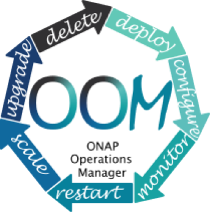

.. This work is licensed under a Creative Commons Attribution 4.0 International License.
.. http://creativecommons.org/licenses/by/4.0
.. Copyright 2017-2018 Huawei Technologies Co., Ltd.

1. Introduction 
================

The ONAP project addresses a rising need for a common platform for
telecommunication, cable, and cloud operators—and their solution
providers—to deliver differentiated network services on demand,
profitably and competitively, while leveraging existing investments.

Prior to ONAP, operators of large networks have been challenged to keep
up with the scale and cost of manual changes required to implement new
service offerings, from installing new data center equipment to, in some
cases, upgrading on-premises customer equipment. Many are seeking to
exploit SDN and NFV to improve service velocity, simplify equipment
interoperability and integration, and reduce overall CapEx and OpEx
costs. In addition, the current, highly fragmented management landscape
makes it difficult to monitor and guarantee service-level agreements
(SLAs).

ONAP is addressing these problems by developing global and massive scale
(multi-site and multi-VIM) orchestration capabilities for both physical
and virtual network elements. It facilitates service agility by
providing a common set of Northbound REST APIs that are open and
interoperable, and by supporting YANG and TOSCA data models. ONAP’s
modular and layered nature improves interoperability and simplifies
integration, allowing it to support multiple VNF environments by
integrating with multiple VIMs, VNFMs, SDN Controllers, and even legacy
equipment. This approach allows network and cloud operators to optimize
their physical and virtual infrastructure for cost and performance; at
the same time, ONAP’s use of standard models reduces integration and
deployment costs of heterogeneous equipment, while minimizing management
fragmentation. ONAP exists to instantiate and operate VNFs. Typical
operator networks are expected to support multiple instances of hundreds
of different types of VNFs. ONAP’s consolidated VNF requirements
publication is a significant deliverable to enable commercial
development of ONAP-compliant VNFs.

The ONAP platform allows end user organizations and their network/cloud
providers to collaboratively instantiate network elements and services
in a dynamic, closed-loop process, with real-time response to actionable
events. In order to design, engineer, plan, bill and assure these
dynamic services, there are three major requirements:

-  A robust design framework that allows specification of the service in
   all aspects – modeling the resources and relationships that make up
   the service, specifying the policy rules that guide the service
   behavior, specifying the applications, analytics and closed-loop
   events needed for the elastic management of the service 


-  An orchestration and control framework (Service Orchestrator and
   Controllers) that is recipe/policy-driven to provide automated
   instantiation of the service when needed and managing service demands
   in an elastic manner 


-  An analytic framework that closely monitors the service behavior
during the service lifecycle based on the specified design, analytics
and policies to enable response as required from the control framework,
to deal with situations ranging from those that require healing to those
that require scaling of the resources to elastically adjust to demand
variations.

To achieve this, ONAP decouples the details of specific services and
technologies from the common information models, core orchestration
platform and generic management engines (for discovery, provisioning,
assurance etc). Furthermore, it marries the speed and style of a
DevOps/NetOps approach with the formal models and processes operators
require to introduce new services and technologies. It leverages
cloud-native technologies including Kubernetes to manage and rapidly
deploy the ONAP platform and related components. This is in stark
contrast to traditional OSS/Management software platform architectures,
which hardcoded services and technologies, and required lengthy software
development and integration cycles to incorporate changes.

The ONAP Platform enables product/service independent capabilities for
design, creation and lifecycle management, in accordance with the
following foundational principles:

-  Ability to dynamically introduce full service lifecycle orchestration
   (design, provisioning and operation) and service API for new services
   & technologies without the need for new platform software releases or
   without affecting operations for the existing services 


-  Carrier-grade scalability including horizontal scaling (linear
   scale-out) and distribution to support large number of services and
   large networks 


-  Metadata-driven and policy-driven architecture to ensure flexible and
   automated ways in which capabilities are used and delivered 


-  The architecture shall enable sourcing best-in-class components 


-  Common capabilities are ‘developed’ once and ‘used’ many times 


-  Core capabilities shall support many diverse services and
   infrastructures


-  The architecture shall support elastic scaling as needs grow or
   shrink 


**Figure 1: ONAP Platform** 


|image0|

2. ONAP Architecture 
=====================

The platform provides the common functions (e.g., data collection,
control loops, metadata recipe creation, policy/recipe distribution,
etc.) necessary to construct specific behaviors. To create a service or
operational capability, it is necessary to develop
service/operations-specific service definitions, data collection,
analytics, and policies (including recipes for corrective/remedial
action) using the ONAP Design Framework Portal. Figure 2 provides a
high-level view of the ONAP architecture and microservices-based
platform components, including all ONAP projects.

**Figure 2: ONAP Platform components with projects (Beijing Release)**

|image1|

In Figure 3 below, we provide a functional view of the architecture,
which highlights the role of key new components:

1. The Beijing release standardizes and improves northbound
   interoperability for the ONAP Platform using the **External API**
   component (1)

2. **OOM** provides the ability to manage cloud-native installation and
   deployments to Kubernetes-managed cloud environments.

3. ONAP Common Services now manage more complex and optimized
   topologies\ **. MUSIC** allows ONAP to scale to multi-site
   environments to support global scale infrastructure requirements. The
   ONAP Optimization Framework (OOF) provides a declarative,
   policy-driven approach for creating and running optimization
   applications like Homing/Placement, and Change Management Scheduling
   Optimization.

4. **Information Model and framework utilities** have evolved to
   harmonize the topology, workflow, and policy models from a number of
   SDOs including ETSI NFV MANO, TM Forum SID, ONF Core, OASIS TOSCA,
   IETF and MEF.

|image2| Figure 3. Functional view of the ONAP architecture

3. Microservices Support
========================

As a cloud-native application that consists of numerous services, ONAP
requires sophisticated initial deployment as well as post-deployment
management. It needs to be highly reliable, scalable, secure and easy to
manage. Also, the ONAP deployment needs to be flexible to suit the
different scenarios and purposes for various operator environments.
Users may also want to select part of the ONAP components to integrate
into their own systems. To achieve all these goals, ONAP is designed as
a microservices based system, with all components released as Docker
containers.

The ONAP Operations Manager
(`OOM <https://wiki.onap.org/display/DW/ONAP+Operations+Manager+Project>`__)
is responsible for orchestrating the end-to-end lifecycle management and
monitoring of ONAP components. OOM uses Kubernetes to provide CPU
efficiency and platform deployment. In addition, OOM helps enhance ONAP
platform maturity by providing scalability and resiliency enhancements
to the components it manages.

OOM is the lifecycle manager of the ONAP platform and uses the
Kubernetes container management system and Consul to provide the
following functionality:

1. **Deployment** - with built-in component dependency management
   (including multiple clusters, federated deployments across sites, and
   anti-affinity rules)

2. |image3|\ **Configuration -** unified configuration across all ONAP
   components

3. **Monitoring** - real-time health monitoring feeding to a Consul GUI
   and Kubernetes

4. **Restart** - failed ONAP components are restarted automatically

5. **Clustering and Scaling** - cluster ONAP services to enable seamless
   scaling 

6. **Upgrade** - change-out containers or configuration with little or
   no service impact

7. **Deletion** - cleanup individual containers or entire deployments

OOM supports a wide variety of cloud infrastructures to suit your
individual requirements.

The Microservices Bus (MSB) component project provides some fundamental
microservices support such as service registration/discovery, external
API gateway, internal API gateway, client software development kit
(SDK), and Swagger SDK to help ONAP projects evolve towards the
microservice direction. MSB is integrated with OOM to provide
transparent service registration for ONAP microservices, it also
supports OpenStack(Heat) and bare metal deployment.

4. Portal 
==========

ONAP delivers a single, consistent user experience to both design-time
and run-time environments, based on the user’s role. Role changes are
are configured within a single ONAP instance instance.

This user experience is managed by the ONAP Portal, which provides
access to design, analytics and operational control/administration
functions via a shared, role-based menu or dashboard. The portal
architecture provides web-based capabilities such as application
onboarding and management, centralized access management, and
dashboards, as well as hosted application widgets.

The portal provides an SDK to enable multiple development teams to
adhere to consistent UI development requirements by taking advantage of
built-in capabilities (Services/ API/ UI controls), tools and
technologies. ONAP also provides a Command Line Interface (CLI) for
operators who require it (e.g., to integrate with their scripting
environment). ONAP SDKs enable operations/security, third parties (e.g.,
vendors and consultants), and other experts to continually
define/redefine new collection, analytics, and policies (including
recipes for corrective/remedial action) using the ONAP Design Framework
Portal.

5. Design-time Framework 
=========================

The design-time framework is a comprehensive development environment
with tools, techniques, and repositories for defining/ describing
resources, services, and products.

The design time framework facilitates reuse of models, further improving
efficiency as more and more models become available. Resources,
services, products, and their management and control functions can all
be modeled using a common set of specifications and policies (e.g., rule
sets) for controlling behavior and process execution. Process
specifications automatically sequence instantiation, delivery and
lifecycle management for resources, services, products and the ONAP
platform components themselves. Certain process specifications (i.e.,
‘recipes’) and policies are geographically distributed to optimize
performance and maximize autonomous behavior in federated cloud
environments.

Service Design and Creation (SDC) provides tools, techniques, and
repositories to define/simulate/certify system assets as well as their
associated processes and policies. Each asset is categorized into one of
four asset groups: Resource, Services, Products, or Offers.

The SDC environment supports diverse users via common services and
utilities. Using the design studio, product and service designers
onboard/extend/retire resources, services and products. Operations,
Engineers, Customer Experience Managers, and Security Experts create
workflows, policies and methods to implement Closed Loop
Automation/Control and manage elastic scalability.

To support and encourage a healthy VNF ecosystem, ONAP provides a set of
VNF packaging and validation tools in the VNF Supplier API and Software
Development Kit (VNF SDK) and VNF Validation Program (VVP) components.
Vendors can integrate these tools in their CI/CD environments to package
VNFs and upload them to the validation engine. Once tested, the VNFs can
be onboarded through SDC.

The Policy Creation component deals with polices; these are rules,
conditions, requirements, constraints, attributes, or needs that must be
provided, maintained, and/or enforced. At a lower level, Policy involves
machine-readable rules enabling actions to be taken based on triggers or
requests. Policies often consider specific conditions in effect (both in
terms of triggering specific policies when conditions are met, and in
selecting specific outcomes of the evaluated policies appropriate to the
conditions). Policy allows rapid modification through easily updating
rules, thus updating technical behaviors of components in which those
policies are used, without requiring rewrites of their software code.
Policy permits simpler management / control of complex mechanisms via
abstraction.

The Closed Loop Automation Management Platform (CLAMP) provides a
platform for designing and managing control loops. CLAMP is used to
design a closed loop, configure it with specific parameters for a
particular network service, then deploy and decommission it. Once
deployed, a user can also update the loop with new parameters during
runtime, as well as suspend and restart it.

6. Runtime Framework 
=====================

The runtime execution framework executes the rules and policies
distributed by the design and creation environment.

This allows for the distribution of policy enforcement and templates
among various ONAP modules such as the Service Orchestrator (SO),
Controllers, Data Collection, Analytics and Events (DCAE), Active and
Available Inventory (A&AI), and a Security Framework. These components
use common services that support logging, access control, and data
management. A new component, Multi-Site State Coordination (MUSIC),
allows the platform to register and manage state across multi-site
deployments. The External API provides access for third-party frameworks
such as MEF, TM Forum and potentially others, to facilitate interactions
between operator BSS and relevant ONAP components.

Orchestration 
--------------

The Service Orchestrator (SO) component executes the specified processes
by automating sequences of activities, tasks, rules and policies needed
for on-demand creation, modification or removal of network, application
or infrastructure services and resources. The SO provides orchestration
at a very high level, with an end-to-end view of the infrastructure,
network, and applications.

The External API Northbound Interface component provides a
standards-based interface between the BSS and and various ONAP
components, including Service Orchestrator, A&AI and SDC, providing an
abstracted view of the platform. This type of abstraction allows service
providers to use their existing BSS/OSS environment and minimize
lengthy, high-cost integration with underlying infrastructure. The
Beijing release is the first of a series of enhancements in support of
SDO collaborations, which are expected to support inter-operator
exchanges and other use cases defined by associated standards bodies
such as MEF, TM Forum and others.

Policy-driven Workload Optimization
-----------------------------------

In the Beijing Release, ONAP Optimization Framework (OOF) provides a
policy-driven and model-driven framework for creating optimization
applications for a broad range of use cases. OOF-HAS is a policy-driven
workload optimization service that enables optimized placement of
services across multiple sites and multiple clouds, based on a wide
variety of policy constraints including capacity, location, platform
capabilities, and other service specific constraints. 

In the Beijing Release, ONAP Multi-VIM/Cloud (MC) and several other ONAP
components such as Policy, SO, A&AI etc. play an important role in
enabling “Policy-driven Performance/Security-aware Adaptive Workload
Placement/Scheduling” across cloud sites through OOF-HAS. OOF-HAS uses
Hardware Platform Awareness (HPA) and real-time Capacity Checks provided
by ONAP MC to determine the optimal VIM/Cloud instances, which can
deliver the required performance SLAs, for workload (VNF etc.) placement
and scheduling (Homing). The key operator benefit is realizing the true
value of virtualization through fine grained optimization of cloud
resources while delivering the performance/security SLAs. For the
Beijing release, this feature is available for the vCPE use case.

Controllers 
------------

Controllers are applications which are coupled with cloud and network
services and execute the configuration, real-time policies, and control
the state of distributed components and services. Rather than using a
single monolithic control layer, operators may choose to use multiple
distinct Controller types that manage resources in the execution
environment corresponding to their assigned controlled domain such as
cloud computing resources (network configuration (SDN-C) and application
(App-C). Also, the Virtual Function Controller (VF-C) provides an ETSI
NFV compliant NFV-O function, that is responsible for lifecycle
management of virtual services and the associated physical COTS server
infrastructure. VF-C provides a generic VNFM capability but also
integrates with external VNFMs and VIMs as part of a NFV MANO stack.

In the Beijing release, the new Multisite State Coordination (MUSIC)
project records and manages state of the Portal and ONAP Optimization
Framework to ensure consistency, redundancy and high availability across
geographically distributed ONAP deployments.

Inventory 
----------

Active and Available Inventory (A&AI) provides real-time views of a
system’s resources, services, products and their relationships with each
other. The views provided by A&AI relate data managed by multiple ONAP
instances, Business Support Systems (BSS), Operation Support Systems
(OSS), and network applications to form a “top to bottom” view ranging
from the products end-users buy, to the resources that form the raw
material for creating the products. A&AI not only forms a registry of
products, services, and resources, it also maintains up-to-date views of
the relationships between these inventory items.

To deliver the promised dynamism of SDN/NFV, A&AI is updated in real
time by the controllers as they make changes in the network environment.
A&AI is metadata-driven, allowing new inventory types to be added
dynamically and quickly via SDC catalog definitions, eliminating the
need for lengthy development cycles.

7. Closed-Loop Automation 
==========================

The following sections describe the ONAP frameworks designed to address
major operator requirements. The key pattern that these frameworks help
automate is:

**Design -> Create -> Collect -> Analyze -> Detect -> Publish ->
Respond.**

We refer to this automation pattern as “closed-loop automation” in that
it provides the necessary automation to proactively respond to network
and service conditions without human intervention. A high-level
schematic of the “closed-loop automation” and the various phases within
the service lifecycle using the automation is depicted in Figure 3.

Closed-loop control is provided by Data Collection, Analytics and Events
(DCAE) and one or more of the other ONAP runtime components.
Collectively, they provide FCAPS (Fault Configuration Accounting
Performance Security) functionality. DCAE collects performance, usage,
and configuration data; provides computation
of analytics; aids in
troubleshooting; and publishes events, data and analytics (e.g., to
policy, orchestration, and the data lake). Another component, “Holmes”,
connects to DCAE and provides alarm correlation for ONAP, which depicts
the topological relation between different alarms raising either from
different layers of VNFs or from different VNF entities that are
distributed all over the network.

Working with the Policy Framework and CLAMP, these components detect
problems in the network and identify the appropriate remediation. In
some cases, the action will be automatic, and they will notify Service
Orchestrator or one of the controllers to take action. In other cases,
as configured by the operator, they will raise an alarm but require
human intervention before executing the change.

**Figure 5: ONAP Closed Loop Automation**

|image4|

8. Common Services 
===================

ONAP provides common operational services for all ONAP components
including activity logging, reporting, common data layer, access
control, secret and credential management, resiliency, and software
lifecycle management.

These services provide access management and security enforcement, data
backup, restoration and recovery. They support standardized VNF
interfaces and guidelines.

Operating in a virtualized environment introduces new security
challenges and opportunities. ONAP provides increased security by
embedding access controls in each ONAP platform component, augmented by
analytics and policy components specifically designed for the detection
and mitigation of security violations.

9. ONAP Modeling
================

Adopting the model-driven approach, ONAP provides models to assist the
service design, development of various ONAP components and improve the
interoperability of ONAP.

Models are essential part for the design time and run time framework
development. The ONAP modeling project leverages the experience of
member companies, standard organizations and other open source projects
to produce models which are simple, extensible, and reusable. The goal
is to fulfill the requirements of various use cases, guide the
development and bring consistency among ONAP components and explore a
common model to improve the interoperability of ONAP.

In the Bejing Release, ONAP supports the following Models:

-  A VNF Information Model based on ETSI NFV IFA011 v.2.4.1 with
   appropriate modifications aligned with ONAP requirements;

-  A VNF Descriptor Model based on TOSCA implementation based on the IM
   and follow the same model definitions in ETSI NFV SOL001 v 0.6.0.

-  VNF Package format based on ETSI NFV SOL004 specification.

These models enable ONAP to interoperate with implementations based on
standard, and improve the industry collaboration. Service models,
multi-VIM models and other models will be explored and defined in the
Casablanca and future releases.

10. ONAP Use Cases 
===================

The ONAP project tests blueprints for real-world use cases to enable
rapid adoption of the platform. With the first release of ONAP
(“Amsterdam”), we introduced two blueprints: vCPE and VoLTE. Subsequent
releases test additional functionality and/or new blueprints.

Virtual CPE Use Case 
---------------------

In this use case, many traditional network functions such as NAT,
firewall, and parental controls are implemented as virtual network
functions. These VNFs can either be deployed in the data center or at
the customer edge (or both). Also, some network traffic will be tunneled
(using MPLS VPN, VxLAN, etc.) to the data center, while other traffic
can flow directly to the Internet. A vCPE infrastructure allows service
providers to offer new value-added services to their customers with less
dependency on the underlying hardware.

In this use case, the customer has a physical CPE (pCPE) attached to a
traditional broadband network such as DSL (Figure 1). On top of this
service, a tunnel is established to a data center hosting various VNFs.
In addition, depending on the capabilities of the pCPE, some functions
can be deployed on the customer site.

This use case traditionally requires fairly complicated orchestration
and management, managing both the virtual environment and underlay
connectivity between the customer and the service provider. ONAP
supports such a use case with two key components – SDN-C, which manages
connectivity services, and APP-C, which manages virtualization services.
In this case, ONAP provides a common service orchestration layer for the
end-to-end service. It uses the SDN-C component to establish network
connectivity. Similarly, ONAP uses the APP-C component to manage the VNF
lifecycle. Deploying ONAP in this fashion simplifies and greatly
accelerates the task of trialing and launching new value-added services.

In the Beijing Release, the vCPE use case supports Policy-driven
Workload Optimization, which is supported by OOF, Multi-VIM/Cloud,
Policy, SO, A&AI and other ONAP components.

**Figure 6. ONAP vCPE Architecture**

|image5|

Read the Residential vCPE Use Case with ONAP whitepaper to learn more.

Voice over LTE (VoLTE) Use Case 
--------------------------------

The second blueprint developed for ONAP is Voice over LTE. This
blueprint demonstrates how
a Mobile Service Provider (SP) could deploy
VoLTE services based on SDN/NFV. This blueprint incorporates commercial
VNFs to create and manage the underlying vEPC and vIMS services by
interworking with vendor-specific components, including VNFMs, EMSs,
VIMs and SDN controllers, across Edge Data Centers and a Core Date
Center.

|image6|

**Figure 7. ONAP VoLTE Architecture**

ONAP supports the VoLTE use case with several key components: SO, VF-C,
SDN-C, and Multi-VIM/ Cloud. In this use case, SO is responsible for
VoLTE end-to-end service orchestration. It collaborates with VF-C and
SDN-C to deploy the VoLTE service. ONAP uses the SDN-C component to
establish network connectivity, then the VF-C component completes the
Network Services and VNF lifecycle management (including service
initiation, termination and manual scaling which is composed of VNFs
based on the unified VNFD model) and FCAPS (fault, configuration,
accounting, performance, security) management. VF-C can also integrate
with commercial VIMs in the Edge and Core datacenters via abstract
interfaces provided by Multi-VIM/Cloud.

Using ONAP to manage the complete lifecycle of the VoLTE use case brings
increased agility, CAPEX and OPEX reductions, and increased
infrastructure efficiency to Communication Service Providers (CSPs). In
addition, the usage of commercial software in this blueprint offers CSPs
an efficient path to rapid production.

Read the VoLTE Use Case with ONAP whitepaper to learn more.

Conclusion 
===========

The ONAP platform provides a comprehensive platform for real-time,
policy-driven orchestration and automation of physical and virtual
network functions that will enable software, network, IT and cloud
providers and developers to rapidly automate new services and support
complete lifecycle management.

By unifying member resources, ONAP will accelerate the development of a
vibrant ecosystem of VNFs around a globally shared architecture and
implementation for network automation–with an open standards focus–
faster than any one product could on its own.

.. |image0| image:: media/ONAP-DTRT.png
   :width: 6in
   :height: 2.6in
.. |image1| image:: media/ONAP-toplevel.png
   :width: 6.5in
   :height: 3.13548in
.. |image2| image:: media/ONAP-fncview.png
   :width: 6.5in
   :height: 3.409in

.. |image4| image:: media/ONAP-closedloop.png
   :width: 6in
   :height: 2.6in
.. |image5| image:: media/ONAP-vcpe.png
   :width: 6.5in
   :height: 3.28271in
.. |image6| image:: media/ONAP-volte.png
   :width: 6.5in
   :height: 3.02431in
