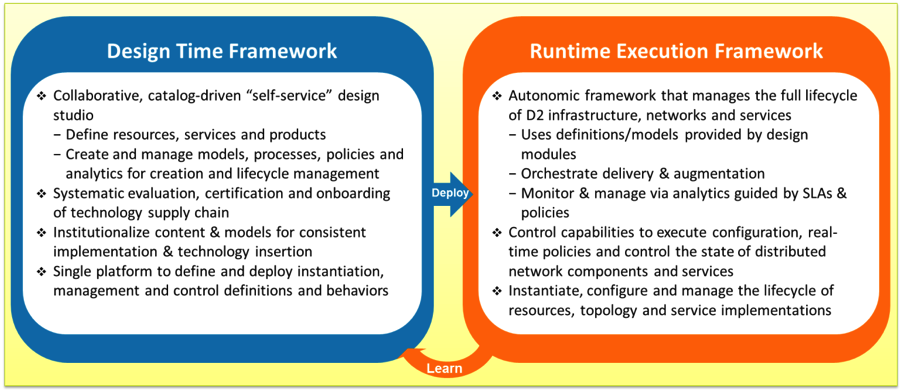

.. This work is licensed under a Creative Commons Attribution 4.0 International License.
.. http://creativecommons.org/licenses/by/4.0
.. Copyright 2017 Huawei Technologies Co., Ltd.

Introducing the ONAP Architecture (Beijing Release)
=====================================================

Introduction
-------------

The ONAP project was formed in March, 2017 in response to a rising need
for a common platform for telecommunication, cable, and cloud
operators—and their solution providers—to deliver differentiated network
services on demand, profitably and competitively, while leveraging
existing investments.

Prior to ONAP, operators of large networks have been challenged to keep
up with the scale and cost of manual changes required to implement new
service offerings, from installing new data center equipment to, in some
cases, upgrading on-premises customer equipment. Many are seeking to
exploit SDN and NFV to improve service velocity, simplify equipment
interoperability and integration, and reduce overall CapEx and OpEx
costs. In addition, the current, highly fragmented management landscape
makes it difficult to monitor and guarantee service-level agreements
(SLAs).

ONAP is addressing these problems by developing global and massive scale
(multi-site and multi-VIM) orchestration capabilities for both physical
and virtual network elements. It facilitates service agility by
providing a common set of REST northbound APIs that are open and
interoperable, and by supporting YANG and TOSCA data models. ONAP’s
modular and layered nature improves interoperability and simplifies
integration, allowing it to support multiple VNF environments by
integrating with multiple VIMs, VNFMs, SDN Controllers, and even legacy
equipment. This approach allows network and cloud operators to optimize
their physical and virtual infrastructure for cost and performance; at
the same time, ONAP’s use of standard models reduces integration and
deployment costs of heterogeneous equipment, while minimizing management
fragmentation.

The ONAP platform allows end customers and their network/cloud providers
to collaboratively instantiate network elements and services in a
dynamic, closed-loop process, with real-time response to actionable
events. In order to design, engineer, plan, bill and assure these
dynamic services, there are three (3) major requirements:

-  A robust design framework that allows specification of the service in
   all aspects – modeling the resources and relationships that make up
   the service, specifying the policy rules that guide the service
   behavior, specifying the applications, analytics and closed-loop
   events needed for the elastic management of the service

-  An orchestration and control framework (Service Orchestrator and
   Controllers) that is recipe/policy driven to provide automated
   instantiation of the service when needed and managing service demands
   in an elastic manner

-  An analytic framework that closely monitors the service behavior
   during the service lifecycle based on the specified design, analytics
   and policies to enable response as required from the control
   framework, to deal with situations ranging from those that require
   healing to those that require scaling of the resources to elastically
   adjust to demand variations.

To achieve this, ONAP decouples the details of specific services and
technologies from the common information models, core orchestration
platform and generic management engines (for discovery, provisioning,
assurance etc). Furthermore, it marries the speed and style of a
DevOps/NetOps approach with the formal models and processes operators
require to introduce new services and technologies. This is in stark
contrast to the traditional OSS/Management software platform
architectures, which hardcoded service and technologies and required
lengthy software development and integration cycles to incorporate
changes.

The ONAP Platform enables product/service independent capabilities for
design, creation and lifecycle management, in accordance with the
following foundational principles:

-  Ability to dynamically introduce full service life-cycle
   orchestration (design, provisioning and operation) and service API
   for new services & technologies without the need for new platform
   software releases or without affecting operations for the existing
   services

-  Carrier-grade scalability including horizontal scaling (linear
   scale-out) and distribution to support large number of services
   and large networks

-  Metadata-driven and policy-driven architecture to ensure flexible
   ways in which capabilities are used and delivered

-  The architecture shall enable sourcing best-in-class components

-  Common capabilities are ‘developed’ once and ‘used’ many times

-  Core capabilities shall support many diverse services

-  The architecture shall support elastic scaling as needs grow or
   shrink

|image0|\

**Figure 1:** ONAP Platform

ONAP Architecture
-----------------

Figure 2 provides a high-level view of the ONAP architecture and
microservices-based platform components. The platform provides the
common functions (e.g., data collection, control loops, meta-data recipe
creation, policy/recipe distribution, etc.) necessary to construct
specific behaviors. To create a service or operational capability, it is
necessary to develop service/operations-specific collection, analytics,
and policies (including recipes for corrective/remedial action) using
the ONAP Design Framework Portal.

|image1|\

**Figure 2:** ONAP Platform components (Beijing Release)

Portal
++++++

ONAP delivers a single, consistent user experience to both design time
and run time environments, based on the user’s role; role changes to be
configured within the single ecosystem. This user experience is managed
by the ONAP Portal, which provides access to design, analytics and
operational control/administration functions via a shared, role-based
menu or dashboard. The portal architecture provides web-based
capabilities such as application onboarding and management, centralized
access management, and dashboards, as well as hosted application
widgets.

The portal provides an SDK to enable multiple development teams to
adhere to consistent UI development requirements by taking advantage of
built-in capabilities (Services/ API/ UI controls), tools and
technologies. ONAP also provides a Command Line Interface (CLI) for
operators who require it (e.g., to integrate with their scripting
environment). ONAP SDKs enable operations/security, third parties (e.g.,
vendors and consultants), and other experts to continually define/refine
new collection, analytics, and policies (including recipes for
corrective/remedial action) using the ONAP Design Framework Portal.

Design time Framework
+++++++++++++++++++++

The design time framework is a comprehensive development environment
with tools, techniques, and repositories for defining/describing
resources, services, and products. The design time framework facilitates
re-use of models, further improving efficiency as more and more models
become available. Resources, services and products can all be modeled
using a common set of specifications and policies (e.g., rule sets) for
controlling behavior and process execution. Process specifications
automatically sequence instantiation, delivery and lifecycle management
for resources, services, products and the ONAP platform components
themselves. Certain process specifications (i.e., ‘recipes’) and
policies are geographically distributed to optimize performance and
maximize autonomous behavior in federated cloud environments.

Service Design and Creation (SDC) provides tools, techniques, and
repositories to define/simulate/certify system assets as well as their
associated processes and policies. Each asset is categorized into one of
four (4) asset groups: Resource, Services, Products, or Offers.

The SDC environment supports diverse users via common services and
utilities. Using the design studio, product and service designers
onboard/extend/retire resources, services and products. Operations,
Engineers, Customer Experience Managers, and Security Experts create
workflows, policies and methods to implement Closed Loop Automation and
manage elastic scalability.

To support and encourage a healthy VNF ecosystem, ONAP provides a set of
VNF packaging and validation tools in the VNF Supplier API and Software
Development Kit (VNF SDK) component. Vendors can integrate these tools
in their CI/CD environments to package VNFs and upload them to the
validation engine. Once tested, the VNFs can be onboarded through SDC.
In the future, ONAP plans to develop a VNF logo program to indicate to
users which VNFs have gone through formal ONAP validation testing.

The Policy Creation component deals with polices; these are conditions,
requirements, constraints, attributes, or needs that must be provided,
maintained, and/or enforced. At a lower level, Policy involves
machine-readable rules enabling actions to be taken based on triggers or
requests. Policies often consider specific conditions in effect (both in
terms of triggering specific policies when conditions are met, and in
selecting specific outcomes of the evaluated policies appropriate to the
conditions). Policy allows rapid updates through easily updating rules,
thus updating technical behaviors of components in which those policies
are used, without requiring rewrites of their software code. Policy
permits simpler management / control of complex mechanisms via
abstraction.

The Closed Loop Automation Management Platform (CLAMP) provides a
platform for designing and managing control loops. It is used to design
a closed loop, configure it with specific parameters for a particular
network service, then deploy and decommission it. Once deployed, a user
can also update the loop with new parameters during runtime, as well as
suspend and restart it.

Runtime Framework
+++++++++++++++++

The runtime execution framework executes the rules and policies
distributed by the design and creation environment. This allows us to
distribute policy enforcement and templates among various ONAP modules
such as the Service Orchestrator (SO), Controllers, Data Collection,
Analytics and Events (DCAE), Active and Available Inventory (A&AI), and
a Security Framework. These components use common services that support
logging, access control, and data management.

Orchestration
+++++++++++++

The Service Orchestrator (SO) component executes the
specified processes and automates sequences of activities, tasks, rules
and policies needed for on-demand creation, modification or removal of
network, application or infrastructure services and resources. The SO
provides orchestration at a very high level, with an end to end view of
the infrastructure, network, and applications.

Controllers
+++++++++++

Controllers are applications which are coupled with cloud and network
services and execute the configuration, real-time policies, and control
the state of distributed components and services. Rather than using a
single monolithic control layer, operators may choose to use multiple
distinct Controller types that manage resources in the execution
environment corresponding to their assigned controlled domain such as
cloud computing resources (network configuration (SDN-C) and application
(App-C). Also, the Virtual Function Controller (VF-C) provides an ETSI
NFV compliant NFV-O function, and is responsible for life cycle
management of virtual services and the associated physical COTS server
infrastructure. While it provides a generic VNFM, it also integrates
with external VNFMs and VIMs as part of a NFV MANO stack.

Inventory
+++++++++

Active and Available Inventory (A&AI) provides real-time views of a
system’s resources, services, products and their relationships with each
other. The views provided by A&AI relate data managed by multiple ONAP
instances, Business Support Systems (BSS), Operation Support Systems
(OSS), and network applications to form a “top to bottom” view ranging
from the products end-users buy, to the resources that form the raw
material for creating the products. A&AI not only forms a registry of
products, services, and resources, it also maintains up-to-date views of
the relationships between these inventory items.

To deliver promised dynamism of SDN/NFV, A&AI is updated in real time by
the controllers as they make changes in the Domain 2 environment. A&AI
is metadata-driven, allowing new inventory types to be added dynamically
and quickly via SDC catalog definitions, eliminating the need for
lengthy development cycles.

Closed-Loop Automation
----------------------

The following sections describe the ONAP frameworks designed to address
these major requirements. The key pattern that these frameworks help
automate is:

**Design -> Create -> Collect -> Analyze -> Detect -> Publish ->
Respond**

We refer to this automation pattern as “closed-loop automation” in that
it provides the necessary automation to proactively respond to network
and service conditions without human intervention. A high-level
schematic of the “closed-loop automation” and the various phases within
the service lifecycle using the automation is depicted in Figure 3.

Closed-loop control is provided by Data Collection, Analytics and Events
(DCAE) and other ONAP components. Collectively, they provide FCAPS
(Fault Configuration Accounting Performance Security) functionality.
DCAE collects performance, usage, and configuration data; provides
computation of analytics; aids in troubleshooting; and publishes events,
data and analytics (e.g., to policy, orchestration, and the data lake).
Another component, “Holmes”, connects to DCAE and provides alarm
correlation for ONAP.

Working with the Policy Framework and CLAMP, these components detect
problems in the network and identify the appropriate remediation. In
some cases, the action will be automatic, and they will notify Service
Orchestrator or one of the controllers to take action. In other cases,
as configured by the operator, they will raise an alarm but require
human intervention before executing the change.

|image2|

\ **Figure 3:** ONAP Closed Loop Automation

Common Services
---------------

ONAP provides common operational services for all ONAP components
including activity logging, reporting, common data layer, access
control, resiliency, and software lifecycle management. These services
provide access management and security enforcement, data backup,
restoration and recovery. They support standardized VNF interfaces and
guidelines.

Operating in a virtualized environment introduces new security challenges
and opportunities. ONAP provides increased security by embedding access controls
in each ONAP platform component, augmented by analytics and policy components
specifically designed for the detection and mitigation of security violations.

Beijing Use Cases
-------------------

The ONAP project uses real-world use cases to help focus our releases.
For the first release of ONAP (“Beijing”), we introduce two use cases:
vCPE and VoLTE.

\ **Virtual CPE Use Case**

In this use case, many traditional network functions such as NAT,
firewall, and parental controls are implemented as virtual network
functions. These VNFs can either be deployed in the data center or at
the customer edge (or both). Also, some network traffic will be tunneled
(using MPLS VPN, VxLAN, etc.) to the data center, while other traffic
can flow directly to the Internet. A vCPE infrastructure allows service
providers to offer new value-added services to their customers with less
dependency on the underlying hardware.

In this use case, the customer has a physical CPE (pCPE) attached to a
traditional broadband network such as DSL (Figure 4). On top of this
service, a tunnel is established to a data center hosting various VNFs.
In addition, depending on the capabilities of the pCPE, some functions
can be deployed on the customer site.

This use case traditionally requires fairly complicated orchestration
and management, managing both the virtual environment and underlay
connectivity between the customer and the service provider. ONAP
supports such a use case with two key components – SDN-C, which manages
connectivity services, and APP-C, which manages virtualization services.
In this case, ONAP provides a common service orchestration layer for the
end-to-end service. It uses the SDN-C component to establish network
connectivity. Similarly, ONAP uses the APP-C component to manage the
virtualization infrastructure. Deploying ONAP in this fashion simplifies
and greatly accelerates the task of trialing and launching new
value-added services.

|image3|

**Figure 4. ONAP vCPE Architecture**

Read the Residential vCPE Use Case with ONAP whitepaper to learn more.

**Voice over LTE (VoLTE) Use Case**

The second use case developed with Beijing is Voice over LTE. This use
case demonstrates how a Mobile Service Provider (SP) could deploy VoLTE
services based on SDN/NFV.  The SP is able to onboard the service via
ONAP. Specific sub-use cases are:

-  Service onboarding

-  Service configuration 

-  Service termination

-  Auto-scaling based on fault and/or performance

-  Fault detection & correlation, and auto-healing

-  Data correlation and analytics to support all sub use cases

To connect the different data centers, ONAP will also have to interface
with legacy systems and physical function to establish VPN connectivity
in a brown field deployment.

The VoLTE use case, shown in Figure 5, demonstrates the use of the VF-C
component and TOSCA-based data models to manage the virtualization
infrastructure.

|image4|

**Figure 5. ONAP VoLTE Architecture**

Read the VoLTE Use Case with ONAP whitepaper to learn more.

Conclusion
----------

The ONAP platform provides a comprehensive platform for real-time, policy-driven orchestration and automation of physical and virtual network functions that will enable software, network, IT and cloud providers and developers to rapidly automate new services and support complete lifecycle management.

By unifying member resources, ONAP will accelerate the development of a vibrant ecosystem around a globally shared architecture and implementation for network automation–with an open standards focus–faster than any one product could on its own.

.. |image1| image:: media/ONAP-toplevel.png
   :width: 6.5in
   :height: 3.13548in
.. |image2| image:: media/ONAP-closedloop.png
   :width: 6in
   :height: 2.6in
.. |image3| image:: media/ONAP-vcpe.png
   :width: 6.5in
   :height: 3.28271in
.. |image4| image:: media/ONAP-volte.png
   :width: 6.5in
   :height: 3.02431in
