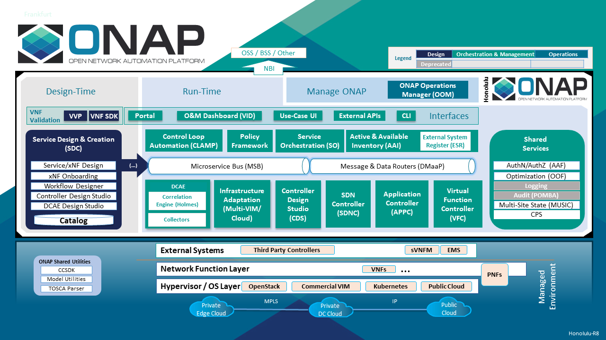
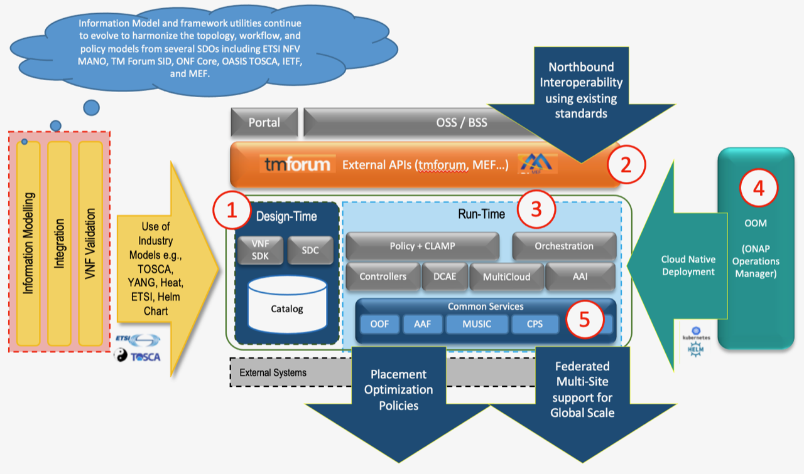
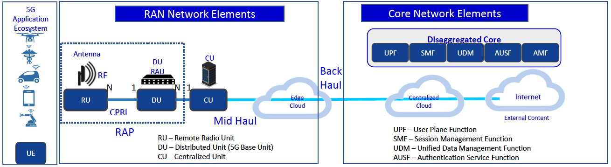

.. This work is licensed under a Creative Commons Attribution
.. 4.0 International License.
.. http://creativecommons.org/licenses/by/4.0
.. Copyright 2017-2018 Huawei Technologies Co., Ltd.
.. Copyright 2019 ONAP Contributors

.. _ONAP-architecture:

Introduction
============
ONAP is a comprehensive platform for orchestration, management, and automation
of network and edge computing services for network operators, cloud providers,
and enterprises. Real-time, policy-driven orchestration and automation of
physical, virtual, and cloud native network functions enables rapid automation
of new services and complete lifecycle management critical for 5G and
next-generation networks.

The ONAP project addresses the rising need for a common automation platform for
telecommunication, cable, and cloud service providers—and their solution
providers—to deliver differentiated network services on demand, profitably and
competitively, while leveraging existing investments.

The challenge that ONAP meets is to help operators of telecommunication
networks to keep up with the scale and cost of manual changes required to
implement new service offerings, from installing new data center equipment to,
in some cases, upgrading on-premises customer equipment. Many are seeking to
exploit SDN and NFV to improve service velocity, simplify equipment
interoperability and integration, and to reduce overall CapEx and OpEx costs.
In addition, the current, highly fragmented management landscape makes it
difficult to monitor and guarantee service-level agreements (SLAs).

ONAP is addressing these challenges by developing global and massive scale
(multi-site and multi-VIM) automation capabilities for physical, virtual, and
cloud native network elements. It facilitates service agility by supporting
data models for rapid service and resource deployment and providing a common
set of northbound REST APIs that are open and interoperable, and by supporting
model-driven interfaces to the networks. ONAP’s modular and layered nature
improves interoperability and simplifies integration, allowing it to support
multiple VNF environments by integrating with multiple VIMs, VNFMs, SDN
Controllers, as well as legacy equipment (PNF). The Service Design & Creation
(SDC) project also offers seamless orchestration of CNFs. ONAP’s consolidated
xNF requirements publication enables commercial development of ONAP-compliant
xNFs. This approach allows network and cloud operators to optimize their
physical and virtual infrastructure for cost and performance; at the same time,
ONAP’s use of standard models reduces integration and deployment costs of
heterogeneous equipment. All this is achieved while minimizing management
fragmentation.

The ONAP platform allows end-user organizations and their network/cloud
providers to collaboratively instantiate network elements and services in a
rapid and dynamic way, together with supporting a closed control loop process
that supports real-time response to actionable events. In order to design,
engineer, plan, bill and assure these dynamic services, there are three major
requirements:

- A robust design framework that allows the specification of the service in all
  aspects – modeling the resources and relationships that make up the service,
  specifying the policy rules that guide the service behavior, specifying the
  applications, analytics and closed control loop events needed for the elastic
  management of the service
- An orchestration and control framework (Service Orchestrator and Controllers)
  that is recipe/ policy-driven to provide an automated instantiation of the
  service when needed and managing service demands in an elastic manner
- An analytic framework that closely monitors the service behavior during the
  service lifecycle based on the specified design, analytics and policies to
  enable response as required from the control framework, to deal with
  situations ranging from those that require healing to those that require
  scaling of the resources to elastically adjust to demand variations.

To achieve this, ONAP decouples the details of specific services and supporting
technologies from the common information models, core orchestration platform,
and generic management engines (for discovery, provisioning, assurance etc.).

Furthermore, it marries the speed and style of a DevOps/NetOps approach with
the formal models and processes operators require to introduce new services and
technologies. It leverages cloud-native technologies including Kubernetes to
manage and rapidly deploy the ONAP platform and related components. This is in
stark contrast to traditional OSS/Management software platform architectures,
which hardcoded services and technologies, and required lengthy software
development and integration cycles to incorporate changes.

The ONAP Platform enables service/resource independent capabilities for design,
creation and lifecycle management, in accordance with the following
foundational principles:

- Ability to dynamically introduce full service lifecycle orchestration (design
  , provisioning and operation) and service API for new services and
  technologies without the need for new platform software releases or without
  affecting operations for the existing services
- Scalability and distribution to support a large number of services and large
  networks
- Metadata-driven and policy-driven architecture to ensure flexible and
  automated ways in which capabilities are used and delivered
- The architecture shall enable sourcing best-in-class components
- Common capabilities are ‘developed’ once and ‘used’ many times
- Core capabilities shall support many diverse services and infrastructures

Further, ONAP comes with a functional architecture with component definitions
and interfaces, which provides a force of industry alignment in addition to
the open source code.

ONAP Architecture
=================

The ONAP architecture consists of a design time and run time functions, as well
as functions for managing ONAP itself.

**Figure 1 provides a high-level view of the ONAP architecture with its
microservices-based platform components.**

|image1|

Figure 2 below, provides a simplified functional view of the architecture,
which highlights the role of a few key components:

#. Design time environment for onboarding services and resources into ONAP and
   designing required services.
#. External API provides northbound interoperability for the ONAP Platform and
   Multi-VIM/Cloud provides cloud interoperability for the ONAP workloads.
#. OOM provides the ability to manage cloud-native installation and deployments
   to Kubernetes-managed cloud environments.
#. ONAP Shared Services provides shared capabilities for ONAP modules. The ONAP
   Optimization Framework (OOF) provides a declarative, policy-driven approach
   for creating and running optimization applications like Homing/Placement,
   and Change Management Scheduling Optimization.
#. ONAP shared utilities provide utilities for the support of the ONAP
   components.
#. Information Model and framework utilities continue to evolve to harmonize
   the topology, workflow, and policy models from a number of SDOs including
   ETSI NFV MANO, ETSI/3GPP, O-RAN, TM Forum SID, ONF Core, OASIS TOSCA, IETF,
   and MEF.

|image2|

**Figure 2. Functional view of the ONAP architecture**

Microservices Support
=====================
As a cloud-native application that consists of numerous services, ONAP requires
sophisticated initial deployment as well as post- deployment management.

The ONAP deployment methodology needs to be flexible enough to suit the
different scenarios and purposes for various operator environments. Users may
also want to select a portion of the ONAP components to integrate into their
own systems. And the platform needs to be highly reliable, scalable, secure
and easy to manage. To achieve all these goals, ONAP is designed as a
microservices-based system, with all components released as Docker containers
following best practice building rules to optimize their image size. To reduce
the ONAP footprint, a first effort to use a shared database has been initiated
with a Cassandra and mariadb-galera clusters.

The ONAP Operations Manager (OOM) is responsible for orchestrating the
end-to-end lifecycle management and monitoring of ONAP components. OOM uses
Kubernetes to provide CPU efficiency and platform deployment. In addition, OOM
helps enhance ONAP platform maturity by providing scalability and resiliency
enhancements to the components it manages.

OOM is the lifecycle manager of the ONAP platform and uses the Kubernetes
container management system and Consul to provide the following functionality:

#. Deployment - with built-in component dependency management (including
   multiple clusters, federated deployments across sites, and anti-affinity
   rules)
#. Configuration - unified configuration across all ONAP components
#. Monitoring - real-time health monitoring feeding to a Consul GUI and
   Kubernetes
#. Restart - failed ONAP components are restarted automatically
#. Clustering and Scaling - cluster ONAP services to enable seamless scaling
#. Upgrade - change out containers or configuration with little or no service
   impact
#. Deletion - clean up individual containers or entire deployments

OOM supports a wide variety of cloud infrastructures to suit your individual
requirements.

Microservices Bus (MSB) provides fundamental microservices support including
service registration/ discovery, external API gateway, internal API gateway,
client software development kit (SDK), and Swagger SDK. When integrating with
OOM, MSB has a Kube2MSB registrar which can grasp services information from k8s
metafile and automatically register the services for ONAP components.

In the spirit of leveraging the microservice capabilities, further steps
towards increased modularity have been taken. Service Orchestrator (SO) and the
controllers have increased its level of modularity.

Portal
======
ONAP delivers a single, consistent user experience to both design time and
runtime environments, based on the user’s role. Role changes are configured
within a single ONAP instance.

This user experience is managed by the ONAP
Portal, which provides access to design, analytics and operational control/
administration functions via a shared, role-based menu or dashboard. The portal
architecture provides web-based capabilities such as application onboarding and
management, centralized access management through the Authentication and
Authorization Framework (AAF), and dashboards, as well as hosted application
widgets.

The portal provides an SDK to enable multiple development teams to adhere to
consistent UI development requirements by taking advantage of built-in
capabilities (Services/ API/ UI controls), tools and technologies. ONAP also
provides a Command Line Interface (CLI) for operators who require it (e.g., to
integrate with their scripting environment). ONAP SDKs enable operations/
security, third parties (e.g., vendors and consultants), and other experts to
continually define/redefine new collection, analytics, and policies (including
recipes for corrective/remedial action) using the ONAP Design Framework Portal.

Design Time Framework
=====================
The design time framework is a comprehensive development environment with tools
, techniques, and repositories for defining/ describing resources, services,
and products.

The design time framework facilitates reuse of models, further improving
efficiency as more and more models become available. Resources, services,
products, and their management and control functions can all be modeled using a
common set of specifications and policies (e.g., rule sets) for controlling
behavior and process execution. Process specifications automatically sequence
instantiation, delivery and lifecycle management for resources, services,
products and the ONAP platform components themselves. Certain process
specifications (i.e., ‘recipes’) and policies are geographically distributed to
optimize performance and maximize autonomous behavior in federated cloud
environments.

Service Design and Creation (SDC) provides tools, techniques, and repositories
to define/simulate/certify system assets as well as their associated processes
and policies. Each asset is categorized into one of four asset groups: Resource
, Services, Products, or Offers. SDC supports the onboarding of Network
Services packages (ETSI SOL 0007 ), CNF packages (Helm), VNF packages (Heat or
ETSI SOL004) and PNF packages (ETSI SOL004). SDC also includes some
capabilities to model 5G network slicing using the standard properties (Slice
Profile, Service Template).

The SDC environment supports diverse users via common services and utilities.
Using the design studio, product and service designers onboard/extend/retire
resources, services and products. Operations, Engineers, Customer Experience
Managers, and Security Experts create workflows, policies and methods to
implement Closed control Loop Automation/Control and manage elastic
scalability.

To support and encourage a healthy VNF ecosystem, ONAP provides a set of VNF
packaging and validation tools in the VNF Supplier API and Software Development
Kit (VNF SDK) and VNF Validation Program (VVP) components. Vendors can
integrate these tools in their CI/CD environments to package VNFs and upload
them to the validation engine. Once tested, the VNFs can be onboarded through
SDC. In addition, the testing capability of VNFSDK is being utilized at the LFN
Compliance Verification Program to work towards ensuring a highly consistent
approach to VNF verification.

The Policy Creation component deals with policies; these are rules, conditions,
requirements, constraints, attributes, or needs that must be provided,
maintained, and/or enforced. At a lower level, Policy involves machine-readable
rules enabling actions to be taken based on triggers or requests. Policies
often consider specific conditions in effect (both in terms of triggering
specific policies when conditions are met, and in selecting specific outcomes
of the evaluated policies appropriate to the conditions).

Policy allows rapid modification through easily updating rules, thus updating
technical behaviors of components in which those policies are used, without
requiring rewrites of their software code. Policy permits simpler
management / control of complex mechanisms via abstraction.

Runtime Framework
=================
The runtime execution framework executes the rules and policies and other
models distributed by the design and creation environment.

This allows for the distribution of models and policy among various ONAP
modules such as the Service Orchestrator (SO), Controllers, Data Collection,
Analytics and Events (DCAE), Active and Available Inventory (A&AI). These
components use common services that support access control.

Orchestration
-------------
The Service Orchestrator (SO) component executes the specified processes by
automating sequences of activities, tasks, rules and policies needed for
on-demand creation, modification or removal of network, application or
infrastructure services and resources, this includes VNFs, CNFs and PNFs.
The SO provides orchestration at a very high level, with an end-to-end view
of the infrastructure, network, and applications. Examples of this include
BroadBand Service (BBS) and Cross Domain and Cross Layer VPN (CCVPN).

Virtual Infrastructure Deployment (VID)
---------------------------------------
The Virtual Infrastructure Deployment (VID) application enables users to
instantiate infrastructure services from SDC, along with their associated
components, and to execute change management operations such as scaling and
software upgrades to existing VNF instances.

Policy-Driven Workload Optimization
-----------------------------------
The ONAP Optimization Framework (OOF) provides a policy-driven and model-driven
framework for creating optimization applications for a broad range of use
cases. OOF Homing and Allocation Service (HAS) is a policy driven workload
optimization service that enables optimized placement of services across
multiple sites and multiple clouds, based on a wide variety of policy
constraints including capacity, location, platform capabilities, and other
service specific constraints.

ONAP Multi-VIM/Cloud (MC) and several other ONAP components such as Policy, SO,
A&AI etc. play an important role in enabling “Policy-driven Performance/
Security-Aware Adaptive Workload Placement/ Scheduling” across cloud sites
through OOF-HAS. OOF-HAS uses Hardware Platform Awareness (HPA), cloud agnostic
Intent capabilities, and real-time capacity checks provided by ONAP MC to
determine the optimal VIM/Cloud instances, which can deliver the required
performance SLAs, for workload (VNF etc.) placement and scheduling (Homing).
Operators now realize the true value of virtualization through fine grained
optimization of cloud resources while delivering performance and security SLAs.

Controllers
-----------
Controllers are applications which are coupled with cloud and network services
and execute the configuration, real-time policies, and control the state of
distributed components and services. Rather than using a single monolithic
control layer, operators may choose to use multiple distinct controller types
that manage resources in the execution environment corresponding to their
assigned controlled domain such as cloud computing resources (network
configuration (SDN-C) and application (App-C). The App-C and SDN-C also support
the Virtual Function Controller (VF-C) provides an ETSI NFV compliant NFV-O
function that is responsible for lifecycle management of virtual services and
the associated physical COTS server infrastructure. VF-C provides a generic
VNFM capability but also integrates with external VNFMs and VIMs as part of an
NFV MANO stack.

The Controller Design Studio (CDS) community in ONAP has contributed a
framework to automate the resolution of resources for instantiation and any
config provisioning operation, such as day0, day1 or day2 configuration. The
essential function of CDS is to create and populate a controller blueprint,
create a configuration file from this Controller blueprint, and associate at
design time this configuration file (configlet) to a PNF/VNF/CNF during the
design phase. CDS removes dependence on code releases and the delays they cause
and puts the control of services into the hands of the service providers. Users
can change a model and its parameters with great flexibility to fetch data from
external systems (e.g. IPAM) that is required in real deployments. This makes
service providers more responsive to their customers and able to deliver
products that more closely match the needs of those customers.

Inventory
---------
Active and Available Inventory (A&AI) provides real-time views of a system’s
resources, services, products and their relationships with each other, and also
retains a historical view. The views provided by A&AI relate data managed by
multiple ONAP instances, Business Support Systems (BSS), Operation Support
Systems (OSS), and network applications to form a “top to bottom” view ranging
from the products end users buy, to the resources that form the raw material
for creating the products. A&AI not only forms a registry of products,
services, and resources, it also maintains up-to-date views of the
relationships between these inventory items.

To deliver the promised dynamism of SDN/NFV, A&AI is updated in real time by
the controllers as they make changes in the network environment. A&AI is
metadata-driven, allowing new inventory types to be added dynamically and
quickly via SDC catalog definitions, eliminating the need for lengthy
development cycles.

Policy Framework
----------------
The Policy framework provides policy based decision making capability and
supports multiple policy engines and can distribute policies through policy
design capabilities in SDC, simplifying the design process.

Multi Cloud Adaptation
----------------------
Multi-VIM/Cloud provides and infrastructure adaptation layer for VIMs/Clouds
and K8s  clusters in exposing advanced hardware platform awareness and cloud
agnostic intent capabilities, besides standard capabilities, which are used by
OOF and other components for enhanced cloud selection and SO/VF-C for cloud
agnostic workload deployment. The K8s plugin is in charge to deploy the CNF on
the Kubernetes clusters using Kubernetes API.

Closed Control Loop Automation
==============================
Closed loop control is provided by cooperation among a number of design-time
and run-time elements. The Runtime loop starts with data collectors from Data
Collection, Analytics and Events (DCAE). ONAP includes the following collectors
: VES (VNF Event Streaming)  for events, HV-VES for high-volume events, SNMP
for SNMP traps, File Collector to receive files, and RESTCONF Collector to
collect the notifications. After data collection/verification phase, data are
moved through the loop of micro-services like Homes for event detection, Policy
for determining actions, and finally, controllers and orchestrators to
implement actions CLAMP is used to monitor the loops themselves. DCAE also
includes a number of specialized micro-services to support some use-cases such
as the Slice Analysis or SON-Handler.  Some dedicated event processor modules
transform collected data (SNMP, 3GPP XML, RESTCONF) to VES format and push the
various data onto data lake. CLAMP, Policy and DCAE all have design time
aspects to support the creation of the loops.

We refer to this automation pattern as “closed control loop automation” in that
it provides the necessary automation to proactively respond to network and
service conditions without human intervention. A high-level schematic of the
“closed control loop automation” and the various phases within the service
lifecycle using the automation is depicted in Figure 3.

Closed control loop control is provided by Data Collection, Analytics and
Events (DCAE) and one or more of the other ONAP runtime components.
Collectively, they provide FCAPS (Fault Configuration Accounting Performance
Security) functionality. DCAE collects performance, usage, and configuration
data; provides computation of analytics; aids in troubleshooting; and publishes
events, data and analytics (e.g., to policy, orchestration, and the data lake).
Working with the Policy Framework and CLAMP, these components detect problems
in the network and identify the appropriate remediation. In some cases, the
action will be automatic, and they will notify Service Orchestrator or one of
the controllers to take action. In other cases, as configured by the operator,
they will raise an alarm but require human intervention before executing the
change. The policy framework is extended to support additional policy decision
capabilities with the introduction of adaptive policy execution.

|image3|

**Figure 3: ONAP Closed Control Loop Automation**

Shared Services
===============
ONAP provides a set of operational services for all ONAP components including
activity logging, reporting, common data layer, access control, secret and
credential management, resiliency, and software lifecycle management.

These services provide access management and security enforcement, data backup,
restoration and recovery. They support standardized VNF interfaces and
guidelines.

Operating in a virtualized environment introduces new security challenges and
opportunities. ONAP provides increased security by embedding access controls in
each ONAP platform component, augmented by analytics and policy components
specifically designed for the detection and mitigation of security violations.

ONAP Modeling
=============
ONAP provides models to assist with service design, the development of ONAP
service components, and with the improvement of standards interoperability.
Models are an essential part for the design time and runtime framework
development. The ONAP modeling project leverages the experience of member
companies, standard organizations and other open source projects to produce
models which are simple, extensible, and reusable. The goal is to fulfill the
requirements of various use cases, guide the development and bring consistency
among ONAP components and explore a common model to improve the
interoperability of ONAP.

ONAP supports various models detailed in
:ref:`Modeling Documentation<onap-modeling-modelspec:master_index>`.

The modeling project includes the ETSI catalog component, which provides the
parser functionalities, as well as additional package management
functionalities.

Industry Alignment
==================
ONAP support and collaboration with other standards and open source communities
is evident in the architecture.

- MEF and TMF interfaces are used in the External APIs
- In addition to the ETSI-NFV defined VNFD and NSD models mentioned above, ONAP
  supports the NFVO interfaces (SOL005 between the SO and VFC, SOL003 from
  either the SO or VFC to an external VNFM).
- Further collaboration includes 5G/ORAN & 3GPP Harmonization, Acumos DCAE
  Integration, and CNCF Telecom User Group (TUG).

Read this whitepaper for more information:
`The Progress of ONAP: Harmonizing Open Source and Standards <https://www.onap.org/wp-content/uploads/sites/20/2019/04/ONAP_HarmonizingOpenSourceStandards_032719.pdf>`_

ONAP Blueprints
===============
ONAP can support an unlimited number of use cases, within reason. However, to
provide concrete examples of how to use ONAP to solve real-world problems, the
community has created a set of blueprints. In addition to helping users rapidly
adopt the ONAP platform through end-to-end solutions, these blueprints also
help the community prioritize their work.

5G Blueprint
------------
The 5G blueprint is a multi-release effort, with five key initiatives around
end-to-end service orchestration, network slicing, PNF/VNF lifecycle management
, PNF integration, and network optimization. The combination of eMBB that
promises peak data rates of 20 Mbps, uRLLC that guarantees sub-millisecond
response times, MMTC that can support 0.92 devices per sq. ft., and network
slicing brings with it some unique requirements. First ONAP needs to manage the
lifecycle of a network slice from initial creation/activation all the way to
deactivation/termination. Next, ONAP needs to optimize the network around real
time and bulk analytics, place VNFs on the correct edge cloud, scale and heal
services, and provide edge automation. ONAP also provides self organizing
network (SON) services such as physical cell ID allocation for new RAN sites.
These requirements have led to the five above-listed initiatives and have been
developed in close cooperation with other standards and open source
organizations such as 3GPP, TM Forum, ETSI, and O-RAN Software Community.

|image4|

**Figure 4. End-to-end 5G Service**

Read the `5G Blueprint <https://www.onap.org/wp-content/uploads/sites/20/2019/07/ONAP_CaseSolution_5G_062519.pdf>`_
to learn more.

Residential Connectivity Blueprints
-----------------------------------
Two ONAP blueprints (vCPE and BBS) address the residential connectivity use
case.

Virtual CPE (vCPE)
..................
Currently, services offered to a subscriber are restricted to what is designed
into the broadband residential gateway. In the blueprint, the customer has a
slimmed down physical CPE (pCPE) attached to a traditional broadband network
such as DSL, DOCSIS, or PON (Figure 5). A tunnel is established to a data
center hosting various VNFs providing a much larger set of services to the
subscriber at a significantly lower cost to the operator. In this blueprint,
ONAP supports complex orchestration and management of open source VNFs and both
virtual and underlay connectivity.

|image5|

**Figure 5. ONAP vCPE Architecture**

Read the `Residential vCPE Use Case with ONAP blueprint <https://www.onap.org/wp-content/uploads/sites/20/2018/11/ONAP_CaseSolution_vCPE_112918FNL.pdf>`_
to learn more.

Broadband Service (BBS)
.......................
This blueprint provides multi-gigabit residential internet connectivity
services based on PON (Passive Optical Network) access technology. A key
element of this blueprint is to show automatic re-registration of an ONT
(Optical Network Terminal) once the subscriber moves (nomadic ONT) as well as
service subscription plan changes. This blueprint uses ONAP for the design,
deployment, lifecycle management, and service assurance of broadband services.
It further shows how ONAP can orchestrate services across different locations
(e.g. Central Office, Core) and technology domains (e.g. Access, Edge).

|image6|

**Figure 6. ONAP BBS Architecture**

Read the `Residential Connectivity Blueprint <https://www.onap.org/wp-content/uploads/sites/20/2019/07/ONAP_CaseSolution_BBS_062519.pdf>`_
to learn more.

Voice over LTE (VoLTE) Blueprint
--------------------------------
This blueprint uses ONAP to orchestrate a Voice over LTE service. The VoLTE
blueprint incorporates commercial VNFs to create and manage the underlying
vEPC and vIMS services by interworking with vendor-specific components,
including VNFMs, EMSs, VIMs and SDN controllers, across Edge Data Centers and
a Core Data Center. ONAP supports the VoLTE use case with several key
components: SO, VF-C, SDN-C, and Multi-VIM/ Cloud. In this blueprint, SO is
responsible for VoLTE end-to-end service orchestration working in collaboration
with VF-C and SDN-C. SDN-C establishes network connectivity, then the VF-C
component completes the Network Services and VNF lifecycle management
(including service initiation, termination and manual scaling) and FCAPS
(fault, configuration, accounting, performance, security) management. This
blueprint also shows advanced functionality such as scaling and change
management.

|image7|

**Figure 7. ONAP VoLTE Architecture Open Network Automation Platform**

Read the `VoLTE Blueprint <https://www.onap.org/wp-content/uploads/sites/20/2018/11/ONAP_CaseSolution_VoLTE_112918FNL.pdf>`_
to learn more.

Optical Transport Networking (OTN)
----------------------------------
Two ONAP blueprints (CCVPN and MDONS) address the OTN use case. CCVPN addresses
Layers 2 and 3, while MDONS addresses Layers 0 and 1.

CCVPN (Cross Domain and Cross Layer VPN) Blueprint
..................................................
CSPs, such as CMCC and Vodafone, see a strong demand for high-bandwidth, flat,
high-speed OTN (Optical Transport Networks) across carrier networks. They also
want to provide a high-speed, flexible and intelligent service for high-value
customers, and an instant and flexible VPN service for SMB companies.

|image8|

**Figure 8. ONAP CCVPN Architecture**

The CCVPN (Cross Domain and Cross Layer VPN) blueprint is a combination of SOTN
(Super high-speed Optical Transport Network) and ONAP, which takes advantage of
the orchestration ability of ONAP, to realize a unified management and
scheduling of resources and services. It achieves cross-domain orchestration
and ONAP peering across service providers. In this blueprint, SO is responsible
for CCVPN end-to-end service orchestration working in collaboration with VF-C
and SDN-C. SDN-C establishes network connectivity, then the VF-C component
completes the Network Services and VNF lifecycle management. ONAP peering
across CSPs uses an east-west API which is being aligned with the MEF Interlude
API. The key innovations in this use case are physical network discovery and
modeling, cross-domain orchestration across multiple physical networks, cross
operator end-to-end service provisioning, close-loop reroute for cross-domain
service, dynamic changes (branch sites, VNFs) and intelligent service
optimization (including AI/ML).

Read the `CCVPN Blueprint <https://www.onap.org/wp-content/uploads/sites/20/2019/07/ONAP_CaseSolution_CCVPN_062519.pdf>`_
to learn more.

MDONS (Multi-Domain Optical Network Service) Blueprint
......................................................
While CCVPN addresses the automation of networking layers 2 and 3, it does not
address layers 0 and 1. Automating these layers is equally important because
providing an end-to-end service to their customers often requires a manual and
complex negotiation between CSPs that includes both the business arrangement
and the actual service design and activation. CSPs may also be structured such
that they operate multiple networks independently and require similar
transactions among their own networks and business units in order to provide an
end-to-end service. The MDONS blueprint created by AT&T, Orange, and Fujitsu
solves the above problem. MDONS and CCVPN used together can solve the OTN
automation problem in a comprehensive manner.

|image9|

**Figure 9. ONAP MDONS Architecture**

vFW/vDNS Blueprint
------------------
The virtual firewall, virtual DNS blueprint is a basic demo to verify that ONAP
has been correctly installed and to get a basic introduction to ONAP. The
blueprint consists of 5 VNFs: vFW, vPacketGenerator, vDataSink, vDNS and
vLoadBalancer. The blueprint exercises most aspects of ONAP, showing VNF
onboarding, network service creation, service deployment and closed-loop
automation. The key components involved are SDC, CLAMP, SO, APP-C, DCAE and
Policy. In the recent releases, the vFW blueprint has been demonstrated by
using a mix of a CNF and VNF and entirely using CNFs.

Verified end to end tests
=========================
Use cases
---------
Various use cases have been tested for the Release. Use case examples are
listed below. See detailed information on use cases, functional requirements,
and automated use cases can be found here:
:ref:`Verified Use Cases<onap-integration:docs_usecases_release>`.

- E2E Network Slicing
- 5G OOF (ONAP Optimization Framework) SON (Self-Organized Network)
- CCVPN-Transport Slicing
- MDONS (Multi-Domain Optical Network Service)

Functional requirements
-----------------------
Various functional requirements have been tested for the Release. Detailed
information can be found in the
:ref:`Verified Use Cases<onap-integration:docs_usecases_release>`.

- xNF Integration
  - ONAP CNF orchestration - Enhancements
  - PNF PreOnboarding
  - PNF Plug & Play
- Lifecycle Management
  - Policy Based Filtering
  - Bulk PM / PM Data Control Extension
  - Support xNF Software Upgrade in association to schema updates
  - Configuration & Persistency Service
- Security
  - CMPv2 Enhancements
- Standard alignment
  - ETSI-Alignment for Guilin and Honolulu
  - ONAP/3GPP & O-RAN Alignment-Standards Defined Notifications over VES
  - Extend ORAN A1 Adapter and add A1 Policy Management
- NFV testing Automatic Platform
  - Support for Test Result Auto Analysis & Certification
  - Support for Test Task Auto Execution
  - Support for Test Environment Auto Deploy
  - Support for Test Topology Auto Design

Conclusion
==========
The ONAP platform provides a comprehensive platform for real-time, policy-
driven orchestration and automation of physical and virtual network functions
that will enable software, network, IT and cloud providers and developers to
rapidly automate new services and support complete lifecycle management.

By unifying member resources, ONAP will accelerate the development of a vibrant
ecosystem around a globally shared architecture and implementation for network
automation—with an open standards focus— faster than any one product could on
its own.

Resources
=========
See the Resources page on `ONAP.org <https://www.onap.org/resources>`_

.. |image3| image:: media/ONAP-closedloop.png
   :width: 800px

.. |image5| image:: media/ONAP-vcpe.png
   :width: 800px
.. |image6| image:: media/ONAP-bbs.png
   :width: 800px
.. |image7| image:: media/ONAP-volte.png
   :width: 800px
.. |image8| image:: media/ONAP-ccvpn.png
   :width: 800px
.. |image9| image:: media/ONAP-mdons.png
   :width: 800px
