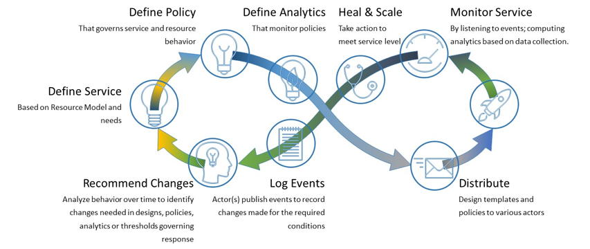

.. This work is licensed under a Creative Commons Attribution
.. 4.0 International License.
.. http://creativecommons.org/licenses/by/4.0
.. Copyright 2017-2018 Huawei Technologies Co., Ltd.

.. _ONAP-architecture:

1. Introduction
===============

The ONAP project addresses the rising need for a common automation platform
for telecommunication, cable, and cloud service providers—and their solution
providers—to deliver differentiated network services on demand, profitably and
competitively, while leveraging existing investments.

Prior to ONAP, operators of telecommunication networks have been challenged to
keep up with the scale and cost of manual changes required to implement new
service offerings, from installing new data center equipment to, in some cases,
upgrading on-premises customer equipment. Many are seeking to exploit SDN and
NFV to improve service velocity, simplify equipment interoperability and
integration, and reduce overall CapEx and OpEx costs. In addition, the current,
highly fragmented management landscape makes it difficult to monitor and
guarantee service-level agreements (SLAs). These challenges are still very real
now as ONAP creates its third release.

ONAP is addressing these challenges by developing global and massive scale
(multi-site and multi-VIM) automation capabilities for both physical and
virtual network elements. It facilitates service agility by supporting data
models for rapid service and resource deployment, and providing a common set of
Northbound REST APIs that are open and interoperable, and by supporting model
driven interfaces to the networks. ONAP’s modular and layered nature improves
interoperability and simplifies integration, allowing it to support multiple
VNF environments by integrating with multiple VIMs, VNFMs, SDN Controllers, and
even legacy equipment. ONAP’s consolidated VNF requirements publication will
enable commercial development of ONAP-compliant VNFs. This approach allows
network and cloud operators to optimize their physical and virtual
infrastructure for cost and performance; at the same time, ONAP’s use of
standard models reduces integration and deployment costs of heterogeneous
equipment, while minimizing management fragmentation.

The ONAP platform allows end user organizations and their network/cloud
providers to collaboratively instantiate network elements and services in a
dynamic, closed control loop process, with real-time response to actionable
events. In order to design, engineer, plan, bill and assure these dynamic
services, there are three major requirements:

-  A robust design framework that allows specification of the service in all
   aspects – modeling the resources and relationships that make up the service,
   specifying the policy rules that guide the service behavior, specifying the
   applications, analytics and closed control loop events needed for the
   elastic management of the service.

-  An orchestration and control framework (Service Orchestrator and
   Controllers) that is recipe/policy-driven to provide automated instantiation
   of the service when needed and managing service demands in an elastic
   manner.

-  An analytic framework that closely monitors the service behavior during the
   service lifecycle based on the specified design, analytics and policies to
   enable response as required from the control framework, to deal with
   situations ranging from those that require healing to those that require
   scaling of the resources to elastically adjust to demand variations.

To achieve this, ONAP decouples the details of specific services and
technologies from the common information models, core orchestration platform,
and generic management engines (for discovery, provisioning, assurance etc.).
Furthermore, it marries the speed and style of a DevOps/NetOps approach with
the formal models and processes operators require to introduce new services
and technologies. It leverages cloud-native technologies including Kubernetes
to manage and rapidly deploy the ONAP platform and related components. This is
in stark contrast to traditional OSS/Management software platform
architectures, which hardcoded services and technologies, and required lengthy
software development and integration cycles to incorporate changes.

The ONAP Platform enables product/service independent capabilities for design,
creation and lifecycle management, in accordance with the following
foundational principles:

-  Ability to dynamically introduce full service lifecycle orchestration
   (design, provisioning and operation) and service API for new services and
   technologies without the need for new platform software releases or without
   affecting operations for the existing services
-  Carrier-grade scalability including horizontal scaling (linear scale-out)
   and distribution to support large number of services and large networks
-  Metadata-driven and policy-driven architecture to ensure flexible and
   automated ways in which capabilities are used and delivered
-  The architecture shall enable sourcing best-in-class components
-  Common capabilities are ‘developed’ once and ‘used’ many times
-  Core capabilities shall support many diverse services and infrastructures
-  The architecture shall support elastic scaling as needs grow or shrink

2. ONAP Architecture
====================

The platform provides the common functions (e.g., data collection, control
loops, meta-data recipe creation, policy/recipe distribution, etc.) necessary
to construct specific behaviors.

To create a service or operational capability, it is necessary to develop
service/operations-specific service definitions, data collection, analytics,
and policies (including recipes for corrective/remedial action) using the ONAP
Design Framework Portal.

Figure 1 provides a high-level view of the ONAP architecture and
microservices-based platform components.

|image1|

**Figure 1: ONAP Platform architecture (Casablanca Release)**

Figure 2 below, provides a simplified functional view of the architecture,
which highlights the role of a few key components:

1. Design time environment for onboarding services and resources into ONAP and
   designing required services.
2. External API provides northbound interoperability for the ONAP Platform and
   Multi-VIM/Cloud provides cloud interoperability for the ONAP workloads.
3. OOM provides the ability to manage cloud-native installation and deployments
   to Kubernetes-managed cloud environments.
4. ONAP Common Services manages complex and optimized topologies. MUSIC allows
   ONAP to scale to multi-site environments to support global scale
   infrastructure requirements. The ONAP Optimization Framework (OOF) provides
   a declarative, policy-driven approach for creating and running optimization
   applications like Homing/Placement, and Change Management Scheduling
   Optimization.
5. Information Model and framework utilities continue to evolve to harmonize
   the topology, workflow, and policy models from a number of SDOs including
   ETSI NFV MANO, TM Forum SID, ONF Core, OASIS TOSCA, IETF and MEF.

|image2|

**Figure 2. Functional view of the ONAP architecture**

The Casablanca release has a number of important new features in the areas of
design time and runtime, ONAP installation, and S3P.

Design time: The Service Design and Creation (SDC) project in ONAP has two new
dashboards—DCAE design studio, SO Workflow Designer—to help designers, product
managers, TechOps, and VNF owners create artifacts in one unified design
palette.

Runtime: Service Orchestration (SO) and controllers have new functionality to
support physical network functions (PNFs), reboot, traffic migration, expanded
hardware platform awareness (HPA), cloud agnostic intent capabilities, improved
homing service, SDN geographic redundancy, scale-out and edge cloud onboarding.
This will expand the actions available to support lifecycle management
functionality, increase performance and availability, and unlock new edge
automation and 5G use cases. With support for ETSI NFV-SOL003, the introduction
of an ETSI compliant VNFM is simplified.

In the area of monitoring, analytics, and service assurance, ONAP has early
support for the Linux Foundation PNDA project in DCAE as a compliment to CDAP.
Next, the data collection framework can now collect real-time messages through
a high-volume collector, handle PNFs, and support SNMP and bulk performance
management data files. The Policy project supports a new policy engine as well
as the new Casablanca blueprints and can distribute policies through policy
design capabilities in SDC, simplifying the design process. Next, the Holmes
alarm correlation engine features a new GUI and provides richer functionality
through scripting, again simplifying how rapidly alarm correlation rules can be
developed.

Moreover, there are new features in A&AI to support audit capabilities by
providing historical data. ONAP northbound API continues to align better with
TMForum (around ServiceOrder) and MEF APIs (around Legato and Interlude APIs)
to simplify integration with OSS/BSS. The VID and UUI operations GUI projects
can support a larger range of lifecycle management actions through a simple
point and click interface allowing operators to perform more tasks with ease.
Furthermore, The CLAMP project offers a new dashboard to view DMaaP and other
events during design and runtime to ease the debugging of control-loop
automation. ONAP has experimentally introduced ISTIO in certain components to
progress the introduction of Service Mesh.

ONAP installation: The ONAP Operations Manager (OOM) continues to make progress
in streamlining ONAP installation by using Kubernetes (Docker and Helm Chart
technologies). In Casablanca, OOM supports pluggable persistent storage
including GlusterFS, providing users with more storage options. In a multi-node
deployment, OOM allows more control on the placement of services based on
available resources or node selectors. Finally, OOM now supports backup/restore
of an entire k8s deployment thus introducing data protection.

Casablanca has introduced the controller design studio, as part of the
controller framework, which enables a model driven approach for how an ONAP
controller controls the network resources.

Deployability: Casablanca continued the 7 Dimensions momentum (Stability,
Security, Scalability, Performance; and Resilience, Manageability, and
Usability) from the prior to the Beijing release. A new logging project
initiative called Post Orchestration Model Based Audit (POMBA), can check for
deviations between design and ops environments thus increasing network service
reliability. Numerous other projects ranging from Logging, SO, VF-C, A&AI,
Portal, Policy, CLAMP and MSB have a number of improvements in the areas of
performance, availability, logging, move to a cloud native architecture,
authentication, stability, security, and code quality. Finally, versions of
OpenDaylight and Kafka that are integrated in ONAP were upgraded to the Oxygen
and v0.11 releases providing new capabilities such as P4 and data routing
respectively.

3. Microservices Support
========================

As a cloud-native application that consists of numerous services, ONAP requires
sophisticated initial deployment as well as post-deployment management.

The ONAP deployment methodology needs to be flexible enough to suit the
different scenarios and purposes for various operator environments. Users may
also want to select a portion of the ONAP components to integrate into their
own systems. And the platform needs to be highly reliable, scalable, secure and
easy to manage. To achieve all these goals, ONAP is designed as a
microservices-based system, with all components released as Docker containers.

The ONAP Operations Manager (OOM) is responsible for orchestrating the
end-to-end lifecycle management and monitoring of ONAP components. OOM uses
Kubernetes to provide CPU efficiency and platform deployment. In addition, OOM
helps enhance ONAP platform maturity by providing scalability and resiliency
enhancements to the components it manages.

OOM is the lifecycle manager of the ONAP platform and uses the Kubernetes
container management system and Consul to provide the following functionality:

1. Deployment - with built-in component dependency management (including
   multiple clusters, federated deployments across sites, and anti-affinity
   rules)
2. Configuration - unified configuration across all ONAP components
3. Monitoring - real-time health monitoring feeding to a Consul GUI and
   Kubernetes
4. Restart - failed ONAP components are restarted automatically
5. Clustering and Scaling - cluster ONAP services to enable seamless scaling
6. Upgrade - change out containers or configuration with little or no service
   impact
7. Deletion - clean up individual containers or entire deployments

OOM supports a wide variety of cloud infrastructures to suit your individual
requirements.

Microservices Bus (MSB) provides fundamental microservices supports including
service registration/discovery, external API gateway, internal API gateway,
client software development kit (SDK), and Swagger SDK. MSB supports both
OpenStack (Heat) and bare metal deployment. When integrating with OOM, MSB has
a Kube2MSB registrar which can grasp services information from k8s metafile and
automatically register the services for ONAP components.

4. Portal
=========

ONAP delivers a single, consistent user experience to both design time and
runtime environments, based on the user’s role. Role changes are configured
within a single ONAP instance.

This user experience is managed by the ONAP Portal, which provides access to
design, analytics and operational control/administration functions via a
shared, role-based menu or dashboard. The portal architecture provides
web-based capabilities such as application onboarding and management,
centralized access management through the Authentication and Authorization
Framework, and dashboards, as well as hosted application widgets.

The portal provides an SDK to enable multiple development teams to adhere to
consistent UI development requirements by taking advantage of built-in
capabilities (Services/ API/ UI controls), tools and technologies. ONAP also
provides a Command Line Interface (CLI) for operators who require it (e.g., to
integrate with their scripting environment). ONAP SDKs enable
operations/security, third parties (e.g., vendors and consultants), and other
experts to continually define/redefine new collection, analytics, and policies
(including recipes for corrective/remedial action) using the ONAP Design
Framework Portal.

5. Design-time Framework
========================

The design time framework is a comprehensive development environment with
tools, techniques, and repositories for defining/describing resources,
services, and products.

The design time framework facilitates reuse of models, further improving
efficiency as more and more models become available. Resources, services and
their management and control functions can all be modeled using a common set
of specifications and policies (e.g., rule sets) for controlling behavior and
process execution. Process specifications automatically sequence instantiation,
delivery and lifecycle management for resources, services, products and the
ONAP platform components themselves. Certain process specifications (i.e.,
‘recipes’) and policies are geographically distributed to optimize performance
and maximize autonomous behavior in federated cloud environments.

Service Design and Creation (SDC) provides tools, techniques, and repositories
to define/simulate/certify system assets as well as their associated processes
and policies. Each asset is categorized into one of two asset groups: Resource
or Services.
The SDC environment supports diverse users via common services and utilities.
Using the design studio, product and service designers onboard/extend/retire
resources and services. Operations, Engineers, Customer Experience Managers,
and Security Experts create workflows, policies and methods to implement Closed
control Loop Automation/Control and manage elastic scalability.

To support and encourage a healthy VNF ecosystem, ONAP provides a set of VNF
packaging and validation tools in the VNF Supplier API and Software Development
Kit (VNF SDK) and VNF Validation Program (VVP) components. Vendors can
integrate these tools in their CI/CD environments to package VNFs and upload
them to the validation engine. Once tested, the VNFs can be onboarded through
SDC. In addition, the testing capability of VNFSDK is being utilized at the LFN
Compliance Verification Program to work towards ensuring a highly consistent
approach to VNF verification.

The Policy Creation component deals with policies; these are rules, conditions,
requirements, constraints, attributes, or needs that must be provided,
maintained, and/or enforced. At a lower level, Policy involves machine-readable
rules enabling actions to be taken based on triggers or requests. Policies
often consider specific conditions in effect (both in terms of triggering
specific policies when conditions are met, and in selecting specific outcomes
of the evaluated policies appropriate to the conditions).

Policy allows rapid modification through easily updating rules, thus updating
technical behaviors of components in which those policies are used, without
requiring rewrites of their software code. Policy permits simpler management /
control of complex mechanisms via abstraction.

The Closed Loop Automation Management Platform (CLAMP) provides a platform for
managing control loops. CLAMP is used to manage a closed control loop,
configure it with specific parameters for a particular network service, then
deploy and decommission it. Once deployed, a user can also update the loop with
new parameters during runtime, as well as suspend and restart it.

6. Runtime Framework
====================

The runtime execution framework executes the rules and policies distributed by
the design and creation environment.

This allows for the distribution of policy enforcement and templates among
various ONAP modules such as the Service Orchestrator (SO), Controllers, Data
Collection, Analytics and Events (DCAE), Active and Available Inventory (A&AI),
and a Security Framework. These components use common services that support
logging, access control, Multi-Site State Coordination (MUSIC), which allow the
platform to register and manage state across multi-site deployments. The
External API provides access for third-party frameworks such as MEF, TM Forum
and potentially others, to facilitate interactions between operator BSS and
relevant ONAP components. The logging services also includes event based
analysis capabilities to support post orchestration consistency analysis.

Orchestration
-------------

The Service Orchestrator (SO) component executes the specified processes by
automating sequences of activities, tasks, rules and policies needed for
on-demand creation, modification or removal of network, application or
infrastructure services and resources. The SO provides orchestration at a very
high level, with an end-to-end view of the infrastructure, network, and
applications.

The External API Northbound Interface component provides a standards-based
interface between the BSS and various ONAP components, including Service
Orchestrator, A&AI, and SDC. This provides an abstracted view of the platform
within the existing BSS/OSS environment without lengthy, high-cost
infrastructure integration. The Beijing release was the first of a series of
enhancements in support of SDO collaborations, which are expected to support
inter-operator exchanges and other use cases defined by associated standards
bodies such as MEF, TM Forum and others.

The Virtual Infrastructure Deployment (VID) application enables users to
instantiate infrastructure services from SDC, along with their associated
components, and to execute change management operations such as scaling and
software upgrades to existing VNF instances.

Policy-Driven Workload Optimization
-----------------------------------

The ONAP Optimization Framework (OOF) provides a policy-driven and model-driven
framework for creating optimization applications for a broad range of use
cases. OOF Homing and Allocation Service (HAS) is a policy driven workload
optimization service that enables optimized placement of services across
multiple sites and multiple clouds, based on a wide variety of policy
constraints including capacity, location, platform capabilities, and other
service specific constraints.

ONAP Multi-VIM/Cloud (MC) and several other ONAP components such as Policy, SO,
A&AI etc. play an important role in enabling “Policy-driven
Performance/Security-Aware Adaptive Workload Placement/ Scheduling” across
cloud sites through OOF-HAS. OOF-HAS uses Hardware Platform Awareness (HPA),
cloud agnostic intent capabilities and real-time capacity checks provided by
ONAP MC to determine the optimal VIM/Cloud instances, which can deliver the
required performance SLAs, for workload (VNF etc.) placement and scheduling
(Homing). Operators now realize the true value of virtualization through fine
grained optimization of cloud resources while delivering performance and
security SLAs. For the Beijing release, this feature was available for the vCPE
use case.

Controllers
-----------

Controllers are applications which are coupled with cloud and network services
and execute the configuration, real-time policies, and control the state of
distributed components and services. Rather than using a single monolithic
control layer, operators may choose to use multiple distinct controller types
that manage resources in the execution environment corresponding to their
assigned controlled domain such as cloud computing resources (network
configuration (SDN-C) and application (App-C). Also, the Virtual Function
Controller (VF-C) provides an ETSI NFV compliant NFV-O function that is
responsible for lifecycle management of virtual services and the associated
physical COTS server infrastructure. VF-C provides a generic VNFM capability
but also integrates with external VNFMs and VIMs as part of an NFV MANO stack.

The new Multisite State Coordination (MUSIC) project records and manages state
of the Portal and ONAP Optimization Framework to ensure consistency, redundancy
and high availability across geographically distributed ONAP deployments.

Inventory
---------

Active and Available Inventory (A&AI) provides real-time views of a system’s
resources, services, products and their relationships with each other, and in
Casablanca it also retains a historical view. The views provided by A&AI relate
data managed by multiple ONAP instances, Business Support Systems (BSS),
Operation Support Systems (OSS), and network applications to form a
“top to bottom” view ranging from the products end users buy, to the resources
that form the raw material for creating the products. A&AI not only forms a
registry of products, services, and resources, it also maintains up-to-date
views of the relationships between these inventory items.

To deliver the promised dynamism of SDN/NFV, A&AI is updated in real time by
the controllers as they make changes in the network environment. A&AI is
metadata-driven, allowing new inventory types to be added dynamically and
quickly via SDC catalog definitions, eliminating the need for lengthy
development cycles.

Multi Cloud Adaptation
----------------------

Multi-VIM/Cloud provides and infrastructure adaptation layer for VIMs/Clouds
in exposing advanced hardware platform awareness and cloud agnostic intent
capabilities, besides standard capabilities, which are used by OOF and other
components for enhanced cloud selection and SO/VF-C for cloud agnostic workload
deployment. The cloud agnostic intent capabilities are newly introduced in the
Casablanca release.

7. Closed Control Loop Automation
=================================

Closed loop control is provided by cooperation among a number of design time
and runtime elements. The Runtime loop starts with Data Collection, Analytics
and Events (DCAE) and then moves through the loop of micro-services like Holmes
for event detection, Policy for determining actions, and finally controllers
and orchestrators to implement actions CLAMP is used to monitor the loops
themselves. CLAMP, Policy and DCAE all have design time aspects to support the
creation of the loops.

We refer to this automation pattern as “closed control loop automation” in that
it provides the necessary automation to proactively respond to network and
service conditions without human intervention. A high-level schematic of the
“closed control loop automation” and the various phases within the service
lifecycle using the automation is depicted in Figure 3.

Closed control loop control is provided by Data Collection, Analytics and
Events (DCAE) and one or more of the other ONAP runtime components.
Collectively, they provide FCAPS (Fault Configuration Accounting Performance
Security) functionality. DCAE collects performance, usage, and configuration
data; provides computation of analytics; aids in troubleshooting; and publishes
events, data and analytics (e.g., to policy, orchestration, and the data lake).
Another component, “Holmes”, connects to DCAE and provides alarm correlation
for ONAP. In the Casablanca Release, DCAE evolved to support new analytics
capabilities with PNDA (http://pnda.io/) as well as new data collection
capabilities with High Volume VES and bulk performance management support.

Working with the Policy Framework and CLAMP, these components detect problems
in the network and identify the appropriate remediation. In some cases, the
action will be automatic, and they will notify Service Orchestrator or one of
the controllers to take action. In other cases, as configured by the operator,
they will raise an alarm but require human intervention before executing the
change. The policy framework is extended to support additional policy decision
capabilities with the introduction of adaptive policy execution.

|image3|

**Figure 3: ONAP Closed Control Loop Automation**

8. Common Services
==================

ONAP provides common operational services for all ONAP components including
activity logging, reporting, common data layer, access control, secret and
credential management, resiliency, and software lifecycle management.

These services provide access management and security enforcement, data backup,
restoration and recovery. They support standardized VNF interfaces and
guidelines.

Operating in a virtualized environment introduces new security challenges and
opportunities. ONAP provides increased security by embedding access controls
in each ONAP platform component, augmented by analytics and policy components
specifically designed for the detection and mitigation of security violations.

9. ONAP Modeling
================

ONAP provides models to assist with service design, the development of ONAP
service components, and with the improvement of standards interoperability.

Models are essential part for the design time and runtime framework
development. The ONAP modeling project leverages the experience of member
companies, standard organizations and other open source projects to produce
models which are simple, extensible, and reusable. The goal is to fulfill the
requirements of various use cases, guide the development and bring consistency
among ONAP components and explore a common model to improve the
interoperability of ONAP.

In the Casablanca Release, ONAP supports the following Models:

-  A VNF Descriptor Information Model based on ETSI NFV IFA011 v.2.4.1 with
   appropriate modifications aligned with ONAP requirements;
-  A VNF Descriptor Model based on TOSCA implementation based on the IM and
   follow the same model definitions in ETSI NFV SOL001 v 0.6.0.
-  VNF Package format leveraging the ETSI NFV SOL004 specification.
-  A Network Service Descriptor (NSD) has been realized by the VFC (using the
   modelling project parsing capabilities).

These models enable ONAP to interoperate with implementations based on
standards, and improve the industry collaboration.

10. ONAP Blueprints
===================

ONAP can support an unlimited number of use cases. However, to provide concrete
examples of how to use ONAP to solve real-world problems, the community has
created a set of blueprints. In addition to helping users rapidly adopt the
ONAP platform through end-to-end solutions, these blueprints also help the
community prioritize their work. With the ONAP Casablanca release, we
introduced two new blueprints: 5G and CCVPN. Prior blueprints, vCPE, VoLTE and
vFW/vDNS have been ported to Casablanca as well.

5G Blueprint
------------
The 5G blueprint is a multi-release effort, with Casablanca introducing first
set of capabilities around PNF integration, edge automation, real-time
analytics, network slicing, data modeling, homing, scaling, and network
optimization. The combination of eMBB that promises peak data rates of 20 Mbps,
uRLLC that guarantees sub millisecond response times and MMTC that can support
0.92 devices per sq. ft. brings with it some unique requirements. First, ONAP
needs to support network services that include PNFs in addition to VNFs. Next
ONAP needs to support edge cloud onboarding as network services will no longer
be restricted to just large datacenters but will proliferate a large number of
distributed edge locations. Finally, ONAP needs to collect real-time
performance data for analytics and policy driven closed-loop automation. These
requirements have led to several initiatives within ONAP to holistically address
the 5G blueprint.

|image4|

**Figure 4. Disaggregated Hybrid RAN**

Read the 5G Blueprint to learn more.

Virtual CPE Blueprint
---------------------

This blueprint addresses a residential use case, where the services offered to
a subscriber are currently restricted to what is designed into the broadband
residential gateway. In this blueprint, the customer has a slimmed down
physical CPE (pCPE), that only consists of bridging functionality, attached to
a traditional broadband network such as DSL or DOCSIS (Figure 5). A tunnel is
established to a data center hosting various VNFs providing a much larger set
of services to the subscriber at a significantly lower cost to the operator.
ONAP supports complex orchestration and management of both virtual and underlay
connectivity with two key components–SDN-C, which manages connectivity service
, and APP-C, which manages virtualization services. In this case, ONAP provides
a common service orchestration layer for the end-to-end service. This blueprint
shows advanced functionality such as scaling, change management , HPA and cloud
agnostic intent.

|image5|

**Figure 5. ONAP vCPE Architecture**

Read the Residential vCPE Use Case with ONAP blueprint to learn more.

Voice over LTE (VoLTE) Blueprint
--------------------------------

This blueprint uses ONAP to orchestrate a Voice over LTE service. This
blueprint demonstrates how a Mobile Service Provider (SP) could deploy VoLTE
services based on SDN/NFV. The VoLTE blueprint incorporates commercial VNFs to
create and manage the underlying vEPC and vIMS services by interworking with
vendor-specific components, including VNFMs, EMSs, VIMs and SDN controllers,
across Edge Data Centers and a Core Data Center. ONAP supports the VoLTE use
case with several key components: SO, VF-C, SDN-C, and Multi-VIM/ Cloud. In
this blueprint, SO is responsible for VoLTE end-to-end service orchestration
working in collaboration with VF-C and SDN-C. SDN-C establishes network
connectivity, then the VF-C component completes the Network Services and VNF
lifecycle management (including service initiation, termination and manual
scaling) and FCAPS (fault, configuration, accounting, performance, security)
management. This blueprint also shows advanced functionality such as scaling
and change management.

|image6|

**Figure 6. ONAP VoLTE Architecture Open Network Automation Platform**

Read the VoLTE with ONAP blueprint to learn more.

CCVPN (Cross Domain and Cross Layer VPN) Blueprint
--------------------------------------------------
CSPs, such as CMCC and Vodafone, see a strong demand for high-bandwidth, flat,
high-speed OTN (Optical Transport Networks) across carrier networks. They also
want to provide a high-speed, flexible and intelligent service for high-value
customers, and an instant and flexible VPN service for SMB companies.

|image7|

**Figure 7. ONAP CCVPN Architecture**

The CCVPN (Cross Domain and Cross Layer VPN) blueprint is a combination of SOTN
(Super high-speed Optical Transport Network) and ONAP, which takes advantage of
the orchestration ability of ONAP, to realize a unified management and
scheduling of resource and services. It achieves cross-domain orchestration and
ONAP peering across service providers. ONAP supports the CCVPN use case with
several key components: SO, VF-C, SDN-C, Policy, Holmes and DCAE. In this
blueprint, SO is responsible for CCVPN end-to-end service orchestration working
in collaboration with VF-C and SDN-C. SDN-C establishes network connectivity,
then the VF-C component completes the Network Services and VNF lifecycle
management. ONAP peering across CSPs uses east-west API which is being aligned
with the MEF Interlude API. The key innovations in this use case are physical
network discovery and modeling, cross-domain orchestration across multiple
physical networks, cross operator end-to-end service provisioning and
close-loop reroute for cross-domain service.

Read the CCVPN with ONAP blueprint to learn more.

vFW/vDNS Blueprint
------------------

The virtual firewall, virtual DNS blueprint is a basic demo to verify that
ONAP has been correctly installed and to get a basic introduction to ONAP.
The blueprint consists of 5 VNFs: vFW, vPacketGenerator, vDataSink, vDNS and
vLoadBalancer. The blueprint exercises most aspects of ONAP, showing VNF
onboarding, network service creation, service deployment and closed-loop
automation. The key components involved are SDC, CLAMP, SO, APP-C, DCAE and
Policy.

Read the vFW/vDNS with ONAP blueprint to learn more.

BBS (Broadband Service) Blueprint
---------------------------------

The Broadband Service blueprint uses ONAP for the design, provisioning, life-cycle management and
assurance of fixed broadband access services. In a first step, BBS blueprint works with multi-Gigabit
Internet Connectivity services based on PON (Passive Optical Network access technology, and relies
on the orchestration and automation capabilities provided by the ONAP platform to support new
scenarios, such as the Nomadic ONT (see Figure 8).

|image8|

**Figure 8. ONAP BBS Nomadic ONT Architecture**

This blueprint shows the extensibility of the ONAP platform in supporting the orchestration of
services across different location (e.g., Central Office, Core) and technology domains (e.g.,
Access, Edge).

In a joint collaboration with BBF (Broadband Forum) members, BBS implements and tests some of the
specifications defined in the architectural framework of CloudCO (Cloud Central Office), Technical
Report TR-384, among others. CloudCO aims at re-architecting the broadband network using SDN and NFV
technologies and a cloud-like infrastructure deployed at Central Offices.

The definition of External API capabilities supporting this use case also relies on TM Forum
OpenAPIs and MEF LSO.

BBS uses the following ONAP key components: ExternalAPI, SDC, SO, SDN-C, APEX policy engine and
DCAE. 

.. |image1| image:: media/ONAP-toplevel.png
   :width: 6.5in
   :height: 3.13548in
.. |image2| image:: media/ONAP-fncview.png
   :width: 6.5in
   :height: 3.409in

.. |image4| image:: media/ONAP-5G.png
   :width: 6in
   :height: 2.6in
.. |image5| image:: media/ONAP-vcpe.png
   :width: 6.5in
   :height: 3.28271in
.. |image6| image:: media/ONAP-volte.png
   :width: 6.5in
   :height: 3.02431in
.. |image7| image:: media/ONAP-ccvpn.png
   :width: 6.5in
   :height: 3.02431in

