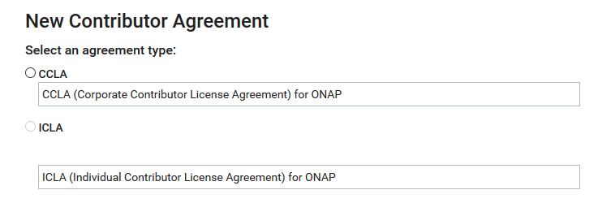

.. This work is licensed under a Creative Commons Attribution 4.0
.. International License. http://creativecommons.org/licenses/by/4.0
.. Copyright 2020 Nokia.

Setting up environment
======================

This chapter is based on the `Git Guide <https://docs.releng.linuxfoundation.org/en/latest/git.html>`_
and the `Gerrit Guide <https://docs.releng.linuxfoundation.org/en/latest/gerrit.html>`_
in the Linux Foundation Releng Documentation.

Prerequisites
~~~~~~~~~~~~~

Before you start, you should have an LFID account (sign up
`here <https://identity.linuxfoundation.org/>`_).

Installing git
~~~~~~~~~~~~~~

1. Install Git.

   For Debian based systems:

   .. code-block:: bash

      sudo apt-get install git -y

   For rpm based systems:

   .. code-block:: bash

      sudo dnf install git -y

   For MacOS systems, install `homebrew <http://brew.sh>`_ and install Git

   .. code-block:: bash

      brew install git

.. note:: For more information on git, see the `Git Guide <https://docs.releng.linuxfoundation.org/en/latest/git.html>`_ in the Linux Foundation Releng Documentation.

Configure Git
~~~~~~~~~~~~~

1. Set the author name or email used to sign off a commit with the following commands.

.. code-block:: bash

   git config --local user.name "Your Name"
   git config --local user.email yourname@example.com

.. note:: Your name and e-mail address (including capitalization) must match the one you entered when creating your LFID account.

2. Optionally, change the Git commit editor to your preferred editor, for example, vim.

.. code-block:: bash

   git config --global core.editor "vim"

Installing git-review
~~~~~~~~~~~~~~~~~~~~~

1. Install git-review.

.. code-block:: bash

    pip install git-review

.. note:: If you don’t have pip installed already, follow the `installation documentation <https://pip.pypa.io/en/stable/installing/#installing-with-get-pip-py>`_ for pip.

Setting up gerrit
~~~~~~~~~~~~~~~~~

Setting SSH keys
----------------

1. Generate SSH keys.

.. code-block:: bash

    ssh-keygen -t rsa

Your public key is now available as .ssh/id_rsa.pub in your home folder.

2. Print the generated key to the terminal and copy it.

.. code-block:: bash

    cat .ssh/id_rsa.pub

3. On the project gerrit page, go to Settings.

.. figure:: https://docs.releng.linuxfoundation.org/en/latest/_images/gerrit-settings.png
   :alt: Settings page for your Gerrit account
   :width: 50 %

4. Click **SSH Public Keys** under **Settings**.

5. Click **Add Key**.

6. In the **Add SSH Public Key** text box, paste the contents of your **id\_rsa.pub** file and then click **Add**.

.. figure:: https://docs.releng.linuxfoundation.org/en/latest/_images/gerrit-ssh-keys.png
    :alt: Adding your SSH key
    :width: 50 %

Setting up CLA as an individual contributor
-------------------------------------------

1. Navigate to **Settings** — the gear icon on the upper right corner, and click **Agreements** from the menu on the left:

.. figure:: https://raw.githubusercontent.com/communitybridge/docs/master/.gitbook/assets/settings-icon.png

.. figure:: https://raw.githubusercontent.com/communitybridge/docs/master/.gitbook/assets/agreements.png

2. Click **New Contributor Agreement**.

.. figure:: https://raw.githubusercontent.com/communitybridge/docs/master/.gitbook/assets/agreement-link.png

3. New Contributor Agreement types appear:

.. figure:: https://raw.githubusercontent.com/communitybridge/docs/master/.gitbook/assets/new-contributor-agreement.png

4. Choose the Individual CLA option.

5. Click the **Please review the agreement link** and then click the message link that appears:

.. figure:: https://raw.githubusercontent.com/communitybridge/docs/master/.gitbook/assets/cla-gerrit-icla-proceed-to-sign-cla.png

6. Sign in to EasyCLA if you are prompted.

7. Select **Company**.

.. note:: To contribute to this project, you must be authorized under a signed Contributor License Agreement. You are contributing on behalf of your work for a company.

If any further prompts appear, follow the steps described at the below links:

- `If a Confirmation of Association with statement appears <https://docs.linuxfoundation.org/docs/communitybridge/easycla/contributors/contribute-to-a-gerrit-project#if-a-confirmation-of-association-with-statement-appears>`_
- `If your company has not signed CCLA <https://docs.linuxfoundation.org/docs/communitybridge/easycla/contributors/contribute-to-a-gerrit-project#if-your-company-has-not-signed-ccla>`_
- `If you are not added to the approved list <https://docs.linuxfoundation.org/docs/communitybridge/easycla/contributors/contribute-to-a-gerrit-project#if-you-are-not-added-to-the-approved-list>`_
- `If Company is not in the list <https://docs.linuxfoundation.org/docs/communitybridge/easycla/contributors/contribute-to-a-gerrit-project#if-company-is-not-in-the-list>`_

8. Complete the form and click **SEND**.

The CCLA manager signs a Corporate CLA and adds you to the approved list.
