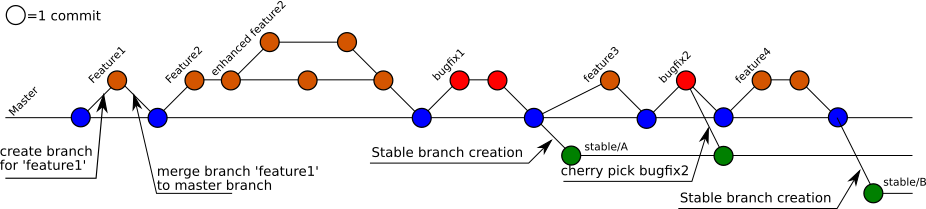

.. This work is licensed under a Creative Commons Attribution 4.0
.. International License. http://creativecommons.org/licenses/by/4.0
.. Copyright 2017 AT&T Intellectual Property.  All rights reserved.
.. Copyright 2022 ONAP

.. _setting-up:

Setting Up
==========

.. warning:: This guide describes the concept of using 'submodules' for
   documentation. Submodules are no longer supported and have been removed.
   This guide is partly outdated and needs an update.
   
   The aggregation of individual project documentation to a coherent set of
   ONAP release documentation is now done in ReadTheDocs using the ONAP 'doc'
   project as its root.

ONAP documentation is stored in git repositories, changes are managed
with gerrit reviews, and published documents generated when there is a
change in any source used to build the documentation.

Authors create source for documents in reStructured Text (RST) that is
rendered to HTML and published on Readthedocs.io.
The developer Wiki or other web sites can reference these rendered
documents directly allowing projects to easily maintain current release
documentation.

Some initial set up is required to connect a project with
the master document structure and enable automated publishing of
changes as summarized in the following diagram and description below
below.

.. seqdiag::
   :height: 700
   :width: 1000

   seqdiag {
     DA [label = "Doc Project\nAuthor/Committer",   color=lightblue];
     DR [label = "Doc Gerrit Repo" ,                     color=pink];
     PR [label = "Other Project\nGerrit Repo",          color=pink ];
     PA [label = "Other Project\nAuthor/Committer", color=lightblue];

     PA  ->   DR [label = "Add project repo as\ngit submodule" ];
     DR  ->   DA [label = "Review & Plan to\nIntegrate Content with\nTocTree Structure" ];
     DR  <--  DA [label = "Vote +2/Merge" ];
     PA  <--  DR [label = "Merge Notification" ];
     PA  ->   PR [label = "Create in project repo\ntop level directory and index.rst" ];
     PR  ->   DA [label = "Add as Reviewer" ];
     PR  <--  DA [label = "Approve and Integrate" ];
     PA  <--  PR [label = "Merge" ];
     }

Setup project repositories
--------------------------
These steps are performed for each project repository that
provides documentation.

1. Set two variables that will be used in the subsequent steps.
Set *reponame* to the project repository you are setting up
just as it appears in the **Project Name** column of
the Gerrit projects page.
Set *lfid* to your Linux Foundation identity that you use to
login to gerrit or for git clone requests over ssh.

.. code-block:: bash

   reponame=
   lfid=

2. Add a directory in the doc project where your
project will be included as a submodule and at least one reference
from the doc project to the documentation index in your repository.
The following sequence will do this over ssh. Please note that the
reference to your project in *repolist.rst* should be considered
temporary and removed when you reference it from more appropriate
place.

.. caution::

   If your access network restricts ssh, you will need to use equivalent
   git commands and HTTP Passwords as described `here <http://wiki.onap.org/x/X4AP>`_.

.. caution::

   Don't replace ../ in *git submodule add* with any relative path on
   your local file system. It refers to the location of your repository
   on the server.

.. code-block:: bash

   git clone ssh://$lfid@gerrit.onap.org:29418/doc
   cd doc
   mkdir -p `dirname docs/submodules/$reponame`
   git submodule add ../$reponame docs/submodules/$reponame.git
   git submodule init docs/submodules/$reponame.git
   git submodule update docs/submodules/$reponame.git

   echo "   $reponame <../submodules/$reponame.git/docs/index>" >> docs/release/repolist.rst

   git add .
   git commit -s
   git review

.. caution::
   Wait for the above change to be merged before any merge to the
   project repository that you have just added as a submodule.
   If the project repository added as submodule changes before the
   doc project merge, git may not automatically update the submodule
   reference on changes and/or the verify job will fail in the step below.

3. Create a docs directory in your repository with
an index.rst file.  The following sequence will complete the minimum
required over ssh.  As you have time to convert or add new content you
can update the index and add files under the docs folder.

.. hint::
   If you have additional content, you can include it by editing the
   index.rst file and/or adding other files before the git commit.
   Check "Templates and Examples" section in :ref:`setting-up` and
   :ref:`converting-to-rst` for more information.

.. code-block:: bash

   git clone ssh://$lfid@gerrit.onap.org:29418/$reponame
   cd $reponame
   mkdir docs
   echo ".. This work is licensed under a Creative Commons Attribution 4.0 International License.

   TODO Add files to toctree and delete this header
   ------------------------------------------------
   .. toctree::
      :maxdepth: 1

   " >  docs/index.rst

   git add .
   git commit -s
   git review

The diagram below illustrates what is accomplished in the setup steps
above from the perspective of a file structure created for a local test,
a jenkins verify job, and/or published release documentation including:

- ONAP gerrit project repositories,

- doc project repository master document index.rst, templates,
  configuration, and other documents

- submodules directory where other project repositories and
  directories/files are referenced

- file structure: directories (ellipses), files(boxes)

- references: directory/files (solid edges), git submodule
  (dotted edges), sphinx toctree (dashed edges)

.. graphviz::

   digraph docstructure {
   size="8,12";
   node [fontname = "helvetica"];
   // Align gerrit repos and docs directories
   {rank=same doc aaf aai reponame repoelipse vnfsdk vvp}
   {rank=same confpy release templates masterindex submodules otherdocdocumentelipse}
   {rank=same releasedocumentindex releaserepolist}

   //Illustrate Gerrit Repos and provide URL/Link for complete repo list
   gerrit [label="gerrit.onap.org/r", href="https://gerrit.onap.org/r/#/admin/projects/" ];
   doc [href="https://gerrit.onap.org/r/gitweb?p=doc.git;a=tree"];
   gerrit -> doc;
   gerrit -> aaf;
   gerrit -> aai;
   gerrit -> reponame;
   gerrit -> repoelipse;
             repoelipse [label=". . . ."];
   gerrit -> vnfsdk;
   gerrit -> vvp;

   //Show example of local reponame instance of component info
   reponame -> reponamedocsdir;
   reponamesm -> reponamedocsdir;
                    reponamedocsdir [label="docs"];
   reponamedocsdir -> repnamedocsdirindex;
                         repnamedocsdirindex [label="index.rst", shape=box];

   //Show detail structure of a portion of doc/docs
   doc  -> docs;
   docs -> confpy;
           confpy [label="conf.py",shape=box];
   docs -> masterindex;
           masterindex [label="Master\nindex.rst", shape=box];
   docs -> release;
   docs -> templates;
   docs -> otherdocdocumentelipse;
           otherdocdocumentelipse [label="...other\ndocuments"];
   docs -> submodules

   masterindex -> releasedocumentindex [style=dashed, label="sphinx\ntoctree\nreference"];

   //Show submodule linkage to docs directory
   submodules -> reponamesm [style=dotted,label="git\nsubmodule\nreference"];
                 reponamesm [label="reponame.git"];

   //Example Release document index that references component info provided in other project repo
   release -> releasedocumentindex;
              releasedocumentindex [label="index.rst", shape=box];
   releasedocumentindex -> releaserepolist [style=dashed, label="sphinx\ntoctree\nreference"];
        releaserepolist  [label="repolist.rst", shape=box];
   release -> releaserepolist;
   releaserepolist -> repnamedocsdirindex [style=dashed, label="sphinx\ntoctree\nreference"];

   }

Branches in the DOC Project
---------------------------

The DOC project 'master' branch aggregates the 'latest' content
from all ONAP project repositories contributing documentation into a
single tree file structure as described in the previous section.  This
branch is continuously integrated and deployed at Read The
Docs as the 'latest' ONAP Documentation by:

* Jenkins doc-verify-rtd and doc-merge-rtd jobs triggered whenever patches on
  contributing repositories contain rst files at or below a top level
  'docs' folder.

* Subscription in the DOC project to changes in submodule repositories.
  These changes appear in the DOC project as commits with title
  'Updated git submodules' when a change to a contributing project
  repository is merged.  No DOC project code review occurs, only a
  submodule repository commit hash is updated to track the head of each
  contributing master branch.

For each ONAP named release the DOC project creates a branch with the
release name.  The timing of the release branch is determined by
work needed in the DOC project to prepare the release branch and the
amount of change unrelated to the release in the master branch.
For example contributing projects that create named release branches
early to begin work on the next release and/or contributing projects
to the master that are not yet part of the named release would result
in an earlier named release branch to cleanly separate work to stabilize
a release from other changes in the master branch.

A named release branch is integrated and deployed at Read The Docs
as the 'named release' by aggregating content from contributing
project repositories.  A contributing project repository can
choose one of the following for the 'named release' branch:

* Remove the contributing project repository submodule and RST
  references when not part of the named release.

* Provide a commit hash or tag for the contributing project master
  branch to be used for the life of the release branch or until a
  request is submitted to change the commit hash or tag.

* Provide the commit hash for the head of a named release branch
  created in the contributing project repository.  This option
  may be appropriate if frequent changes are expected over the
  life of the named release and work the same way as the continuous
  integration and deployment described for the master branch.

The decision on option for each contributing project repository
can be made or changed before the final release is approved.  The
amount of change and expected differences between master and a
named release branch for each repository should drive the choice of
option and timing.

About GIT branches
------------------

GIT is a powerful tool allowing many actions, but without respecting some rules
the GIT structure can be quickly hard to maintain.

Here are some conventions about GIT branches:

  - ALWAYS create a local branch to edit or create any file. This local branch
    will be considered as a topic in Gerrit and allow contributors to
    work at the same time on the same project.

  - 1 feature = 1 branch. In the case of documentation, a new chapter
    or page about a new code feature can be considered as a 'doc feature'

  - 1 bug = 1 branch. In the case of documentation, a correction on an
    existing sentence can be considered as a 'doc bug'

  - the master branch is considered as "unstable", containing new features that
    will converge to a stable situation for the release date.

The day of the release, the repository owner will create a new branch to
fix the code and documentation. This will represent the 'stable' code of the
release. In this context:

  - NEVER push a new feature on a stable branch

  - Only bug correction are authorized on a stable branch using
    cherry pick method

