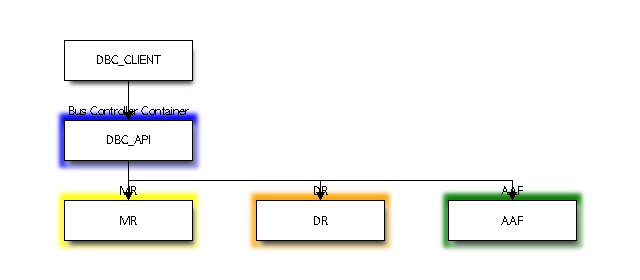
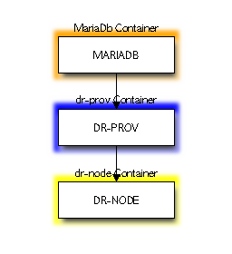
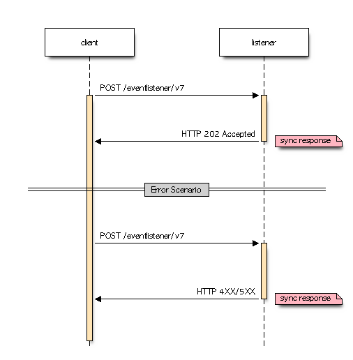
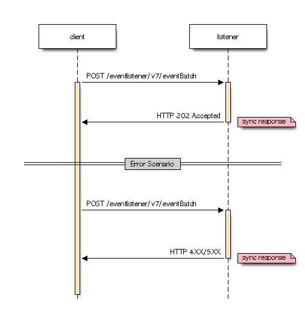

.. This work is licensed under a Creative Commons Attribution 4.0
.. International License. http://creativecommons.org/licenses/by/4.0
.. Copyright 2026 The Linux Foundation

.. _tsc-blockdiag-mermaid-migration-report:

=======================================================================
blockdiag/seqdiag to Mermaid Diagram Migration
=======================================================================

:Author: Matthew Watkins (Linux Foundation Release Engineering)
:References: :ref:`diagrams-blockdiag-to-mermaid`

.. contents:: Table of Contents
   :depth: 3
   :local:

Overview
========

All ONAP documentation repositories that contained live ``.. blockdiag::``
or ``.. seqdiag::`` diagram directives have been identified, and their
diagrams converted to ``.. mermaid::`` syntax.  **9 diagrams** across
**5 repositories** were migrated.

This migration removed the dependency on the abandoned
``sphinxcontrib-blockdiag`` and ``sphinxcontrib-seqdiag`` Python packages,
which are incompatible with both **Pillow >= 10** and **Python >= 3.12**.
With this work complete, all ONAP documentation builds cleanly on
Python 3.13 without the ``Pillow<10`` workaround that was previously
required.

The approach described here is applicable to any Sphinx-based documentation
project that still depends on blockdiag or seqdiag and needs to move to a
modern, actively maintained diagramming solution.

Background
==========

Why migrate?
------------

The ``sphinxcontrib-blockdiag`` and ``sphinxcontrib-seqdiag`` Sphinx
extensions have been abandoned by their upstream maintainers.  They suffer
from two critical compatibility failures:

1. **Python 3.12+ incompatibility** --- ``blockdiag 3.0.0`` uses
   ``ast.NameConstant``, which was removed in Python 3.12.  Any import
   of the module crashes immediately.

2. **Pillow 10+ incompatibility** --- ``blockdiag 3.0.0`` calls
   ``ImageDraw.textsize()``, which was deprecated in Pillow 9.2.0 and
   **removed in Pillow 10.0**.  Documentation builds that pin a modern
   Pillow version will fail with::

       AttributeError: 'ImageDraw' object has no attribute 'textsize'

Why Mermaid?
------------

``sphinxcontrib-mermaid`` was selected over alternatives for the following
reasons:

.. list-table::
   :header-rows: 1
   :widths: 25 15 15 15 15 15

   * - Criterion
     - sphinxcontrib-mermaid
     - sphinxcontrib-plantuml
     - sphinx.ext.graphviz
     - blockdiag
     - seqdiag
   * - Actively maintained
     - ✅ Yes
     - ✅ Yes
     - ✅ Built-in
     - ❌ Abandoned
     - ❌ Abandoned
   * - Python 3.12+ compatible
     - ✅ Yes
     - ✅ Yes
     - ✅ Yes
     - ❌ No
     - ❌ No
   * - Pillow 10+ compatible
     - ✅ N/A (JS-rendered)
     - ✅ N/A (Java)
     - ✅ N/A (native)
     - ❌ No
     - ❌ No
   * - No server-side binary
     - ✅ CDN JS
     - ❌ Requires Java + PlantUML jar
     - ❌ Requires ``dot``
     - ❌ Requires Pillow + fonts
     - ❌ Requires Pillow + fonts
   * - Block diagrams
     - ✅ ``graph``
     - ✅ Yes
     - ✅ ``digraph``
     - ✅ Yes
     - ❌ No
   * - Sequence diagrams
     - ✅ ``sequenceDiagram``
     - ✅ Yes
     - ❌ No
     - ❌ No
     - ✅ Yes
   * - ReadTheDocs compatible
     - ✅ Yes
     - ⚠️ Needs Java in build
     - ⚠️ Needs graphviz in build
     - ❌ Broken
     - ❌ Broken
   * - GitHub rendering
     - ✅ Native (``mermaid`` fences)
     - ❌ No
     - ❌ No
     - ❌ No
     - ❌ No

Migration scope
===============

The table below summarises every repository that required a content or
configuration change as part of this migration.

.. list-table::
   :header-rows: 1
   :widths: 25 15 10 50

   * - Repository
     - Diagram type
     - Count
     - Description
   * - ``dmaap/buscontroller``
     - blockdiag
     - 1
     - Bus Controller API connections to MR, DR, AAF
   * - ``dmaap/datarouter``
     - blockdiag
     - 1
     - DR-PROV, DR-NODE, MariaDB container connectivity
   * - ``sdc``
     - graphviz
     - 2
     - Already used graphviz; config-only cleanup required
   * - ``sdnc/oam``
     - N/A (config only)
     - 0
     - blockdiag/seqdiag loaded in ``conf.py`` but no live directives
   * - ``vnfrqts/requirements``
     - seqdiag
     - 4
     - VES v7.1 and v7.2 call-flow diagrams

.. list-table::
   :header-rows: 1
   :widths: 60 15

   * - Metric
     - Count
   * - Repositories requiring content migration
     - 3
   * - Repositories requiring config-only cleanup
     - 2
   * - ``.. blockdiag::`` directives rewritten
     - 2
   * - ``.. seqdiag::`` directives rewritten
     - 4
   * - ``.. graphviz::`` diagrams (already migrated, verified)
     - 2
   * - **Total diagrams migrated or verified**
     - **9**

Before / after diagrams
========================

This section shows the original blockdiag/seqdiag rendering alongside the
replacement Mermaid diagram for each migration performed.

dmaap/buscontroller --- Bus Controller Architecture
----------------------------------------------------

**Before** (blockdiag):

**After** (Mermaid):

.. mermaid::

   graph TD
       DBC_CLIENT["DBC_CLIENT"] --> DBC_API["DBC_API"]
       DBC_API --> MR["MR"]
       DBC_API --> DR["DR"]
       DBC_API --> AAF["AAF"]

       subgraph "Bus Controller Container"
           DBC_API
       end

       subgraph "MR"
           MR
       end

       subgraph "DR"
           DR
       end

       subgraph "AAF"
           AAF
       end

       classDef blueStyle fill:#33f,stroke:#333,color:#fff
       classDef yellowStyle fill:#ff0,stroke:#333,color:#000
       classDef orangeStyle fill:#f90,stroke:#333,color:#000
       classDef greenStyle fill:#0c0,stroke:#333,color:#000

       class DBC_API blueStyle
       class MR yellowStyle
       class DR orangeStyle
       class AAF greenStyle

dmaap/datarouter --- Data Router Delivery
------------------------------------------

**Before** (blockdiag):

**After** (Mermaid):

.. mermaid::

   graph TD
       MARIADB["MARIADB"] --> DR_PROV["DR-PROV"]
       DR_PROV --> DR_NODE["DR-NODE"]

       subgraph "dr-prov Container"
           DR_PROV
       end

       subgraph "dr-node Container"
           DR_NODE
       end

       subgraph "MariaDb Container"
           MARIADB
       end

       classDef blueStyle fill:#33f,stroke:#333,color:#fff
       classDef yellowStyle fill:#ff0,stroke:#333,color:#000
       classDef orangeStyle fill:#f90,stroke:#333,color:#000

       class DR_PROV blueStyle
       class DR_NODE yellowStyle
       class MARIADB orangeStyle

vnfrqts/requirements --- VES publishAnyEvent Call Flow
------------------------------------------------------

This pattern is identical in VES 7.1 (``ves7_1spec.rst``) and VES 7.2
(``ves_event_listener_7_2.rst``).

**Before** (seqdiag):

**After** (Mermaid):

.. mermaid::
   :caption: ``publishAnyEvent`` Call Flow

   sequenceDiagram
       participant client
       participant listener

       client->>listener: POST /eventlistener/v7
       listener-->>client: HTTP 202 Accepted
       Note right of listener: sync response

       rect rgb(255, 230, 230)
       Note over client, listener: Error Scenario
       client->>listener: POST /eventlistener/v7
       listener-->>client: HTTP 4XX/5XX
       Note right of listener: sync response
       end

vnfrqts/requirements --- VES publishEventBatch Call Flow
--------------------------------------------------------

This pattern is identical in VES 7.1 (``ves7_1spec.rst``) and VES 7.2
(``ves_event_listener_7_2.rst``).

**Before** (seqdiag):

**After** (Mermaid):

.. mermaid::
   :caption: ``publishEventBatch`` Call Flow

   sequenceDiagram
       participant client
       participant listener

       rect rgb(232, 245, 233)
       Note over client, listener: Success Scenario
       client->>listener: POST /eventlistener/v7/eventBatch
       listener-->>client: HTTP 202 Accepted
       Note right of listener: sync response
       end

       rect rgb(255, 235, 238)
       Note over client, listener: Error Scenario
       client->>listener: POST /eventlistener/v7/eventBatch
       listener-->>client: HTTP 4XX/5XX
       Note right of listener: sync response
       end

Mermaid syntax pitfalls
=======================

Several issues were encountered during the conversion that are worth
noting for anyone performing a similar migration:

Node identifiers with hyphens
-----------------------------

Mermaid interprets bare hyphens in node identifiers as minus operators.
A node written as ``DR-PROV`` will cause a parse error.  Use an explicit
label to work around this::

    DR_PROV["DR-PROV"]

The internal identifier uses underscores, while the displayed label
preserves the original hyphenated name.

Reserved ``classDef`` names
---------------------------

Mermaid reserves certain colour keywords.  Defining a class called
``blue``, ``green``, or ``orange`` can conflict with the parser in some
Mermaid versions.  Use descriptive suffixed names instead::

    classDef blueStyle fill:#33f,stroke:#333,color:#fff
    class MY_NODE blueStyle

Applying the migration to other projects
=========================================

The steps below summarise the process used for ONAP and can be followed
by any Sphinx-based documentation project that depends on blockdiag or
seqdiag.

1. **Audit repositories** --- search for live ``.. blockdiag::`` and
   ``.. seqdiag::`` directives across all documentation sources.

2. **Update** ``docs/conf.py`` --- remove ``sphinxcontrib.blockdiag`` and
   ``sphinxcontrib.seqdiag`` from the ``extensions`` list; add
   ``sphinxcontrib.mermaid``.

3. **Update** ``requirements-docs.txt`` --- remove the blockdiag/seqdiag
   packages and add ``sphinxcontrib-mermaid``.

4. **Remove Pillow workarounds** --- delete any ``Pillow<10`` pins from
   ``tox.ini`` or constraint files that were added solely to keep
   blockdiag functioning.

5. **Convert each diagram** --- rewrite every ``.. blockdiag::`` directive
   as a ``.. mermaid:: graph`` and every ``.. seqdiag::`` directive as a
   ``.. mermaid:: sequenceDiagram``.  See :ref:`diagrams-blockdiag-to-mermaid`
   for a full syntax-mapping guide with worked examples.

6. **Verify the build** --- run ``tox -e docs`` with the target Python
   version (3.13 or later) and confirm that ``sphinx-build -W``
   (warnings-as-errors) passes and all diagrams render correctly.

7. **Clean up config-only repositories** --- any repository that loads the
   blockdiag/seqdiag extensions without using any directives needs only
   the configuration changes from steps 2--4.

Build verification
==================

All 5 repositories were built with ``tox -e docs`` using Python 3.13 and
``sphinxcontrib-mermaid``:

.. list-table::
   :header-rows: 1
   :widths: 25 15 15 45

   * - Repository
     - Python
     - Build result
     - Notes
   * - ``dmaap/buscontroller``
     - 3.13
     - ✅ OK
     - ``sphinx-build -W`` (warnings-as-errors) passes
   * - ``dmaap/datarouter``
     - 3.13
     - ✅ OK
     - ``sphinx-build -W`` passes
   * - ``sdc``
     - 3.13
     - ✅ OK
     - ``sphinx-build -W`` passes (requires ``graphviz`` binary)
   * - ``sdnc/oam``
     - 3.13
     - ✅ OK
     - Full build including OpenAPI spec rendering
   * - ``vnfrqts/requirements``
     - 3.13
     - ✅ OK
     - All 4 Mermaid ``sequenceDiagram`` blocks render correctly

Remaining work
==============

Config-only cleanup (32 repositories)
--------------------------------------

In addition to the 5 repositories above, **32 further repositories** load
``sphinxcontrib.blockdiag`` and ``sphinxcontrib.seqdiag`` in their
``docs/conf.py`` and declare them in ``docs/requirements-docs.txt`` without
ever using a directive.  Those repositories require only:

1. Remove ``sphinxcontrib-blockdiag`` and ``sphinxcontrib-seqdiag`` from
   ``docs/requirements-docs.txt``
2. Remove ``'sphinxcontrib.blockdiag'`` and ``'sphinxcontrib.seqdiag'``
   from the ``extensions`` list in ``docs/conf.py``
3. Optionally add ``sphinxcontrib-mermaid`` if future diagrams are planned
4. Remove any ``Pillow<10`` workaround from ``tox.ini``

These are mechanical changes that carry no risk of content regression and
can be batched into a single bulk-update topic.

Update central doc repository constraints
------------------------------------------

Once all downstream repositories have been cleaned up, the central
``doc`` repository should:

1. Remove ``sphinxcontrib-blockdiag`` and ``sphinxcontrib-seqdiag`` from
   ``docs/requirements-docs.txt``
2. Remove them from ``etc/upper-constraints.onap.txt``
3. Add ``sphinxcontrib-mermaid`` to both files (if not already present)