.. This work is licensed under a Creative Commons Attribution 4.0
.. International License.  http://creativecommons.org/licenses/by/4.0
.. Copyright ONAP Community

|image2017-10-27_15-56-53.png|

ONAP Portal for Administrators
==============================

General
-------

The ONAP Portal platform integrates different ONAP applications into a
central core. The Portal platform provides common management services
and connectivity, while the applications run separately.

From the Portal, users access applications. Administrators onboard and
manage applications and widgets, and manage user access.

The Portal SDK for application developers includes bundled tools,
technologies, and built-in capabilities such as services, APIs, and UI
controls. Existing applications can migrate to the Portal with the
provided APIs and libraries. See `ONAP Portal SDK
:ref:`Documentation<onap-portal:master_index>`.

Access
------

Access the ONAP Portal using Mozilla Firefox or Google Chrome(win/mac)
at the provided URL. For example: `https://<hostname:port>/ONAPPORTAL/login.html`.

Access the ONAP portal via the 8989 LoadBalancer documented
:ref:` here<onap-oom:onap-on-kubernetes-with-rancher>`

From the Portal, users access applications directly or by function using
the `Manage menu`.

See also:

-  `Applications in the Portal`

-  `Application Catalog`

Roles
-----

The Portal displays different menus for the following functions:

-  Users

-  Portal Admins

-  Application Admins

-  Governor

-  Operator

Each application also defines a distinct set of user roles. See *Users* .

Admin Tasks
-----------

From the ONAP Portal, administrators:

-  access the same functionality accessible to users
   (see :ref:`ONAP Portal for users<onap_portal_users>`)

-  manage users and application admins

-  onboard applications and widgets

-  edit the functional menu

Administrators see the following menu when accessing the ONAP Portal:

|image2017-10-27_14-14-37.png|

Left menu descriptions:

Admins Menu
-----------

Use the Admins section to:

|image2017-10-27_14-17-0.png|

View or search for application admins
~~~~~~~~~~~~~~~~~~~~~~~~~~~~~~~~~~~~~

#. From the ONAP Portal Home, click Admins in the left menu.

#. View or search for admins:

-  The Admins table shows all admins in alphabetical order by first
   name. Select an application from the dropdown list to view admins for
   a single application.

-  Search for an admin by entering a full or partial search term in the
   search box. Search by first name, last name, or user ID. Searches are
   not case-sensitive.

-  Filter further using a combination of the applications dropdown and
   the search box.

Add an application admin
~~~~~~~~~~~~~~~~~~~~~~~~

#. From the ONAP Portal Home, click Admins in the left menu.

#. Click Add Admin.The New Admin window displays.

#. Enter any combination of the user's first name, last name in the
   search field and click Search.Note: A minimum of three characters is
   required to search.

#. Select the user from the results and click Next.

|image2017-10-27_14-23-38.png|

#. Select an application from the dropdown list.

|image2017-10-27_14-26-38.png|

#. Click Save.

The user can administer and manage users for the applications listed in
the Admins table.

Modify application admin privileges
~~~~~~~~~~~~~~~~~~~~~~~~~~~~~~~~~~~

#. From the ONAP Portal Home, click Admins in the left menu.

#. Search for an admin and then select one by clicking the row in the
   Admins table (see `View or search for application admins`.

#. Modify the admin's application privileges:

-  Add an application to the Administrates list by selecting it from the
   dropdown list

-  Delete an application from the Administrates list by clicking the
   trash icon

|image2017-10-27_14-30-33.png| .

#. Click Save.

Delete an application admin
~~~~~~~~~~~~~~~~~~~~~~~~~~~

To delete an application admin completely, first remove access for each
application.

#. From the ONAP Portal Home, click Admins in the left menu.

#. Search for a name and then select one by clicking the row in the
   Admins table (see `View or search for application admins`.

#. Click the trash icon

|image2017-10-27_14-30-51.png|  and click OK to confirm for each
application in the Administrates list.

#. Click Save.

The application Admin is removed from the table. The Admin is only
removed from the Admins table when they have no application access.

Users Menu
----------

Use the Users section to:

|image2017-10-27_14-35-46.png|

View or search for users
~~~~~~~~~~~~~~~~~~~~~~~~

#. From ONAP Portal Home, click Users in the left menu.

#. Select an application from the dropdown list.

#. Enter a full or partial first name, last, name, user ID, or role in
   the search box; or click the column header to sort that column in
   alphabetical or reverse alphabetical order.

Add a user
~~~~~~~~~~

Portal admins can add or manage users for any application. Application
admins can only add and manage users for their specific applications.

#. From ONAP Portal Home, click Users in the left menu.

#. Click Add User.

#. The New User window displays.

#. Search for or add a new user:

-  To search for a user, enter the user's complete first name, last
   name, or user ID and click search.

-  To add a new user, click New User, fill in the user details, and
   click Add New User. The new user appears in the results list.

#. Select the user from the results and click Next.

|image2017-10-27_14-41-13.png|

#. Select a role from the dropdown lists for each application required
   by the user.

#. Click Save.

The user can access the applications with the roles listed in the Users
table.

Modify users and roles
~~~~~~~~~~~~~~~~~~~~~~

#. From ONAP Portal Home, click Users in the left menu.

#. Select an application from the dropdown, search for a user, and
   select one by clicking the row in the Users table. The user's access
   and roles display.

|image2017-10-27_15-21-13.png|

#. Modify the user's role for each application:

-  Add or change a user role by selecting or clearing the role from the
   dropdown list.

-  Remove all the user's roles for an application by clicking the trash
   icon

|ep_trash_icon.png| .

#. Click Save.

Delete a user
~~~~~~~~~~~~~

To delete a user completely, remove access for each application.

#. From the ONAP Portal Home, click Users in the left menu.

#. Select an application from the dropdown, search for a user, then
   click the row in the Users table to select (see `View or search for
   users`.
   The user's access and roles display.

#. Click the trash icon

|ep_trash_icon.png|  beside an application and click OK to confirm.

#. Click Save.

The User is removed from the applications. The User is only removed from
the Users table when they have no application access.

Portal Admins
-------------

Use the Portal Admins section to:

|image2017-10-27_15-24-5.png|

View or search for Portal Admins
~~~~~~~~~~~~~~~~~~~~~~~~~~~~~~~~

#. From ONAP Portal Home, click Portal Admins in the left menu.

#. Enter a full or partial first name, last, name, or ATTUID in the
   search box, or click the sorting arrows in any column to sort that
   column in alphabetical or reverse alphabetical order.

Add a Portal Admin
~~~~~~~~~~~~~~~~~~

Only Portal Admins can add or delete other Portal Admins.

#. From the ONAP Portal Home, click Portal Admins in the left menu.

#. Click Add Portal Admin. The Add New Portal Admin window displays.

#. Search for or add a new user:

-  To search for a user, enter the user's complete first name, last
   name, or user ID and click search.

-  To add a new user, click New User, fill in the user details, and
   click Add New User. The new user appears in the results list.

#. Select the user from the results and click Save.

The user is listed in the Portal Admins table and can manage users and
admins.

Delete a Portal Admin
~~~~~~~~~~~~~~~~~~~~~

Only Portal Admins can add or delete other Portal Admins.

#. From ONAP Portal Home, click Portal Admins in the left menu.

#. Search for or scroll to a name in the Portal Admins table and click
   the trash icon in the Delete column.

#. Click OK to confirm.

The Portal Admin is removed from the table.

Application Onboarding
----------------------

Use the Application Onboarding section to:

|image2017-10-27_15-27-1.png|

Add an application to the Portal
~~~~~~~~~~~~~~~~~~~~~~~~~~~~~~~~~~~~~~

#. From the ONAP Portal Home, click Application Onboarding in the left
   menu.

#. Click Add App.

#. The Application Details window displays.

|image2017-10-27_15-28-31.png|

4. Fill out the fields as described in the table:

+---------------------------+------------------------------------------+
| **Hyperlink only          | Select to add an application with a URL  |
| application**             | only.                                    |
+===========================+==========================================+
| **Application name**      | Application name to display in the       |
|                           | Portal.                                  |
+---------------------------+------------------------------------------+
| **URL**                   | Application landing page for             |
|                           | hyperlink-only applications.             |
+---------------------------+------------------------------------------+
| **REST API URL**          | [Optional] The endpoint for RESTful API  |
|                           | calls.                                   |
+---------------------------+------------------------------------------+
| **Username**              | The username for the RESTful API calls.  |
|                           | Default = Default                        |
+---------------------------+------------------------------------------+
| **Password**              | Password for the RESTful API call.       |
|                           | Default = AppPassword!1                  |
+---------------------------+------------------------------------------+
| **Name Space**            | Namespace value when Application         |
|                           | registered in AAF.                       |
+---------------------------+------------------------------------------+
| **Communication Inbox**   | Do not fill out. Populated by the        |
|                           | application.                             |
+---------------------------+------------------------------------------+
| **Communication Key**     | Do not fill out. Populated by the        |
|                           | application.                             |
+---------------------------+------------------------------------------+
| **Communication Secret**  | Do not fill out. Populated by the        |
|                           | application.                             |
+---------------------------+------------------------------------------+
| **Upload image**          | Click Browse to select the application   |
|                           | image to display in the ONAP Portal.     |
+---------------------------+------------------------------------------+
| **Allow guest access**    | Select to allow access for users not     |
|                           | listed as Users or Admins.               |
+---------------------------+------------------------------------------+
| **Active**                | Select to make the application active.   |
+---------------------------+------------------------------------------+
| **Centralized**           | Indicate this application is using AAF   |
|                           | for centralized role management.         |
+---------------------------+------------------------------------------+

5. Click Save.

The application appears in the Applications section and in the
Application Onboarding table. The Portal Admin receives an email with
Communications details.

6. Add the application URL to the appropriate Manage menu items:

#. Click Edit Functional Menu in the left menu.

#. Expand the Manage menu to find the correct items.

#. Right-click an item and select Edit.

|ep_editmenu_edit.png|

#. In the URL field, enter the server URL of the new application and
   click Save.

Collect and forward application communication details
~~~~~~~~~~~~~~~~~~~~~~~~~~~~~~~~~~~~~~~~~~~~~~~~~~~~~

The Portal administrator forwards communications details and a list of
servers to the application developer. The application developer adds the
details to the portal-properties file located in \\<app web
directory>/WEB-INF/classes.

**Prerequisites:** *Add an application to the Portal*

#. Collect the following details and send them to the application
   developer.

+----------------------------------------+-----------------------------+
| Key-value pair                         | Obtain from                 |
+========================================+=============================+
| redirect_url = ** /**                  | The redirect URL defined    |
| /process_csp                           | as ** /** /process_csp.     |
+----------------------------------------+-----------------------------+

#. Request that the application developer:

#. Add the key-value pairs above to the portal.properties file located
   in ** /WEB-INF/classes.

#. Add the key-value pair shared_context_rest_url = **  to the
   system.properties file located in the ** /WEB-INF/conf directory.

#. Restart the application

Delete an application from the Portal
~~~~~~~~~~~~~~~~~~~~~~~~~~~~~~~~~~~~~

#. From the ONAP Portal Home, click Widget Onboarding in the left menu.

#. Search for or scroll to an application in the table and click the
   trash icon

|ep_trash_icon.png|  in the Delete column.

#. Click OK to confirm.

The application is removed from the Portal.

Widget Onboarding
-----------------

Use the Widget Onboarding section to:

|image2017-10-27_15-51-18.png|

Add an application widget to the Portal
~~~~~~~~~~~~~~~~~~~~~~~~~~~~~~~~~~~~~~~

#. From ONAP Portal Home, click Widget Onboarding in the left menu.

#. Click Add Widget.

The Widget Details window displays.

|image2017-10-27_15-52-28.png|

3. Fill out the fields as described in the following table.

+------------------+---------------------------------------------------+
| **Application    | Select from a dropdown list of onboarded          |
| Name**           | applications.                                     |
+==================+===================================================+
| **Widget Name**  | The name for the widget that appears in the       |
|                  | Widgets section of the Portal.                    |
+------------------+---------------------------------------------------+
| **Width,         | Automatically populated fields.                   |
| Height**         |                                                   |
+------------------+---------------------------------------------------+
| **URL**          | Widget landing page.                              |
+------------------+---------------------------------------------------+

4. Click Save.

The widget appears in the Widgets section of the Portal. Users with
permissions to the widget's application can access the widget.

Remove a widget from the Portal
~~~~~~~~~~~~~~~~~~~~~~~~~~~~~~~

#. From ONAP Portal Home, click Widget Onboarding in the left menu.

#. Search for or scroll to a widget in the table and click the trash
   icon

|ep_trash_icon.png|  in the Delete column.

#. Click OK to confirm.

The widget is removed from the Portal.

Edit Functional Menu
--------------------

Edit or rearrange the ONAP Portal functional menus in the Edit
Functional Menu section.

|image2017-10-31_11-12-22.png|

ONAP Portal menus have 4 levels. The menu levels correspond to how and
where the menu items appear in the Portal UI.

|image2017-10-31_10-49-27.png|

Use the Edit Functional Menu section to:

Add a menu item
~~~~~~~~~~~~~~~

#. From ONAP Portal Home, click Edit Functional Menu in the left menu.

#. Use the arrows to expand the menu, then right-click on the intended
   parent menu item and select Add.

|image2017-10-31_11-16-14.png|

#. Enter a title for the menu item, then enter a URL or select the
   application to link to from the App dropdown list.

#. Click Save.

#. Click Regenerate Menu to finalize the changes and update the menu.

Edit a menu item
~~~~~~~~~~~~~~~~

#. From the ONAP Portal Home, click Edit Functional Menu in the left
   menu.

#. Use the arrows to expand the menu, then right-click on the menu item
   and select Edit.

#. Make changes to the title, URL, or application and click Continue.

#. Click Regenerate Menu to finalize the changes and update the menu.

|image2017-10-31_11-21-2.png|

Move a menu item
~~~~~~~~~~~~~~~~

#. From ONAP Portal Home, click Edit Functional Menu in the left menu.

#. Use the arrows to expand the menu.

#. Click and drag a menu item to move it.A blue line appears to indicate
   where the menu item will move. A blue box indicates the moved item
   will be a child of that item.

|image2017-10-31_11-23-15.png|

#. Click Regenerate Menu to finalize the changes and update the menu.

Delete a menu item
~~~~~~~~~~~~~~~~~~

A menu item with children cannot be deleted. Delete all child menu items
first.

#. From ONAP Portal Home, click Edit Functional Menu in the left menu.

#. Use the arrows to expand the menu, then right-click on the menu item
   and select Delete.

#. Click OK

#. Click Regenerate Menu to finalize the changes and update the menu.

Portal Microservices Onboarding
-------------------------------

From left menu Microservice Onboarding section:

|image2017-10-31_11-29-12.png|

Add a microservice widget to the Portal
~~~~~~~~~~~~~~~~~~~~~~~~~~~~~~~~~~~~~~~

#. From ONAP Portal Home, click Microservice Onboarding in the left
   menu.

#. Click Add Microservice.

The Microservice Details window displays.

|image2017-10-31_11-34-8.png|

3. Fill out the fields as described in the following table.

+---------------------------------+------------------------------------+
| **Field**                       | Explanation                        |
+=================================+====================================+
| **Microservice Name**           | The name for the microservice that |
|                                 | appears in the Microservice        |
|                                 | section of the Portal.             |
+---------------------------------+------------------------------------+
| **Microservice Description**    | Describe what the microservice     |
|                                 | does                               |
+---------------------------------+------------------------------------+
| **Application Name**            | Select from a dropdown list of     |
|                                 | onboarded applications.            |
+---------------------------------+------------------------------------+
| **Microservice End Point URL**  | Enter Microservice URL             |
+---------------------------------+------------------------------------+
| **Security Type**               | Select from dropdown for           |
|                                 | Authentication Method              |
+---------------------------------+------------------------------------+
| **Add User Parameter**          | Enter parameter key and value if   |
|                                 | applicable to microservice end     |
|                                 | point URL                          |
+---------------------------------+------------------------------------+
| **Active**                      | Active check/uncheck to show/hide  |
|                                 | the microservice                   |
+---------------------------------+------------------------------------+

4. Click Save.

The microservice appears in the Microservices section of the Portal.
Users with permissions to the Microservice application can access the
microservice.

Remove a microservice from the Portal
~~~~~~~~~~~~~~~~~~~~~~~~~~~~~~~~~~~~~

#. From ONAP Portal Home, click Microservice Onboarding in the left
   menu.

#. Search for or scroll to a microservice in the table and click the
   trash icon

|ep_trash_icon.png|  in the Delete column.

#. Click OK to confirm.

The mocroservice is removed from the Portal.

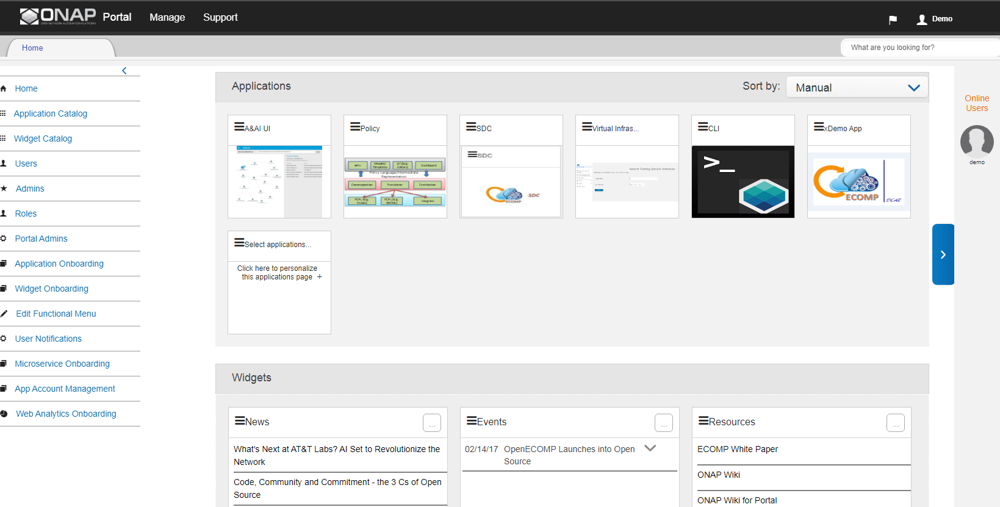
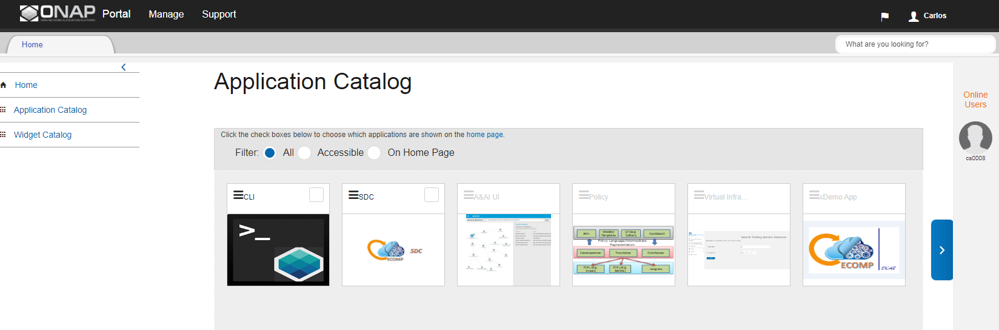
.. |image2017-10-27_14-14-37.png| image:: attachments/16004284_image2017-10-27_14-14-37.png
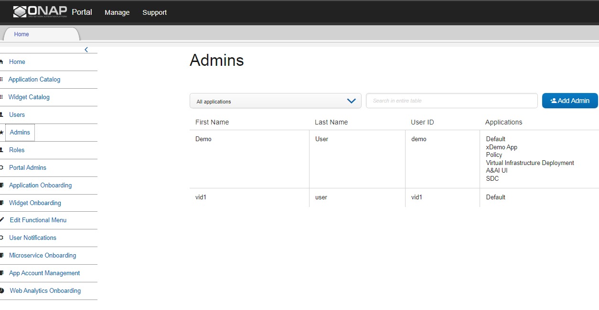
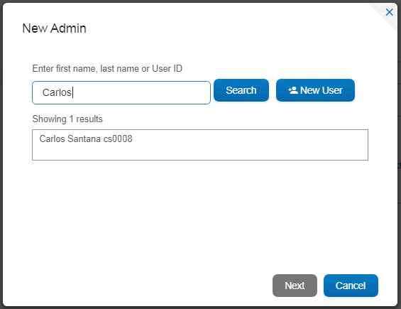
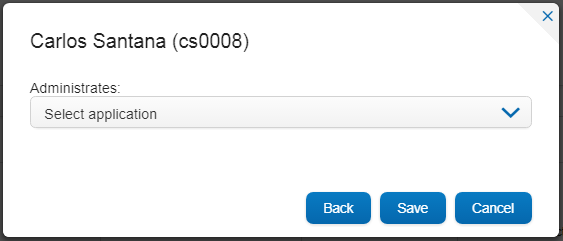

.. |image2017-10-27_14-30-51.png| image:: attachments/16004303_image2017-10-27_14-30-51.png
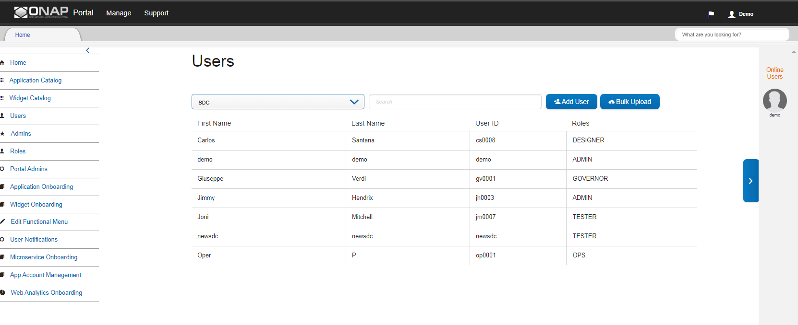
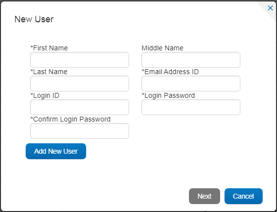
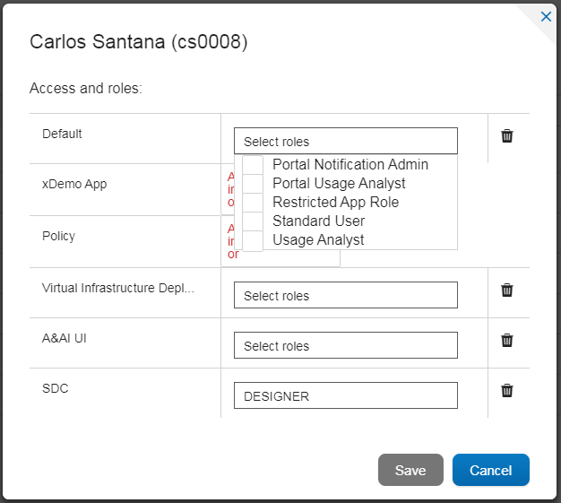
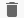
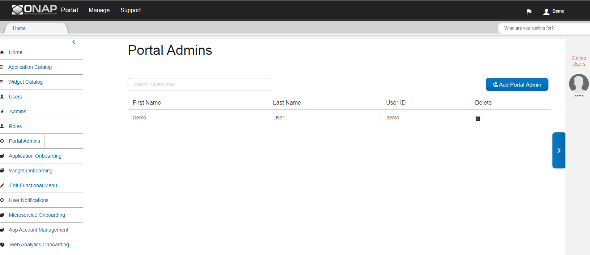
.. |image2017-10-27_15-27-1.png| image:: attachments/16004327_image2017-10-27_15-27-1.png
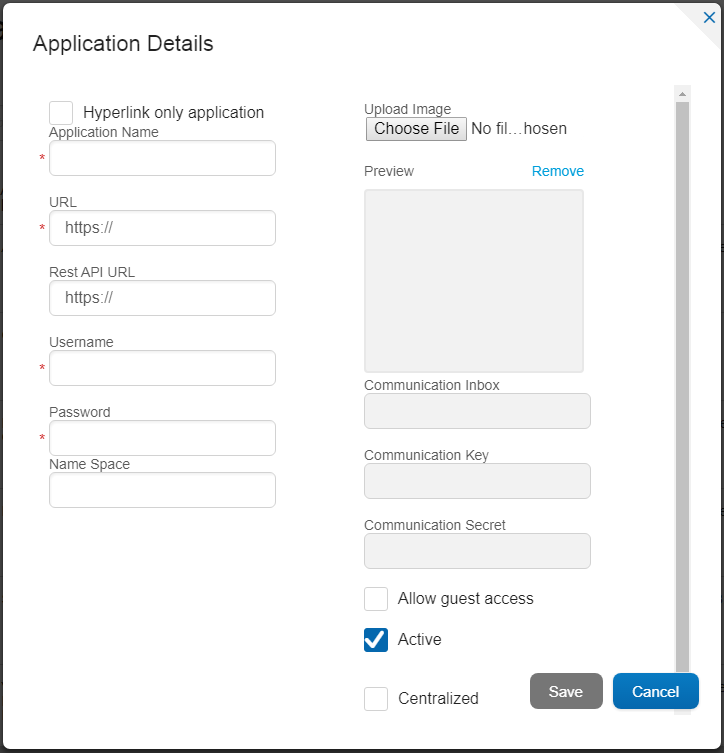
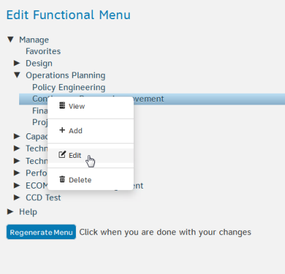
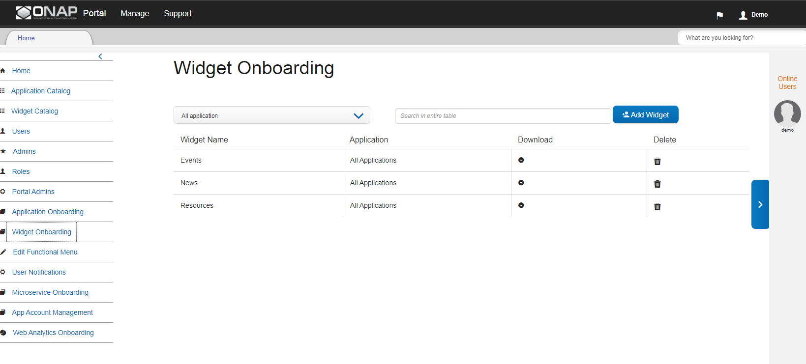
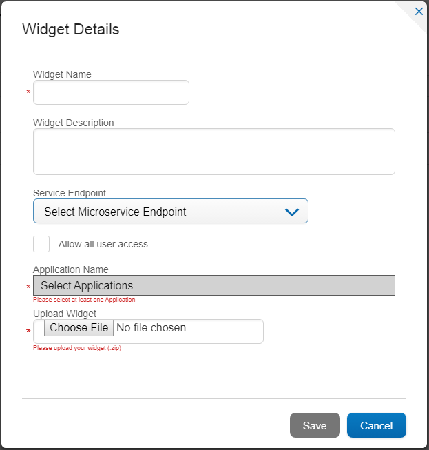
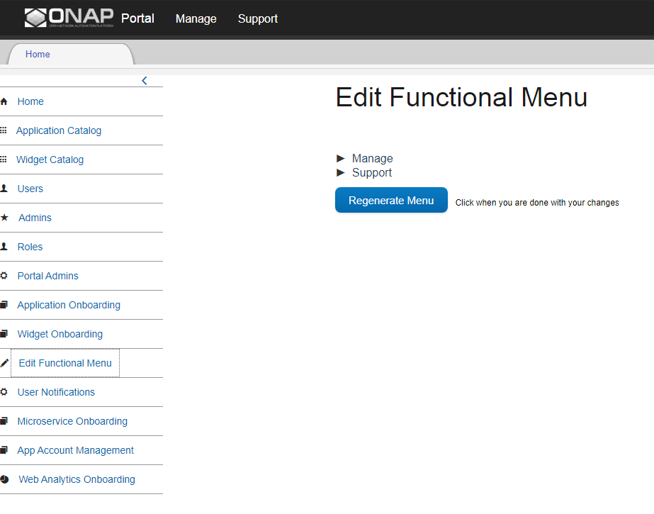
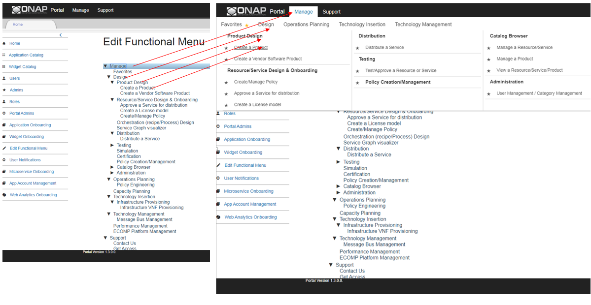
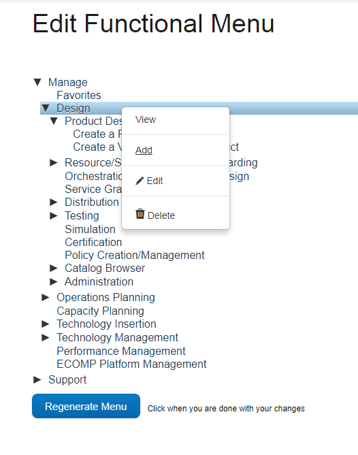
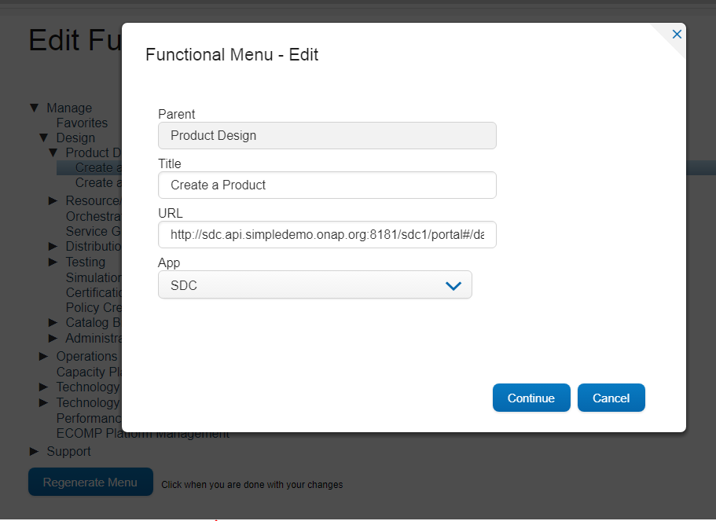
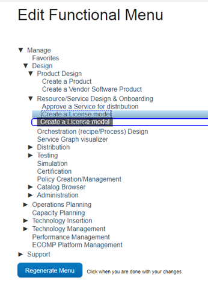
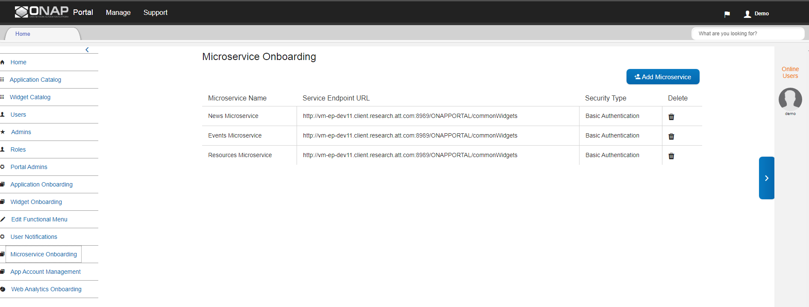
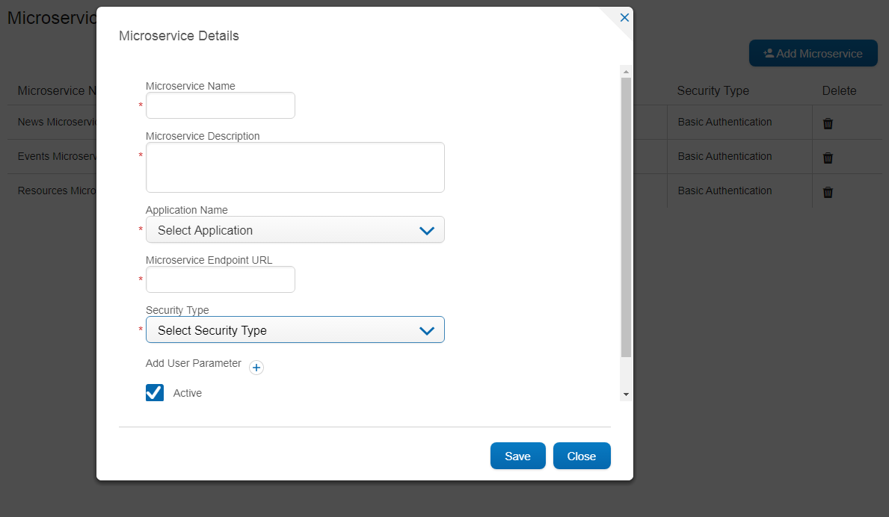
