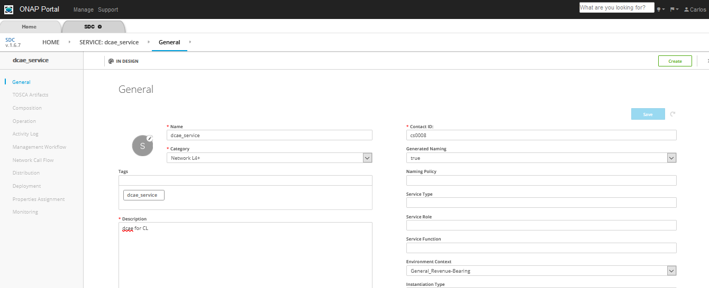
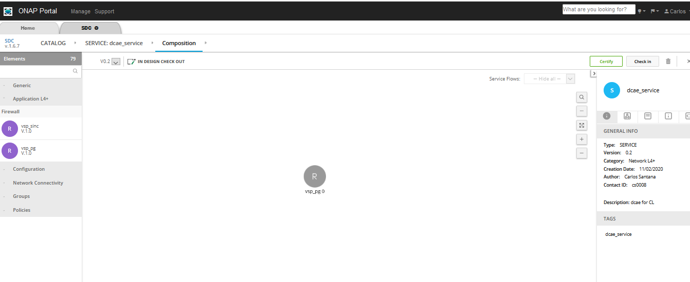
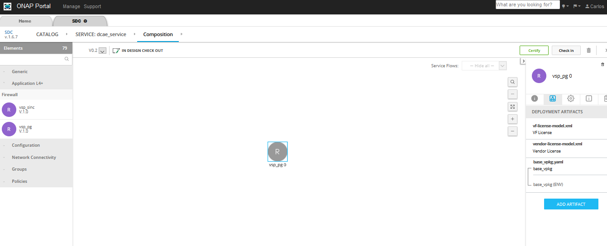
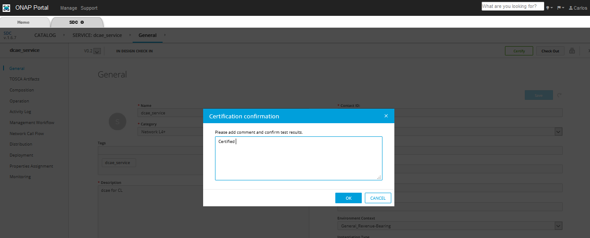
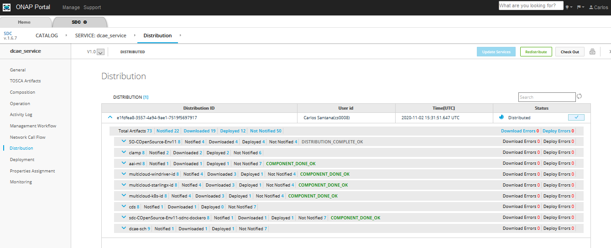
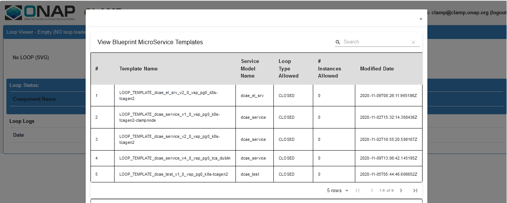

.. This work is licensed under a Creative Commons Attribution 4.0
.. International License. http://creativecommons.org/licenses/by/4.0
.. Copyright © 2017-2020 Aarna Networks, Inc.

Instructions for Designing a Control Loop
=========================================

This document provides step by step instructions on how to design a Control Loop starting from service creation, adding the required DCAE artifacts, policy and VF in   the composition phase of SDC and finally distributing it to the CLAMP for further process.

In order to distribute the DCAE microservice blueprints we need to create a dummy service. The DCAE blueprint will be added as an artifact to the VF inside the service during service composition time.

Here we are using TCA (Threshold Checking Application) DCAE microservice as an example application to upload for designing the control loop.

Follow the below steps for creating and distributing the service

1. Login as DESIGNER (cs0008) and create the service

.. note::
  The service name should not contain any spaces. The DCAE policy fails to fetch the service from PDP if the name has a space. For example ‘dcae1’ will work and        ‘dcae   1’ will not.

|image1|

2. Add any VNF (ex: vfw_pg) that was already created during the SDC design phase.

In the composition canvas drag and drop a resource of type VF from the abstract section in the Elements section (left hand side panel)

|image2|

3. Download the required DCAE MS blueprint to be attached to the service

Use the sample TCA blueprint located here:
https://git.onap.org/dcaegen2/platform/blueprints/tree/blueprints/k8s-tcagen2-clampnode.yaml

.. note::
  - Check if the version of the plugin used in the blueprint is different from existing, then update the blueprint import to match.
  - To check the version run this: `cfy plugins list | grep k8splugin`

4. Now upload the Control Loop Artifact. The procedure to upload the artifact is

  - Click on the VF, as in the picture below the ‘vsp_pg 0’ is selected.
  - Click on ‘DEPLOYMENT ARTIFACTS’  and then click on “Add Artifact”.

  |image3|

  - Fill the details and in the type select DCAE_INVENTORY_BLUEPRINT, then click on Done as in the picture shown below.

  |image4|

5. After uploading the DCAE artifact to the SDC Service, attach the policy model to the Service. From the left drop down, select TCA policy under Policies, and click on the Add policy.

|image5|

6. Click on Checkin on top right corner then click OK

|image6|

7. Search and select the same service from CATALOG and click on Certify on top right corner

|image7|

8. Click Distribute to distribute the service, then click on Distribution in the left hand side panel and monitor until the distribution is complete. We should see artifacts deployed in CLAMP and Policy engine, as can be seen in the picture below

|image8|

9. At this point we can open the CLAMP GUI and verify that the DCAE microservice design template is in place as shown below.

|image9|

.. |image4| image:: media/image4.png
.. |image5| image:: media/image5.png
.. |image6| image:: media/image6.png

