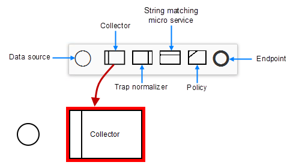

.. This work is licensed under a Creative Commons Attribution 4.0
.. International License. http://creativecommons.org/licenses/by/4.0
.. Copyright 2019 ONAP Contributors. All rights reserved.

Control Loop Design
===================
**Goal:** Create and distribute closed-loop models for automating:
    * recovery of faults reported by traps or alarms
    * capacity management as performance thresholds are crossed

**Tool:** SDC/DCAE-DS/CLAMP

**SDC user role:** Designer

Closed loops use feedback to control and optimize their behavior.
A closed loop can proactively respond to network and service conditions
without human intervention.

There are different phases to the Closed Loop (CL) design:

    #. Design a closed loop template and associate it to a Service,
       the template represents the theoretical flow of the CL. (DCAE-DS/SDC)

       #. generate a deployment artifact that can be ingested by the DCAE,
          today it is a "cloudify" blueprint.

    #. Distribute the control loop to CLAMP and DCAE, the csar is distributed
       to CLAMP, the blueprint is distributed to both CLAMP and DCAE. (SDC)
    #. Submit the closed loop, meaning provision Policy/DCAE with
       closed loop data. (CLAMP)
    #. Deploy the closed loop, it initiates the deployment of the micro
       service on DCAE side (CLAMP)

*Release 1 (Amsterdam)* includes control loop template designer in Clamp UI.

*Release 2 (Bejing)* does not include the control loop template designer
in Clamp UI, this is implemented in DCAE-DS.

**Steps**

        * `Design a Model`_
        * `Configure Collector`_
        * `Configure Alarm Detector`_
        * `Configure Data Analytics Function`_
        * `Configure Policy`_
        * `Distribute the Model`_
        * `Open Loop Design`_

Design a Model
--------------

.. note::
   When required, contact the DCAE Group (see `Mailing Lists <https://wiki.onap.org/display/DW/Mailing+Lists>`_) to
   confirm that a blueprint for the Service has been generated and
   is available on DCAE.

**Prerequisites:** Create and test a VF

#TODO ADD A LINK TO VF Creation and Testing user-guides-service-design?

    #. Create and name a new model
    #. Associate a Service with the model
    #. Based on the service, provide values for its attributes
    #. Select the Resource-VF and Resource-VFC to associate with the model
    #. Select one or more locations in the cloud where the
       closed loop will be deployed
    #. Here is a view of a hypothetical visual design tool
       showing loop modeling components:

       |image0|

    #. Use the tool to select and connect components,
       thus defining the structure of the model
    #. Configure each of the components of the model

       #. `Configure Collector`_
       #. `Configure Alarm Detector`_
       #. `Configure Data Analytics Function`_
       #. `Configure Policy`_

Configure Collector
-------------------

**Prerequisites:** `Design a Model`_.

Using the modeling tool, assign a message topic to which this
component will subscribe.

Configure Alarm Detector
------------------------

**Prerequisites:** `Design a Model`_.

Using the modeling tool, configure the fields described in this table:

+------------+----------------------------+-------------------------------+
| Field      | Values                     | Description                   |
+============+============================+===============================+
| Topic      | * DCAE-CL-EVENT            | DMAAP message topic to        |
| Publishes  | * OPEN-DCAE-HIGHLANDPARK-  | which the component           |
|            |   EVENT-OUTPUT             | subscribes.                   |
+------------+----------------------------+-------------------------------+
| Alarm      | (Multiple values)          | Populated from vendor-provided|
| Condition  |                            | list of alarm names. Stored in|
|            |                            | SDC and retrieved by the      |
|            |                            | modeling tool. Alarms differ  |
|            |                            | per VNF.                      |
+------------+----------------------------+-------------------------------+
| Event      | (Multiple values)          | Categories of alarms for a VNF|
| Source Type|                            | .Differs per VNF.             |
+------------+----------------------------+-------------------------------+
| Event      | * NORMAL                   | Severity level of the alarm   |
| Severity   | * not-NORMAL               | that caused the rule to match.|
|            | * WARNING                  | All conditions are exact      |
|            | * MINOR                    | matches, except for not-Normal|
|            | * MAYOR                    | , which matches anything      |
|            | * CRITICAL                 | except NORMAL.                |
+------------+----------------------------+-------------------------------+

Configure Data Analytics Function
---------------------------------

**Prerequisites:** `Design a Model`_.

   #. In the model, click the *StringMatch*.
   #. Click the *Properties* icon.
   #. Configure fields as required (see table).
   #. Click *Close*.

+------------+----------------------------+-------------------------------+
| Field      | Values                     | Description                   |
+============+============================+===============================+
| Topic      | * DCAE-CL-EVENT            | DMAAP message topic to        |
| Publishes  |                            | which the component subscribes|
+------------+----------------------------+-------------------------------+
| AAI Fields | (Multiple values)          | Additional VM-related fields  |
| Matching   |                            | that downstream elements such |
+------------+                            | as Policy and APPC can use to |
| AAI Field  |                            | take action on the signature. |
| Send       |                            |                               |
| (Select    |                            |                               |
| Multiple)  |                            |                               |
+------------+----------------------------+-------------------------------+
| Resource-  | Integer                    | Group of string matching rules|
| Group      |                            | that are to be treated        |
|            |                            | together. For example, a      |
|            |                            | resource group could contain  |
|            |                            | two different traps that must |
|            |                            | be received to produce a      |
|            |                            | signature, as well as the     |
|            |                            | abatement match.              |
+------------+----------------------------+-------------------------------+
| Alarm      | (Multiple values)          | Populated from vendor-provided|
| Condition  |                            | list of alarm names. Stored in|
|            |                            | SDC and retrieved by the      |
|            |                            | modeling tool. Alarms differ  |
|            |                            | per VNF.                      |
+------------+----------------------------+-------------------------------+
| Event      | * NORMAL                   | Severity level of the alarm   |
| Severity   | * not-NORMAL               | that caused the rule to match.|
|            | * WARNING                  | All conditions are exact      |
|            | * MINOR                    | matches, except for not-Normal|
|            | * MAYOR                    | , which matches anything      |
|            | * CRITICAL                 | except NORMAL.                |
+------------+----------------------------+-------------------------------+
| Event      | (Multiple values)          | Categories of alarms for a    |
| Source Type|                            | VNF. Differs per VNF.         |
+------------+----------------------------+-------------------------------+
| Time       | Integer                    | Interval during which multiple|
| Window     |                            | traps must be received in     |
|            |                            | order to produce a single     |
|            |                            | signature. This value has no  |
|            |                            | meaning if only one onset rule|
|            |                            | exists. A value of 0 means an |
|            |                            | unlimited time window.        |
+------------+----------------------------+-------------------------------+
| Age        | Integer                    | Traps older than this limit   |
| Limit      |                            | are deemed too stale to be    |
|            |                            | meaningful and are not        |
|            |                            | processed.                    |
+------------+----------------------------+-------------------------------+
| Create CL  | * Initial                  | *Initial:* start a closed     |
| Event ID   | * Close                    | loop with a new request ID    |
|            |                            |                               |
|            |                            | *Close:* end an existing      |
|            |                            | closed loop (Close)           |
+------------+----------------------------+-------------------------------+
| Create CL  | * OnSet                    | *OnSet:* start a closed loop  |
| Event ID   | * Abatement                | when a condition starts.      |
| Output     |                            | Triggered with a new          |
| Event Name |                            | request_id and signature flag |
|            |                            | of *Initial*                  |
|            |                            |                               |
|            |                            | *Abatement:* end a closed loop|
|            |                            | when a condition is corrected.|
|            |                            | Triggered with signature flag |
|            |                            | of *Close*.                   |
+------------+----------------------------+-------------------------------+

Configure Policy
----------------

Use this task to configure the operational policy of the closed loop.

**Prerequisites:** `Design a Model`_.

Model configuration involves setting the values in this table,
for each of the Rebuild and Migrate recipies in the model.

+------------+----------------------------+-------------------------------+
| Field      | Values                     | Description                   |
+============+============================+===============================+
| Overall    | Integer                    | Maximum overall time that can |
| Time Limit |                            | be spent on attempting all    |
|            |                            | actions.                      |
+------------+----------------------------+-------------------------------+
| Receipe    | * Restart                  | The automated action to be    |
|            | * Rebuild                  | triggered on the VM by the    |
|            | * Migrate                  | closed loop.                  |
+------------+----------------------------+-------------------------------+
| Max Retries| Positive Integer           | Number of times this action   |
|            |                            | should be attempted before    |
|            |                            | failing on MaxRetriesExceeded.|
+------------+----------------------------+-------------------------------+
| Retry Time | Positive Integer           | Maximum amount of time to take|
| Limit      |                            | performing retries before     |
|            |                            | failing on TimeLimitExceeded. |
+------------+----------------------------+-------------------------------+
| Parent     | (Selection                 | Recipe that precedes this one |
| Policy     |                            | in the chain of operations.   |
|            |                            | If this is the first action in|
|            |                            | the chain, this field is not  |
|            |                            | set.                          |
+------------+----------------------------+-------------------------------+
| Parent     | * Failure:                 | Types of results from the     |
| Policy     |   MaxRetriesExceeded       | previous action on the chain  |
| Conditions | * Failure:                 | that would cause a transition |
|            |   TimeLimitExceeded        | to this action.               |
|            | * Failure: Exception       |                               |
|            | * Failure: Other           |                               |
|            | * Success                  |                               |
+------------+----------------------------+-------------------------------+

Distribute the Model
--------------------

**Prerequisites:** `Design a Model`_.

In this step, the user distributes the models to the DCAE and
Policy subsystems of ONAP.

After a model is uploaded to a VNF, the status icon of the VNF changes
to from "Design" to "Activated" in the ONAP Portal GUI.

Open Loop Design
----------------

Create and distribute open control loops for managing VF faults and
performance after instantiation.

With open loop control systems, the action(s) taken by the Policy do
not affect the output of the system.

For information about creating policy using the Policy Designer,

#TODO ADD A LINK TO VF Creation and Testing user-guides-service-design?

