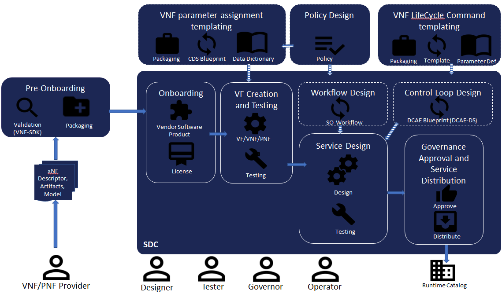

.. This work is licensed under a Creative Commons Attribution 4.0
.. International License. http://creativecommons.org/licenses/by/4.0
.. Copyright 2017 AT&T Intellectual Property.  All rights reserved.

.. _doc_guide_user_des:

Design Service
==============

The goal of the design process is to create all artifacts (models)
that are required to instantiate and manage resources, services,
and products on the ONAP platform. The design process requires
input from users with multiple roles.

Design progresses logically through a series of phases. Each phase:

* is organized into steps that are completed in sequence

* is accessed using a different role with specific responsibilities
  generates artifacts that are used in other phases of design or when
  instantiating or monitoring virtual functions.

The following figure show the different phases and tools involved in
Onboarding, Design and Distribution process.

|image1|

**The "Core" Design Process includes the following steps:**

**Pre-Onboarding**
    A VNF/PNF/CNF Provider delivers its descriptor, model and
    artefacts (e.g. HEAT template, Helm Chart), which will be validated
    and packaged for onboarding to ONAP

**(Resource)-Onboarding**
    In the SDC a License Model is created, the VNF/PNF/CNF package imported
    and a Vendor Software Product (VSP) is created

**VF Creation and Testing**
    A V(N)F, PNF or CR Model is created (a) import of a VSP or VFC
    (b) manual creation and import of artefacts created via external
    tools like the Controller Design Studio (CDS), responsible for the
    Controller Blueprint Design
    The created VF will pass a testing workflow to be used
    in a Service Model

**Service Design**
    A Service Model is created as a composition of resources
    (e.g. V(N)Fs, PNFs,...), Policies, Workflows,...
    The created Service Model will ber certified and handed over to
    the Service Distribution process

**Service Distribution**
    The Service Provider will distribute the Service Model to the
    Runtime Service Catalog

**The optional/additional Design steps are:**

**VNF parameter assignment templating**
    The objective is to automate the resolution of resources for instantiation
    and any config provisioning operation, such as day0, day1 or day2
    configuration.
    The Controller Blueprint archive (CBA) is the overall service design,
    fully model-driven, intent based package needed to design self service
    provisioning and configuration management automation.
    ONAP CDS (Controller Design Studio) is the controller that will process
    the Controller Blueprint archive (CBA) at run-time.

**Policy Design**
    These are rules, conditions, requirements, constraints, attributes,
    or needs that must be provided, maintained, and/or enforced.
    At a lower level, Policy involves machine-readable rules enabling
    actions to be taken based on triggers or requests. ONAP Policy framework
    provides some policy models that are implemented and pre-loaded when
    installing ONAP.

**VNF LifeCycle Command templating**
    APPC Controller Design Tool (CDT) is used for self-service onboarding of
    VNF’s. VNF owners can create templates and other artifacts for APPC
    Configure command (used to apply a post-instantiation configuration)
    as well as other life cycle commands.

**Workflow Design**
    The purpose of the Workflow Designer is to enable designers to define or
    modify workflows to support Service/Resource change management scenarios
    executed by the Service Orchestrator.

**Control Loop Design**
    This phase includes the Design of a closed loop template and associate it
    to a Service. The template represents the theoretical flow of the CL.
    It generates a deployment artifact that can be ingested by the DCAE in
    order to create the needed DCAE microservices in runtime.
    The design is done in the SDC DCAE-DS (Design Studio).
    The DCAE Design Studio enables to define and configure
    the monitoring flows of DCAE.
    The configuration and deployment of a Control Loop will be done with
    Control Loop Automation Management (CLAMP) tool.

The follwing sections will focus on the different Design steps:

.. toctree::
   :maxdepth: 1
   :titlesonly:

   Pre-Onboarding <./pre-onboarding/index.rst>

   Resource-Onboarding <./resource-onboarding/index.rst>

   VF Creation and Testing <./vfcreation/index.rst>

   Service Design <./service-design/index.rst>

   Service Distribution <./service-distribution/index.rst>

   VNF parameter resolution Design <./parameter_resolution/index.rst>

:ref:`Policy Design<onap-policy-parent:design-label>`

:ref:`VNF LifeCycle Command templating<onap-appc:appc_api_guide>`

:ref:`Workflow Design<onap-sdc:workflow>`

:ref:`Control Loop Design<onap-sdc:dcaedesigner>`

:ref:`Control Loop Automation Management<onap-clamp:master_index>`

