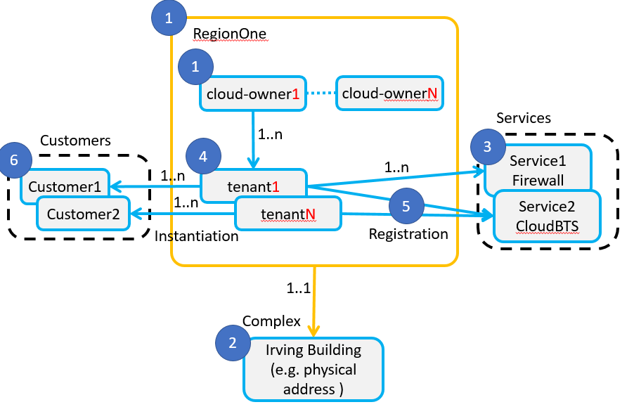

.. This work is licensed under a Creative Commons Attribution 4.0
.. International License. http://creativecommons.org/licenses/by/4.0
.. Copyright 2019 ONAP Contributors. All rights reserved.

.. _doc_guide_user_des_pre-onb:

Pre-Onboarding
==============

    * `Create a Tenant`_ (will be moved to "Service Deployment")
    * `Generate Manifest and Package Artifacts`_ (for HEAT based VNFs)
    * `Validate xNF Package (VNF/PNF)`_

.. _doc_guide_user_des_pre-onb_cre-ten:

Create a Tenant
---------------

.. note::
   This section is not really belonging to the "Design" phase,
   but to the preparation of the "Service Deployment" and will be
   moved in the next release

Each service requires a tenant_ (a group of users who share a common access)
in which resources are stored in the cloud. This process is performed using
facilities of the network cloud, outside of ONAP. Confirm that the tenant is
created and note the tenant ID.

ONAP admin users can configure a cloud-owner to add new cloud resources.
These are the computing and networking resources, that will support
running VNFs. A cloud-owner holds a keystone URL, login, region and
password, in the case of an Openstack cluster. A cloud-owner also
belongs to a region. The region name should be the same as the Openstack
region. Prior to creation of a cloud-owner, its region must be created
first. Multiple tenants can share the same cloud-owner. Note that these
tenants are ONAP tenants, not Openstack tenants. Tenant register
services that customers are allowed to deploy. Finally, the customer is
like an instance of the tenant.

Note: there is no GUI (yet) to configure these objects. REST requests
are sent to AAI to achieve the configuration. For a detailed list of
required REST commands see:

https://wiki.onap.org/display/DW/running+vFW+Demo+on+ONAP+Amsterdam+Release

The overall process is as follows:

 #. Create a region and a cloud-owner. This steps registers Openstack
    credentials. This is the only step requiring entering Openstack specific
    parameters.

 #. Create a complex. The complex describes the coverage of the region with
    a street address etc.

 #. Create a service. The service name should match the name of the service
    onboarded in SDC.

 #. Create a tenant. Tenant in ONAP stores a design for a generic customer.

 #. Associate tenants with their allowed services.

 #. Create an instance of the tenant or customer. The customer is visible in
    VID. A VID user can deploy allowed services on this new customer.

   |image1|

.. _doc_guide_user_des_pre-onb_gen-man:

Generate Manifest and Package Artifacts
---------------------------------------

.. note::
   This section describes the steps required to package a given HEAT
   template into a zip-file, which can be onboarded to SDC. Instructions
   to create TOSCA based VNF or PNF Onboarding Packages are not described
   here

Before onboarding resources, run generate-manifest.py to generate a
MANIFEST file. These steps are performed outside SDC.

**Prerequisites:** Obtain Heat/ENV files and other files required for
onboarding. The requirements are found in the following document.

`Heat requirements <../../../../submodules/vnfrqts/requirements.git/docs/Chapter5/Heat/index.html>`_

#. Put the Heat, ENV, nested Heat, and other files used by get-file in templates
   in a directory.

   Naming guidelines:

    - The base Heat should include "base" in the name.
    - The ENV file name should match the name of the Heat file with which it
      is associated.
    - All get-file file names need to be unique.

#. Put the python script in a directory one level above the directory that
   contains the Heat/ENV and other files.

   For example, [dir x]/[dir y]

    - [dir y] contains the Heat/ENV files and other files
    - [dir x] contains the python script

#. Run the script on the Windows command line (not valid anymore):

   .. code-block:: python

      python generate-manifest.py -f "dir y"

#. Examine the manifest file and confirm that is correct.

#. Package all Heat/ENV files, all other files, and the MANIFEST.json
   into one .zip file.

.. _doc_guide_user_des_pre-onb_val:

Validate xNF Package (VNF/PNF)
------------------------------

VNF and PNF packages have to follow the requirements described in:

`VNF and PNF Modeling Requirements <../../../../submodules/vnfrqts/requirements.git/docs/Chapter5/index.html>`_

`ONAP Management Requirements <../../../../submodules/vnfrqts/requirements.git/docs/Chapter7/index.html>`_

For Validation of VNF and PNF packages the tools delivered by VNFSDK can be
used:

.. toctree::
   :maxdepth: 1
   :titlesonly:

   ../../../onap-provider/vnfvalidator.rst

Prior to resource onboarding, the Certification Group does the following:

 - for VNF and PNF
     - Validation of the delivered xNF package and artifacts
     - using the VNF Validation Tools
 - in case of VNF
    - onboards the Heat template(s) and metadata to the SDC catalog
    - creates a test VF
    - runs the Heat scanning tools
 - shares the results with any group that approves Virtual Functions

In parallel, the Certification Group onboards the VF Image and OS to a
standalone ONAP instance (the "sandbox") and performs the following:

 - security scan
 - compatibility test for the OS and vendor binary
 - malware scan

The Certification group then instantiates the VF image using the vendor
Heat (if provided) in order to validate that the VM can run on the Network
Cloud.

No VF functionality testing is performed at this stage.

.. _tenant: https://wiki.onap.org/display/DW/Glossary#Glossary-tenant
