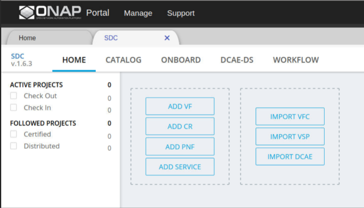
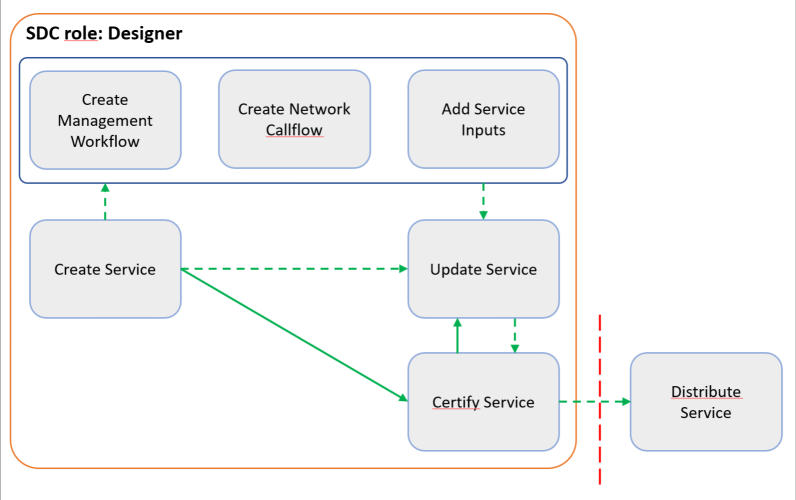
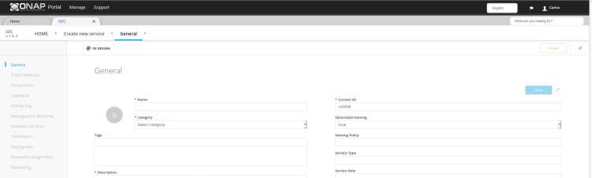
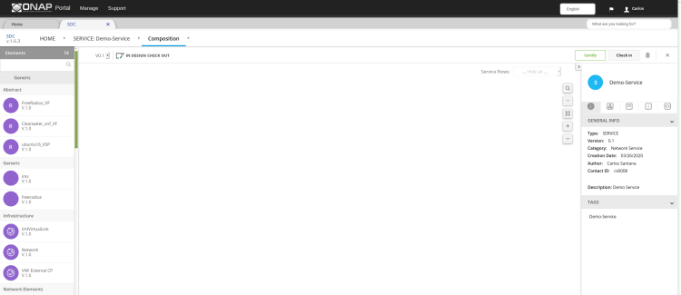
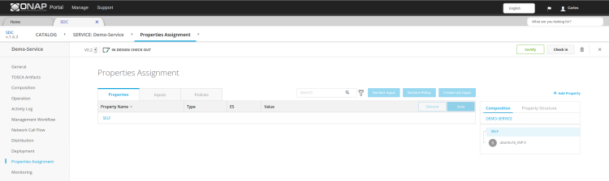
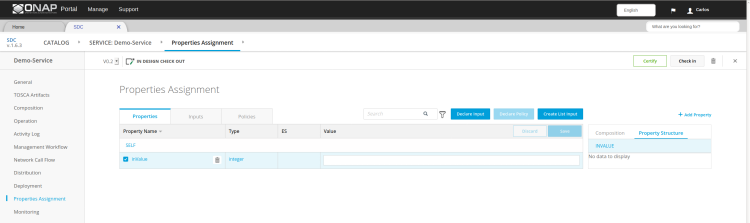
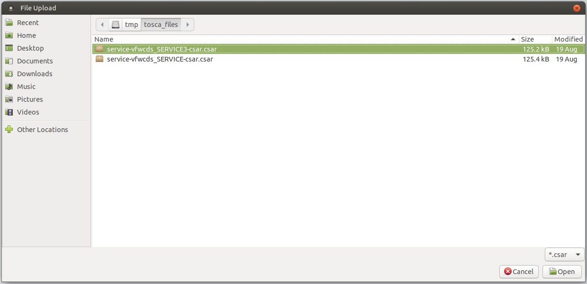
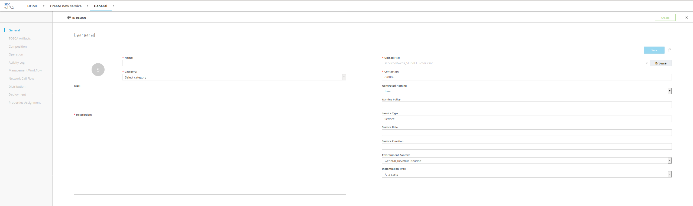

.. This work is licensed under a Creative Commons Attribution 4.0
.. International License. http://creativecommons.org/licenses/by/4.0
.. Copyright 2019 ONAP Contributors. All rights reserved.

.. _doc_guide_user_des_ser-des:

Service Design
==============

**Goal:** Add models and other artifacts required to create, configure,
instantiate, and manage services. Validate and certify the services.
Besides the manual creation of a Service Model, an existing model can
be imported via a CSAR file

**Tool:** SDC

**SDC user roles:** Designer

|image1|

**Figure: Workflow for Service design**

**Steps**

   #. `Create Service`_
   #. `Create a Management Workflow [optional]`_
   #. `Create a Network Callflow [optional]`_
   #. `Manage Service Properties [optional]`_
   #. `Update Service [optional]`_
   #. `Certify Service`_
   #. `Import Service CSAR [optional]`_

.. _doc_guide_user_des_ser-cre_serv:

Create Service
--------------

**Prerequisites:** Create VF/PNFs required for this service (see :ref:`doc_guide_user_des_vf-cre`).

#. From the SDC HOME page, hover over Add and select *ADD SERVICE*.

   |image0|

#. In the General section, complete all fields.

   |image5|

#. Click Create.

   A message displays when Service creation is complete.

#. Click Composition.

   |image6|

   For a description of the Composition section (see SDC User Guide ).

#. Drag one or more elements from the Elements palette to the canvas.
#. To connect elements:

   #. Hover over an element and then hover over \ |image2|.

      Other elements that can connect to this element are highlighted.

   #. Drag to a highlighted element on the canvas.
   #. Select options for Requirements and Capabilities.
   #. Click Connect.

#. To add artifacts at the service level:

   #. Click an empty area in the canvas and click *Deployment Artifacts*
      (right pane).
   #. Click \ |image3|.
   #. Select the type.
   #. Click Browse, locate a file to upload, and click Open.
   #. Complete all other fields.
   #. Click Done.

   Use this function to add YANG artifacts for distribution to SDNC.

#. [Optional]  At any time before checking in the Service, click
   these options to update Service information:

   .. note:: These tasks can be done only before certifying the Service.

   - **General->Icon** change the icon associated with the Service
   - **TOSCA Artifacts** view and edit artifacts, such as the .csar file
     and TOSCA template
   - **Composition** view or edit the graphical representation of the
     service-level TOSCA model
   - **Activity Log** view activity related to the Service
     (displays the action, date, user, status, and any comments related to each
     action)
   - **Management Workflow** model service lifecycle workflows for execution
     in SO (see `Create a Management Workflow [optional]`_)
   - **Network Call Flow** model interactions among VFs (see `Create a
      Network Callflow [optional]`_)
   - **Deployment** view HEAT modules in VSPs
   - **Properties Assignment** define or update properties,
     policies and input parameters used during Service instantiation
     (see `Add Service Inputs [optional]`_).
   - **Monitoring** ...

#. Click *Check In* to save changes.

   A box displays for confirming the changes.

#. Enter a comment and click OK.

   A message displays when the Service is checked in and the
   Home page is displayed.

#. After creating a service and configuring optional fields, certify it
   (see `Certify Service`_).

Note: Create Service can also be invoked via External SDC API.
Refer SDC REST API reference for details of the API.
Currently, only a 'Partner Domain Service' category is supported
which cannot be created manually from SDC portal.

.. _doc_guide_user_des_ser-cre_wf:

Create a Management Workflow [optional]
---------------------------------------

Create a workflow to model the SO recipes of the service life cycle such
as instantiation, upgrade, termination, or suspension of a service or
VNF. In the workflow each of the Activity, represent API calls to
various ONAP components (such as OOF, SDN-C, App-C, etc) that perform a
business function needed.

Note: The information collected in this section is represented in BPMN
format and included in distributed service model.

**Prerequisites:** All the required ActivitySpec as supported by SO
 are registered in SDC.

#. From the SDC HOME page, click CATALOG and search for a service.
#. Click the service and click *Check Out*.
#. Select the panel *Management Workflow*.
#. Click *Add Workflow*.
#. The *Create New Workflow* box displays.
#. Complete all fields.
#. Click Create.

   |image7|

#. Specify Inputs & Outputs of Workflow
#. Define the Composition of Workflow.

   #. All the Tasks in the composition are expected to be ServiceTask
      for using Activities defined in SO.
   #. Select the Implementation in the Task "general" tab to Activity.
   #. Select the required ActivitySpec.

#. Mark the workflow as executable by selecting the Executable flag in
   the workflow "general" tab.
#. Click Save.
#. Certify the Workflow.

.. _doc_guide_user_des_ser-cre_nfw:

Create a Network Callflow [optional]
------------------------------------

Create a network callflow to model the interactions among VFs within a
service, such how VFs interact to deliver a service while the service is
being consumed. In the model, lifelines represent VFs.

Note: The information collected in this section is not distributed with
the service model.

**Prerequisites:** `Create service`_

#. From the SDC HOME page, click CATALOG and search for the service.
#. Click the service and click *Check Out*.
#. Click Network Call Flow.
#. Click Add Workflow.
   The Create New Workflow box displays.
#. Complete all fields.
#. Click Save.
#. In the new workflow pane, click the Lifelines icon.

   The LIFELINES/STEPS view displays.

#. To add a lifeline (component), do the following:

   #. Click LIFELINES to expand the pane.
   #. Click Add Lifeline.
   #. In the [Unnamed Lifeline field], enter a name for the lifeline.
   #. To add other lifelines to the workflow, repeat the actions above.

#. After creating all required lifelines, do the following to add a step
   (showing an action between two lifelines):

   #. Under STEPS (left pane), click Add Message.
      An unnamed step is added under STEPS.
   #. In the [Unnamed Message] field, enter a name or message for the
      step.
   #. From the component and arrow dropdown lists, select the two
      components that communicate in this step, and the arrow to show in
      which direction the communication flows.
   #. To add another step, repeat the actions above.

#. [Optional] Change the order of steps by clicking a step and dragging
   it to the preferred position.
#. Click *Save*.
#. Click *Check In* to save changes.

.. _doc_guide_user_des_ser-para_in:

Manage Service Properties [optional]
------------------------------------

Add new Service parameters and define as input fields
during Service instantiation.

**Prerequisites:** `Create service`_

#. From the SDC HOME page, click CATALOG and search for a service.
#. Click the service and click *Check Out*.
#. Click *Properties Assignment*.

   |image8|

#. From the *Composition* pane, select the *SELF* object
   representing the service.
#. In the *Properties* the existing Service properites are shown
#. With *+Add Property* you can add a new property
#. To set a property as *Input* parameter, select the parameter
   by clicking the check box in each row as required.
   Note: Do not select inputs that are already in the ENV file (this
   overwrites values specified in the ENV).

   |image9|

#. Click *Declare Input* to add the selected parameter to the
   Service *Input* pane.
#. Click *Check In* to save changes.

.. _doc_guide_user_des_ser-upd_serv:

Update Service [optional]
-------------------------

Update service information and artifacts.

Update the version of a VF referenced in the service whenever the VF is
updated (see step 4).

**Prerequisites:**

-  Create a service.
-  If a VF included in the service was updated:
   see :ref:`doc_guide_user_des_vf-cre_vf-upd`

#. From the SDC HOME page, click CATALOG and search for the service.
#. Click the service and click *Check Out*.
#. Click Composition.
#. To update the version of a VF referenced in the service:

   #. Click Composition.
   #. Click the VF in the canvas.
   #. On the *General Info* tab (right pane), select the VF version.

#. To update artifacts at the service level:

   #. Click an empty area in the canvas and click *Deployment Artifacts*
      (right pane).
   #. View, add, delete, or download artifacts as required.

#. [Optional] Add, edit, or remove VFs that comprise the service
   reference architecture (see steps 4 to 6 in \ `Create Service`_).
#. [Optional] Click *Operations* to edit Service Operations.

   #. Create/Edit Operations
   #. Assign Workflow
   #. Click Save

#. [Optional] Click *Management Workflow* to edit, upload, or delete
   associated deployment artifacts
   (see `Create a Management Workflow [optional]`_).
#. [Optional] Click *Network Callflow* to edit the interactions among VFs
   that comprise the service (see `Create a Network Callflow [optional]`_).
#. [Optional] Click *Properties Assignement* to select parameters as
   input fields during Service instantiation
   (see `Add Service Inputs [optional]`_).
#. Click *Check In* to save changes.
#. After updating a service and configuring optional fields, certify it
   (see `Certify Service`_).

.. _doc_guide_user_des_ser-cfy_serv:

Certify Service
---------------

Note: A service cannot be submitted for testing if the reference
architecture contains uncertified resources.

**Prerequisites:** `Create Service`_

**Steps**

#. When a Service is ready for certification,
   click *CATALOG* and search for the checked-in Service.
#. Click the Service and click *Certify*.

#. Enter a comment and click *OK*.

#. A Message appears, that the Service is certified.

Import Service CSAR [optional]
------------------------------

Note: This step can be used, when a Service Model already exists

**Steps**

#. From the SDC HOME page, hover over IMPORT and select *IMPORT SERVICE CSAR*.

   |image0|

#. In the File Upload Dialog, select the csar file and press *Open*.

   |image10|

#. In the General section, complete all fields.

   |image11|

#. Click Create.

   A message displays when Service creation is complete.

#. Continue with Service Design steps mentioned above

