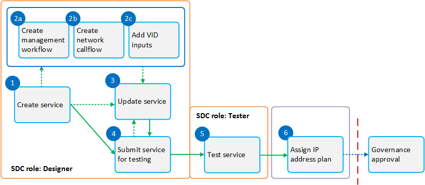

.. This work is licensed under a Creative Commons Attribution 4.0
.. International License. http://creativecommons.org/licenses/by/4.0
.. Copyright 2019 ONAP Contributors. All rights reserved.

.. _doc_guide_user_des_ser-des:

Service Design
==============

**Goal:** Add models and other artifacts required to create, configure,
instantiate, and manage services. Validate and certify the services.

**Tool:** SDC

**SDC user roles:** Designer, Tester

|image1|

**Figure: Workflow for Service design**

**Steps**

   #. `Create a Service`_
   #. `Create a Workflow [optional]`_
   #. `Create a Network Callflow [optional]`_
   #. `Select VID Inputs [optional]`_
   #. `Update a Service [optional]`_
   #. `Submit a Service for Testing`_
   #. `Test a Service`_
   #. `Assign an IP Address Plan`_

Create a Service
----------------

**Prerequisites:** Create VFs required for this service (see :ref:`doc_guide_user_des_vf-cre`).

#. From the SDC HOME page, hover over Add and select Add Service.
#. In the General section, complete all fields.

   Note: Use the letters "Svc" in the name to indicate that the
   component is a service.

#. Click Create.

   A message displays when VF creation is complete.

#. Click Composition.

   For a description of the Composition section (see \ `Composition
   (Service design) <https://wiki.onap.org/x/lIwP>`__ ).

#. Drag one or more elements from the Elements palette to the canvas.
#. To connect elements:

   #. Hover over an element and then hover over \ |image2|.

      Other elements that can connect to this element are highlighted.

   #. Drag to a highlighted element on the canvas.
   #. Select options for Requirements and Capabilities.
   #. Click Connect.

#. To add artifacts at the service level:

   #. Click an empty area in the canvas and click Deployment Artifacts
      (right pane).
   #. Click \ |image3|.
   #. Select the type.
   #. Click Browse, locate a file to upload, and click Open.
   #. Complete all other fields.
   #. Click Done.

   Use this function to add YANG artifacts for distribution to SDNC.

#. Click Check In to save changes.

   A box displays for confirming the changes.

#. Enter a comment and click OK.

   A message displays when the VF is checked in.

#. [Optional] At any time before submitting the service for testing,
   click these options to update service information:

   -  Icon — change the icon associated with the service
   -  TOSCA Artifacts — view and edit artifacts, such as the .csar file
      and TOSCA template
   -  Composition — view or edit the graphical representation of the
      service-level TOSCA model
   -  Activity Log — view activity related to the service
   -  Workflow — model service lifecycle workflows for execution in SO
      (see `Create a Workflow [optional]`_)
   -  Network Call Flow — model interactions among VFs (see `Create a
      Network Callflow [optional]`_)
   -  Deployment — view HEAT modules in VSPs
   -  Inputs — select parameters as input fields during VID
      instantiation (see `Select VID Inputs [optional]`_).

#. After creating a service and configuring optional fields, submit it
   for testing (see `Submit a Service for Testing`_).

Note: Create Service is now exposed as an External SDC API also, it can be
invoked via NBI only. Refer SDC REST API reference for details of the API.
Currently, only a 'Partner Domain Service' category is supported 
and it cannot be created manually from SDC portal.

Create a Workflow [optional]
----------------------------

Create a workflow to model the SO recipes of the service life cycle such
as instantiation, upgrade, termination, or suspension of a service or
VNF. In the workflow each of the Activity, represent API calls to
various ONAP components (such as OOF, SDN-C, App-C, etc) that perform a
business function needed.

Note: The information collected in this section is represented in BPMN
format and included in distributed service model.

**Prerequisites:** All the required ActivitySpec as supported by SO
 are registered in SDC.

#. From the SDC HOME page, click WORKFLOW.
#. Click Add Workflow.
#. The Create New Workflow box displays.
#. Complete all fields.
#. Click Create.
#. Specify Inputs & Outputs of Workflow
#. Define the Composition of Workflow.

   #. All the Tasks in the composition are expected to be ServiceTask
      for using Activities defined in SO.
   #. Select the Implementation in the Task "general" tab to Activity.
   #. Select the required ActivitySpec.

#. Mark the workflow as executable by selecting the Executable flag in
   the workflow "general" tab.
#. Click Save.
#. Certify the Workflow.

Create a Network Callflow [optional]
------------------------------------

Create a network callflow to model the interactions among VFs within a
service, such how VFs interact to deliver a service while the service is
being consumed. In the model, lifelines represent VFs.

Note: The information collected in this section is not distributed with
the service model.

**Prerequisites:** `Create a service`_

#. From the SDC HOME page, click CATALOG and search for a service.
#. Click the service and click Check Out.
#. Click Network Call Flow.
#. Click Add Workflow.
   The Create New Workflow box displays.
#. Complete all fields.
#. Click Save.
#. In the new workflow pane, click the Lifelines icon.

   The LIFELINES/STEPS view displays.

#. To add a lifeline (component), do the following:

   #. Click LIFELINES to expand the pane.
   #. Click Add Lifeline.
   #. In the [Unnamed Lifeline field], enter a name for the lifeline.
   #. To add other lifelines to the workflow, repeat the actions above.

#. After creating all required lifelines, do the following to add a step
   (showing an action between two lifelines):

   #. Under STEPS (left pane), click Add Message.
      An unnamed step is added under STEPS.
   #. In the [Unnamed Message] field, enter a name or message for the
      step.
   #. From the component and arrow dropdown lists, select the two
      components that communicate in this step, and the arrow to show in
      which direction the communication flows.
   #. To add another step, repeat the actions above.

#. [Optional] Change the order of steps by clicking a step and dragging
   it to the preferred position.
#. Click Save.
#. Click Check In to save changes.

Select VID Inputs [optional]
----------------------------

Select parameters as input fields during
`VID <https://wiki.onap.org/display/DW/Glossary#Glossary-VID>`__
instantiation.

Note: For questions about how to use this section, contact the Service
Design and Creation team (see \ `Mailing
Lists <https://wiki.onap.org/display/DW/Mailing+Lists>`__).

**Prerequisites:** `Create a service`_

#. From the SDC HOME page, click CATALOG and search for a service.
#. Click the service and click Check Out.
#. Click Inputs.
#. From the Resource instance inputs pane, expand the name of a
   resource.
#. Select inputs by clicking the check box in each row as required.
   Note: Do not select inputs that are already in the ENV file (this
   overwrites values specified in the ENV).
#. Click \ |image4| to move selected inputs to the Service inputs pane.
#. Click Check In to save changes.

Update a Service [optional]
---------------------------

Update service information and artifacts.

Update the version of a VF referenced in the service whenever the VF is
updated (see step 4).

**Prerequisites:**

-  Create a service.
-  If a VF included in the service was updated: see "Update a VF
   [optional]" and "Test a VF".

#. From the SDC HOME page, click CATALOG and search for a service.
#. Click the service and click Check Out.
#. Click Composition.
#. To update the version of a VF referenced in the service:

   #. Click Composition.
   #. Click the VF in the canvas.
   #. On the General Info tab (right pane), select the VF version.

#. To update artifacts at the service level:

   #. Click an empty area in the canvas and click Deployment Artifacts
      (right pane).
   #. View, add, delete, or download artifacts as required.

#. [Optional] Add, edit, or remove VFs that comprise the service
   reference architecture (see steps 4 to 6 in \ `Create a Service`_).
#. [Optional] Click Operations to edit Service Operations.

   #. Create/Edit Operations
   #. Assign Workflow
   #. Click Save

#. [Optional] Click Management Callflow to edit, upload, or delete
   associated deployment artifacts (see "Create a Management Workflow [optional]").
#. [Optional] Click Network Callflow to edit the interactions among VFs
   that comprise the service (see `Create a Network Callflow [optional]`_).
#. [Optional] Click Inputs to select parameters as input fields during
   VID instantiation (see `Select VID Inputs [optional]`_).
#. Click Check In to save changes.
#. After updating a service and configuring optional fields, submit it
   for testing (see `Submit a Service for Testing`_).

Submit a Service for Testing
----------------------------

Note: A service cannot be submitted for testing if the reference
architecture contains uncertified resources.

**Prerequisites:** `Create a Service`_

#. When a service is ready for testing, click CATALOG and search for the
   service.
#. Click the service and click Submit for Testing.
   A box displays for sending a message to the testers.
#. Enter a message for the testers asking that they begin service
   certification and click OK.

   The default mail client launches with a draft email containing the
   message from step 2.

#. Add the email addresses of the people on the Certification Group with
   the Tester role and send the email.

Test a Service
--------------

Test the design and associated artifacts of a service.

**Prerequisites:** `Submit a Service for Testing`_.

#. Sign in to SDC as a Tester.
#. From the HOME page, select Ready For Testing under Active Projects.
#. In the right pane, click the service to test.
#. Click Start Testing.
#. Test the service.
#. When testing is complete, click Accept.

Assign an IP Address Plan
-------------------------

Assigning an IP address plan is specific to each OpenECOMP installation.
The object: to assign a Service's key to a "plan" for allocating IP
addresses.

.. |image2| image:: media/design_asdccanvas_connect_elements.png
.. |image3| image:: media/design_service_adddeploymentartifact.png
.. |image4| image:: media/design_service_inputs_move.png
