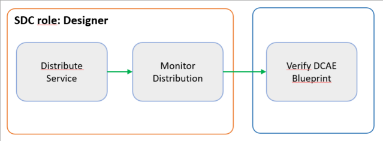
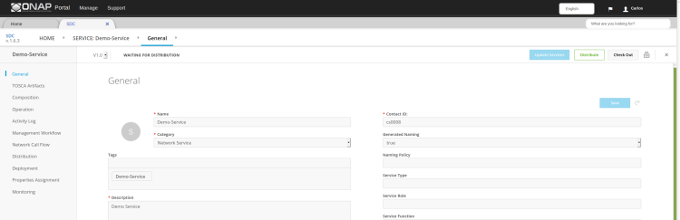
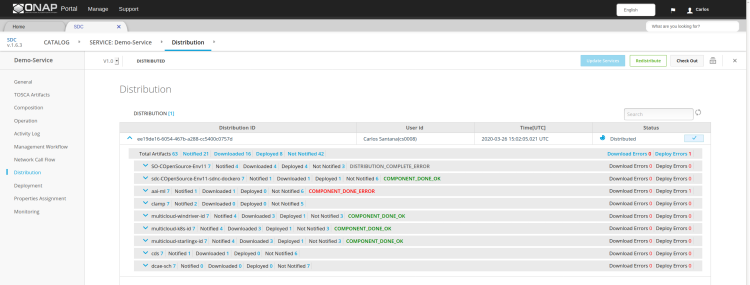

.. This work is licensed under a Creative Commons Attribution 4.0
.. International License. http://creativecommons.org/licenses/by/4.0
.. Copyright 2019 ONAP Contributors.  All rights reserved.

.. _doc_guide_user_des_ser-dis:

Service Distribution
====================

Each ONAP platform operator will have a specific set of policies
and procedures for approving Services and deploying them in the
operator's ONAP environment. This outline describes the general
flow of such procedures.

**Goal:** Add all information required to create, instantiate, and
manage a service in Runtime.

**Tools:** SDC

**SDC user roles:** Designer

|image1|

**Figure: Workflow for Service Distribution**

Steps
-----

- `Distribute Service`_
- `Monitor Distribution`_
- `Verify that the DCAE Blueprint is Deployed`_

.. _doc_guide_user_des_ser-dis-start:

Distribute Service
------------------

**Prerequisites:** The Service is Certified.

**Steps**

#. Sign in to SDC as Designer.
#. From the SDC HOME page, click CATALOG and search for the service.
   It should read *Waiting For Distribution*.
#. Select the service that is *Ready for Distribution*.

   |image2|

#. Review the version history to verify that the correct version is
   selected.
#. In the header, click *Distribute*.

   The service state changes to *Distributed*
#. Continue with the step `Monitor Distribution`_

.. _doc_guide_user_des_ser-dis-mon:

Monitor Distribution
--------------------

**Steps**

#. Sign in to SDC as Designer.
#. From the SDC HOME page, click CATALOG and search for the service.
#. Select the service that is in *Distributed* state.
#. Click *Distribution* in the left pane.
   The Distribution Report displays.

   |image3|

#. In the Distribution Report, navigate to the Distribution ID for the
   service and click the adjacent down arrow.
   The report shows all components associated with the service and their
   distribution statuses.
#. Review the status of each component.
#. If deploy errors are shown, the reason has to be investigated and the
   Service can be *Redistributed*

.. _doc_guide_user_des_ser-dis-dcae:

Verify that the DCAE Blueprint is Deployed
------------------------------------------

The DCAE controller requires a blueprint (or guideline) to be available
at the site on which the first VNF is deployed. This blueprint is a
management workflow and configuration description for a given VNF, and
it must be available after completing the service distribution process
and before beginning the instantiation process.

