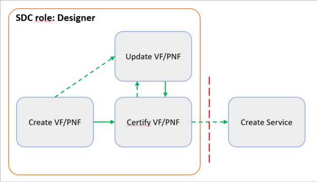
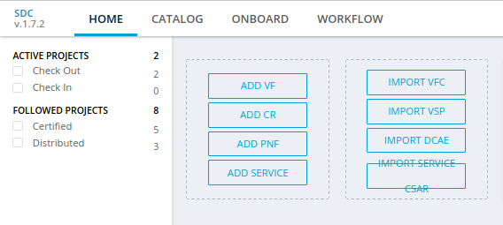
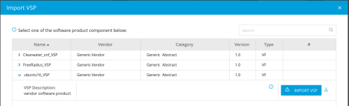
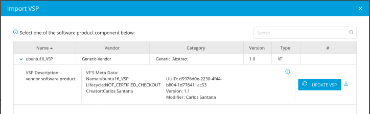
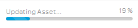
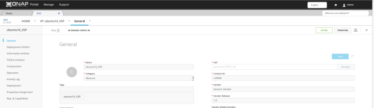
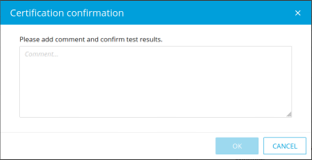
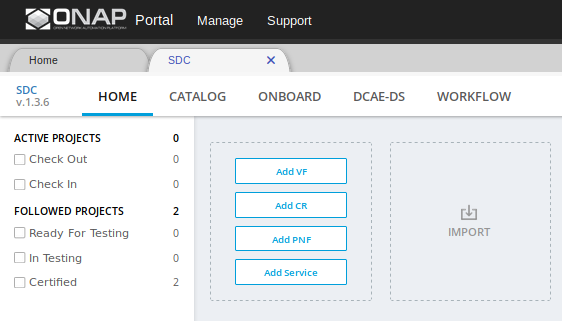
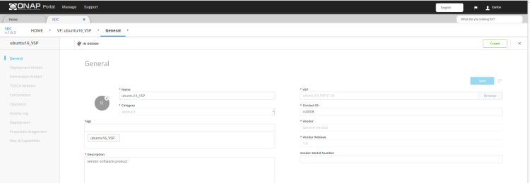

.. This work is licensed under a Creative Commons Attribution 4.0
.. International License. http://creativecommons.org/licenses/by/4.0
.. Copyright 2019 ONAP Doc Team.  All rights reserved.

.. _doc_guide_user_des_vf-cre:

VF/PNF Creation and Testing
===========================
**Goal**: Using VSPs, create one or more VFs/PNFs as the building blocks for a
service. Validate and certify the VFs/PNFs.

**ONAP Component**: SDC

**SDC user roles**: Designer

|image1|

Steps
-----

- `Create a VF/PNF by VSP import`_
- `Create a VF/PNF manually`_
- `Update a VF/PNF [optional]`_
- `Certify VF/PNF`_

.. _doc_guide_user_des_vf-cre_cre-imp:

Create a VF/PNF by VSP import
-----------------------------

**Prerequisites:** (see :ref:`doc_guide_user_des_res-onb` )

- Create a license for each VF/PNF
- Create a Vendor Software Product.

**Steps**

#. From the SDC HOME page, hover over *Import*, then click on *IMPORT VSP*

   |image2|

#. From the *Import VSP* box, expand a VSP name and click the *Import VSP* icon.

   |image3|

#. In the General section, complete all fields.

   |image10|

#. Click *Create*.

   - A message displays while creation is in progress. (This can take up to
     10 minutes.)
   - A message displays when creation is complete.

#. [Optional]  At any time before checking in the VF/PNF, click
   these options to update VF/PNF information:

   .. note:: These tasks can be done only before certifying the VF/PNF.

   - **General->Icon** change the icon associated with the VF/PNF
     (vendor-supplied icons are preferred)
   - **Deployment Artifacts** download, view, modify, or change deployment
     artifacts (for example, the contents of the Heat .zip file, which contains
     the Heat volume template, the license, CDS Blueprints,...)
   - **Information Artifacts** view or upload artifacts, such as test
     scripts, test results, or the AIC questionnaire
   - **TOSCA Artifacts** view or upload the TOSCA model or the TOSCA template
   - **Composition** view or edit the graphical representation of the resource-level
     TOSCA model (generated from the Heat template)
   - **Activity Log** view activity related to assets associated with the VF/PNF
     (displays the action, date, user, status, and any comments related to each
     action)
   - **Deployment** view VF modules defined in the Heat template
   - **Properties Assignment** define or update properties and input parameters
     and policies
   - **Req.& Capabilities** view and add requirements and capabilities

#. Click *Check In* to save changes.

   - A box to enter comments for confirming the changes open.

#. Enter a comment and click *OK*.

   - A message displays when the VF/PNF is checked in and you are redirected
     to the Home screen.
#. After creating and checking a VF/PNF, certify it (see `Certify VF/PNF`_).

.. _doc_guide_user_des_vf-cre_cre-man:

Create a VF/PNF manually
------------------------

**Steps**

#. From the SDC HOME page, hover over *Add*, then click on *ADD VF* or *ADD PNF*.

   |image2|

#. In the General section, complete all fields.

#. Before check-in the VF/PNF, click these
   options to update VF/PNF information:

   .. note:: These tasks can be done only before certifying the VF/PNF.

   - **General->Icon** change the icon associated with the VF/PNF
     (vendor-supplied icons are preferred)
   - **Deployment Artifacts** download, view, modify, or change deployment
     artifacts (for example, the contents of the Heat .zip file, which contains
     the Heat volume template, the license, CDS Blueprints,...)
   - **Information Artifacts** view or upload artifacts, such as test
     scripts, test results, or the AIC questionnaire
   - **TOSCA Artifacts** view or upload the TOSCA model or the TOSCA template
   - **Composition** view or edit the graphical representation of the resource-level
     TOSCA model (generated from the Heat template)
   - **Activity Log** view activity related to assets associated with the VF/PNF
     (displays the action, date, user, status, and any comments related to each
     action)
   - **Deployment** view VF modules defined in the Heat template
   - **Properties Assignment** define or update properties and input parameters
     and policies
   - **Req.& Capabilities** view and add requirements and capabilities

#. Click *Create*.

   - A message displays while creation is in progress. (This can take up to
     10 minutes.)
   - A message displays when creation is complete.

#. Click *Check In* to save changes.

   - A box to enter comments for confirming the changes open.

#. Enter a comment and click *OK*.

   - A message displays when the VF/PNF is checked in and you are redirected
     to the Home screen.
#. After creating and checking a VF/PNF, certify it (see `Certify VF/PNF`_).

.. _doc_guide_user_des_vf-cre_vf-upd:

Update a VF/PNF [optional]
--------------------------

- Update the VSP and other artifacts in a VF/PNF.
- Upload a new version the VSP to the VF/PNF whenever the VSP is updated
  (see steps  3 to 5).
- Other reasons for updating a VF/PNF include:

  - artifact changes at the VF/PNF level that need be uploaded, for example,
    changes to ENV values (see step 6)

**Prerequisites:**

- `Create a VF/PNF by VSP import`_ or `Create a VF/PNF manually`_
- If the VSP was updated: :ref:`doc_guide_user_des_res-onb_upd-vsp`

**Steps**

#. From the SDC HOME page, click *CATALOG* and search for the VF/PNF, click on selected VF/PNF to update.

#. In the General section, click *Check Out*.
   The *VSP* field is displays.

#. In the *VSP* field, click *Browse*.
   The *Import VSP* box displays and shows the VSP that was used to create the VF/PNF.

#. Expand the VSP field and click.

   |image4|

#. Click *Update VSP*
   A progress bar displays.
   |image5|

#. Click *Deployment Artifact* to edit, upload, or delete associated [Optional]
   deployment artifacts.

#. Click *Information Artifact* and edit, upload, or delete associated
   [Optional] information artifacts.

#. Click *Check In* to save changes.

   - A box to enter comments for confirming the changes open.

#. Enter a comment and click *OK*.

   - A message displays when the VF/PNF is checked in and you are redirected
     to the Home screen.
#. After updating the VF/PNF:

   - Certify it (see `Certify VF/PNF`_).
   - Update the VF/PNF version in any service that contains the VF/PNF,
     please go to :ref:`doc_guide_user_des_ser-upd_serv`

.. _doc_guide_user_des_vf-cre_sub-tst:

Certify VF/PNF
--------------

**Prerequisites:** `Create a VF/PNF by VSP import`_ or
`Create a VF/PNF manually`_

**Steps**

#. When a VF/PNF is ready for certification,
   On the SDC HOME page, click *CATALOG* and search for the checked-in VF/PNF.
   Bottom half of the VN/PNF will say “In Design Check In”.

#. Click the VF/PNF and click *Certify*.

   |image7|

   |image8|

#. Enter a comment and click *OK*.

#. A Message appears, that the VF/PNF is certified.

