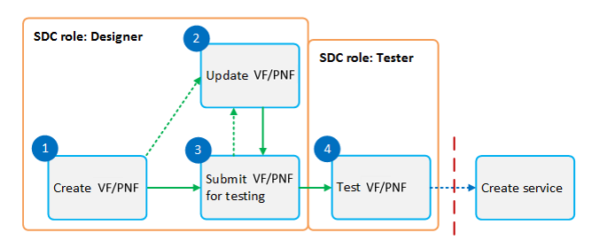
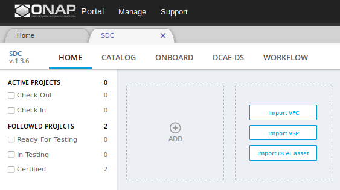
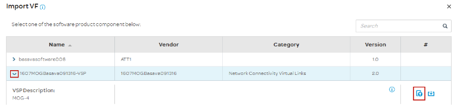
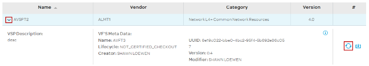
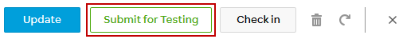
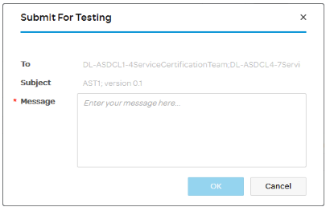

.. This work is licensed under a Creative Commons Attribution 4.0
.. International License. http://creativecommons.org/licenses/by/4.0
.. Copyright 2019 ONAP Doc Team.  All rights reserved.

.. _doc_guide_user_des_vf-cre:

VF/PNF Creation and Testing
===========================
**Goal**: Using VSPs, create one or more VFs/PNFs as the building blocks for a
service. Validate and certify the VFs/PNFs.

**ONAP Component**: SDC

**SDC user roles**: Designer, Tester

|image1|

Steps
-----

- `Create a VF/PNF by VSP import`_
- `Create a VF/PNF manually`_
- `Update a VF/PNF [optional]`_
- `Submit for testing`_
- `Test a VF/PNF`_

.. _doc_guide_user_des_vf-cre_cre-imp:

Create a VF/PNF by VSP import
-----------------------------

**Prerequisites:** (see :ref:`doc_guide_user_des_res-onb` )

- Create a license for each VF/PNF
- Create a Vendor Software Product.

**Steps**

#. From the SDC HOME page, click the *Import VSP*

   |image2|

#. From the *Import VSP* box, expand a VSP name
   and click the *Import VSP* icon.

   |image3|

#. In the General section, complete all fields.

   .. note:: Use the letters "VF" or "PNF" in the name to indicate the
             component type.

#. Click *Create*.

   - A message displays while creation is in progress. (This can take up to
     10 minutes.)
   - A message displays when creation is complete.

#. Click *Check In* to save changes.

   - A box displays for confirming the changes.

#. Enter a comment and click *OK*.

   - A message displays when the VF/PNF is checked in.

#. [Optional]  At any time before submitting the VF/PNF for testing, click
   these options to update VF/PNF information:

   .. note:: These tasks can be done only before submitting the VF/PNF for testing.

   - **Icon** change the icon associated with the VF/PNF (vendor-supplied icons
     are preferred)
   - **Deployment Artifacts** download, view, modify, or change deployment
     artifacts (for example, the contents of the Heat .zip file, which contains
     the Heat volume template, the license, etc.)
   - **Information Artifacts** view or upload artifacts, such as test scripts, test
     results, or the AIC questionnaire
   - **TOSCA Artifacts** view or upload the TOSCA model or the TOSCA template
   - **Properties** define or update properties
   - **Composition** view or edit the graphical representation of the resource-level
     TOSCA model (generated from the Heat template)
   - **Activity Log** view activity related to assets associated with the VF/PNF
     (displays the action, date, user, status, and any comments related to each
     action)
   - **Deployment** view VF modules defined in the Heat template
   - **Inputs** view inputs defined for the resource-level TOSCA model

#. After creating a VF/PNF, submit it for testing (see `Submit for testing`_).

.. _doc_guide_user_des_vf-cre_cre-man:

Create a VF/PNF manually
------------------------

**Steps**

#. From the SDC HOME page, click the *Add VF* or *Add PNF*

   |image9|

#. In the General section, complete all fields.

#. Before submitting the VF/PNF for testing, click these
   options to update VF/PNF information:

   .. note:: These tasks can be done only before submitting the VF/PNF for testing.

   - **Icon** change the icon associated with the VF/PNF (vendor-supplied icons are
     preferred)
   - **Deployment Artifacts** download, view, modify, or change VF/PNF deployment
     artifacts (for example, the contents of the Heat .zip file, which contains
     the Heat volume template, the VF license, etc.)
   - **Information Artifacts** view or upload artifacts, such as test scripts, test
     results, or the AIC questionnaire
   - **TOSCA Artifacts** view or download the TOSCA model or the TOSCA template
   - **Properties** define or update properties
   - **Composition** view or edit the graphical representation of the resource-level
     TOSCA model (generated from the Heat template)
   - **Activity Log** view activity related to assets associated with the VF/PNF
     (displays the action, date, user, status, and any comments related to each
     action)
   - **Deployment** view VF modules defined in the Heat template
   - **Inputs** view inputs defined for the resource-level TOSCA model

#. Click *Create*.

   - A message displays while creation is in progress. (This can take up to
     10 minutes.)
   - A message displays when creation is complete.

#. Click *Check In* to save changes.

   - A box displays for confirming the changes.

#. Enter a comment and click *OK*.

   - A message displays when the is checked in.

#. After creating a VF/PNF, submit it for testing (see `Submit for testing`_).

.. _doc_guide_user_des_vf-cre_vf-upd:

Update a VF/PNF [optional]
--------------------------

- Update the VSP and other artifacts in a VF/PNF.
- Upload a new version the VSP to the VF/PNF whenever
  the VSP is updated (see steps
  3 to 5). Other reasons for updating a VF/PNF include:

  - artifact changes at the VF/PNF level that need be uploaded, for example,
    changes to ENV values (see step 6)

**Prerequisites:**

- `Create a VF/PNF by VSP import`_ or `Create a VF/PNF manually`_
- If the VSP was updated: :ref:`doc_guide_user_des_res-onb_upd-vsp`

**Steps**

#. From the SDC HOME page, click *CATALOG* and search for a VF/PNF.

#. In the General section, click *Check Out*.
   The Select VSP field is displays.

#. In the Select VSP field, click *Browse*.
   The Import VSP box displays and shows the VSP
   that was used to create the VF/PNF.

#. Expand the VSP field and click.

   |image4|

#. Click |image5|
   A progress bar displays. |image6|

#. Click *Deployment Artifact* to edit, upload, or delete associated [Optional]
   deployment artifacts.

#. Click *Information Artifact* and edit, upload, or delete associated
   [Optional] information artifacts.

#. Click *Check In* to save changes.

#. After updating the VF/PNF:

   - Submit the VF/PNF for testing (see `Submit for testing`_).
   - Update the VF/PNF version in any service that contains the VF/PNF
     (see step 4 in Update a service [optional]).

.. _doc_guide_user_des_vf-cre_sub-tst:

Submit for testing
------------------

**Prerequisites:** `Create a VF/PNF by VSP import`_ or
`Create a VF/PNF manually`_

**Steps**

#. When a VF/PNF is ready for testing, click *CATALOG* and service for the
   VF/PNF.
#. Click the VF/PNF and click *Submit for Testing*.

   |image7|

   |image8|

#. Enter a message for the testers asking that they begin service certification
   and click *OK*.

   The default mail client launches with a draft email containing the message.

#. Add the email addresses of the people on the Certification Group for this
   site with the *Tester* role and send the email.

.. _doc_guide_user_des_vf-cre_tst-vf:

Test a VF/PNF
-------------

Test the design and artifacts of a VF/PNF.

**Prerequisites:** `Submit for testing`_

**Steps**

#. Sign in to SDC as a *Tester*.
#. From the HOME page, select *Ready For Testing* under Active Projects.
#. In the right pane, click the VF/PNF.
#. Click *Start Testing*.
#. Test the VF/PNF.
#. When testing is complete, click *Accept*.

.. |image5| image:: media/sdc_artifact_update.png
.. |image6| image:: media/design_vf_updatevspmessage.png

.. |image9| image:: media/SDC-Add.png

