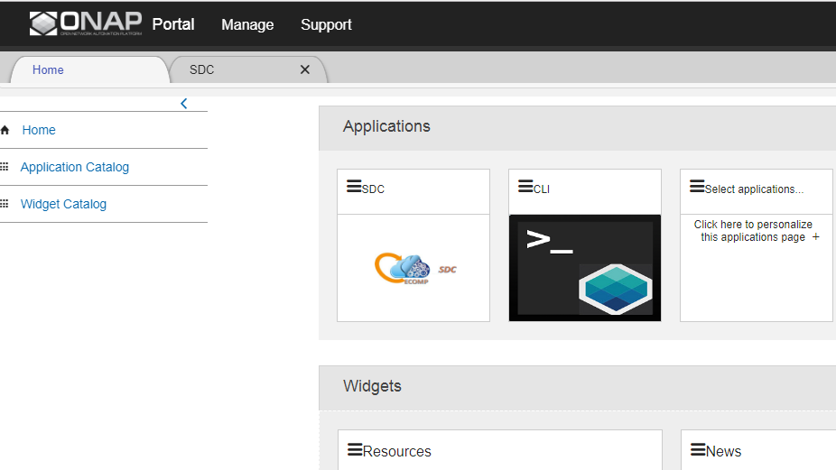
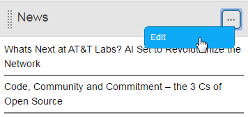
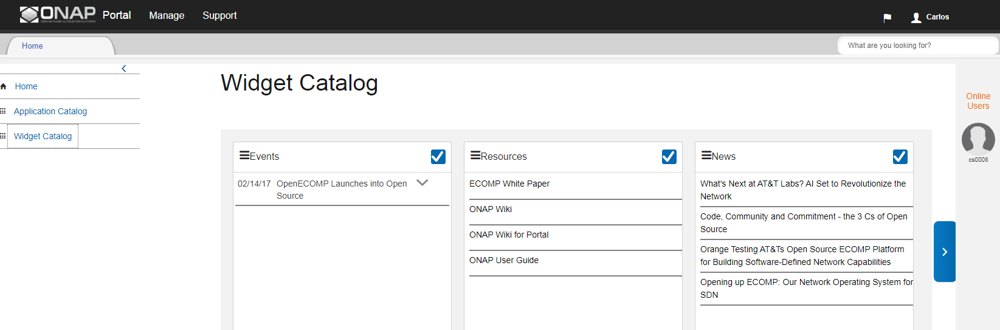

|image2017-10-27_15-56-53.png|

ONAP Portal for Users
=====================

General
-------

The ONAP Portal platform integrates different ONAP applications into a
central core. The Portal platform provides common management services
and connectivity, while the applications run separately.

From the Portal, users access applications. Administrators onboard and
manage applications and widgets, and manage user access.

The Portal SDK for application developers includes bundled tools,
technologies, and built-in capabilities such as services, APIs, and UI
controls. Existing applications can migrate to the Portal with the
provided APIs and libraries. See `ONAP Portal SDK
:ref:`Documentation<portal:master_index>`.

Access
------

Access the ONAP Portal using Mozilla Firefox or Google Chrome(win/mac)
at the provided URL. For example: `https://<hostname:port>/ONAPPORTAL/login.html`.

:ref:`Access the ONAP portal via the 8989 LoadBalancer documented `here<oom:onap-on-kubernetes-with-rancher>`

From the Portal, users access applications directly or by function using
the `Manage menu`.

See also:

-  `Applications in the Portal`

-  `Application Catalog`

Roles
-----

The Portal displays different menus for the following functions:

-  Users

-  Portal Admins

-  Application Admins

-  Governor

-  Operator

Each application also defines a distinct set of user roles. See *Users* .

Portal personalization and features
-----------------------------------

Show and hide the left menu
~~~~~~~~~~~~~~~~~~~~~~~~~~~

To hide the left menu, click the menu icon. Click the menu icon again to
show the menu.

|image2017-10-31_12-21-53.png|

Applications
~~~~~~~~~~~~

Access applications in the Portal directly from the `Application Catalog`
or using the `Manage menu`.
All the default applications in the ONAP Portal are integrated, but
applications may also be onboarded as hyperlink-only. Integrated
applications open in tabs below the header in the Portal; linked
applications open in a new browser window. To close an integrated
application, click the x in the tab.

|image2017-12-5_14-53-43.png|

A maximum of six applications (tabs) can be open at once in the ONAP
Portal.

Manage menu
-----------

The Manage menu provides links to applications by function. Choose from
a list of functional or management tasks for each area. This example
shows the options in the top-level functional Design category:

|image2017-12-5_14-57-22.png|

Favorites
~~~~~~~~~

Hover over a menu item and click the star beside it to add it to
Favorites. Click the star again to remove the item from Favorites.

Editing the Menu
~~~~~~~~~~~~~~~~

Portal Admins edit and manage the menu. See `Edit Functional Menu`

Support Menu
------------

The Support menu provides Contact Us and Get Access links. Portal admins
can add contact details and also edit Support menu. See `Edit Functional Menu`.

Home
----

Home is the default view after login.

|image2017-12-5_16-52-40.png|

Personalize the Home Page
~~~~~~~~~~~~~~~~~~~~~~~~~

Add or remove applications using the `Application Catalog`.
Sort applications or widgets by clicking the drag handle to drag and
drop the application or widget to a new location.

|image2017-12-5_16-57-24.png| Add, manage, and edit what appears in the
widgets by clicking the settings icon and selecting Edit.

|ep_home_editwidget.png|

Application Catalog
-------------------

Use the Application Catalog to select which application should appear on
your Home page. Applications with a check mark already appear on the
Home page.

-  To select an application to appear on the Home page, click the check
   box in the top right corner of the application tile.

-  To remove an application from the Home page, click the check box
   again.

-  Use the Filter to view specific applications: All applications,
   Accessible (currently available) applications, or applications On
   Home Page.

-  Click the drag handle to sort application tiles in the Application
   Catalog.

|image2017-12-5_15-8-37.png|

Widget Catalog
--------------

Widgets are small applications that interact with their host application
and each other to provide quick access for certain tasks. Use the
Widgets section to view and interact with widgets.

-  Click a widget tile to open the widget.

-  Click the drag handle to sort widget tiles.

|image2017-12-5_15-9-27.png|

.. |image2017-10-27_15-56-53.png| image:: attachments/16004343_image2017-10-27_15-56-53.png
.. |image2017-10-31_12-21-53.png| image:: attachments/16004980_image2017-10-31_12-21-53.png

.. |image2017-12-5_14-57-22.png| image:: attachments/20086819_image2017-12-5_14-57-22.png
.. |image2017-12-5_16-52-40.png| image:: attachments/20086839_image2017-12-5_16-52-40.png
.. |image2017-12-5_16-57-24.png| image:: attachments/20086846_image2017-12-5_16-57-24.png

.. |image2017-12-5_15-8-37.png| image:: attachments/20086820_image2017-12-5_15-8-37.png

