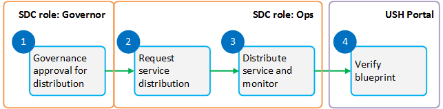

.. This work is licensed under a Creative Commons Attribution 4.0
.. International License. http://creativecommons.org/licenses/by/4.0
.. Copyright 2019 ONAP Contributors.  All rights reserved.

Governance Approval and Service Distribution
============================================

Each ONAP platform operator will have a specific set of policies
and procedures for approving Services and deploying them in the
operator's ONAP environment. This outline describes the general
flow of such procedures.

**Goal:** Add all information required to create, instantiate, and
manage a service.

**Tools:** SDC

**SDC user roles:** Governor, Ops

Steps
-----

- `Review a Service for Governance Approval`_
- `Request Service Distribution`_
- `Distribute a Service`_
- `Verify that the DCAE Blueprint is Deployed`_

|image1|

**Figure 1. Workflow**

Review a Service for Governance Approval
----------------------------------------

A member of the Governance Board performs a governance review of a
certified service and its associated VFs, and then approves (or rejects)
the artifacts for distribution.

**Prerequisites:** Service is tested.

**Steps**

#. Sign in to SDC as a Governor.
#. From the HOME page, click CATALOG and select a service that is ready
   for governance review.
#. Review the service and its associated resources.
#. To view deployment artifacts:

   #. Click Composition tab (left pane) and then click the Deployment
      Artifact icon (right pane) to see the list of artifacts.
   #. Click the download icon adjacent to an artifact to download and
      view it.

#. When the review is complete, click:

   -  Accept if the service passes the governance review. The service is
      marked Approved for Distribution.
   -  Reject if the service fails the governance review. The service is
      marked Rejected for Distribution.

After a service receives governance approval, it moves into the Waiting
to be Distributed section of the Operations Workspace (Ops role)

Request Service Distribution
----------------------------

Request service distribution to populate all appropriate ONAP
components with the resources and artifacts ssociated with the service and its
VFs.

**Prerequisites:**

A service has received governance approval and is
available in the Waiting to be Distributed section of the SDC Operations
Workspace (under the Ops Role). For more information, see 
`Review a Service for Governance Approval`_.

The steps shown here are generic; each service provider has a different,
specific set of instructions. Contact your site IT support for the
particulars.

**Steps**

#. Open at ticket request at your site
#. Make a "DISTRIBUTION REQUEST"
#. Provide the following information in your request:

   -  Environment
   -  Name of service to be distributed
   -  Version number
   -  [Optional] Additional information or instructions (provide special
      instructions for the request)
   -  Your user ID
   -  [Optional] Alternate Contact user ID (provide an alternate contact
      if the primary contact is unavailable)

Distribute a Service
--------------------

**Prerequisites:** The service is approved.

**Steps**

#. Sign in to SDC as Ops.
#. In the Active Projects pane (left pane) of the HOME page, select the
   Waiting For Distribution check box.
#. Select a service that is ready for distribution.
#. Review the version history to verify that the correct version is
   selected.
#. In the header, click Distribute.

   The service moves from the Ready For Distribution folder to the
   Distributed Services folder.

#. From the Workspace pane, click Distributed Services.
   All distributed services display.
#. Select the service distributed in step 5 and click Monitor.
   The Distribution Report displays.
#. In the Distribution Report, navigate to the Component ID for the
   service and click the adjacent down arrow.
   The report shows all components associated with the service and their
   distribution statuses, such as DOWNLOAD_OK.
#. Review the status of each component.

Verify that the DCAE Blueprint is Deployed
------------------------------------------

The DCAE controller requires a blueprint (or guideline) to be available
at the site on which the first VNF is deployed. This blueprint is a
management workflow and configuration description for a given VNF, and
it must be available after completing the service distribution process
and before beginning the instantiation process.

