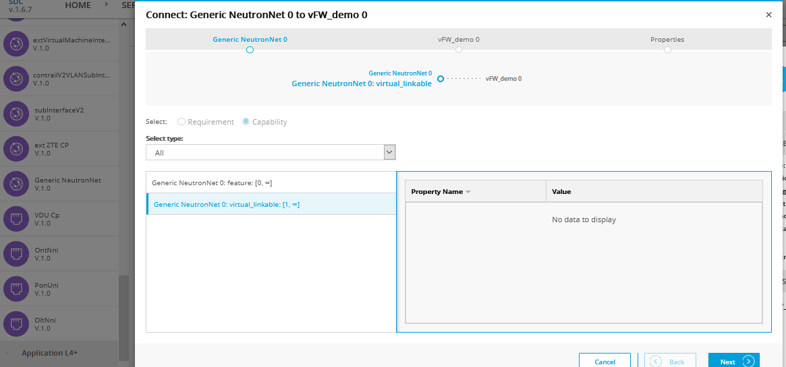
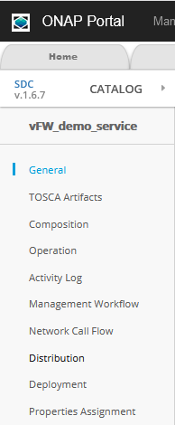

.. This work is licensed under a Creative Commons Attribution 4.0
.. International License. http://creativecommons.org/licenses/by/4.0
.. Copyright © 2017-2020 Aarna Networks, Inc.

vFW Service Design Tutorial
###########################

Browser settings
================

This exercise will use the ONAP Portal. To interact properly with Portal services, please make sure to set the
following settings in your Firefox browser before starting the Service Design and Deployment.

Check your Firefox browser setting to make sure that Remote Proxy DNS setting is on

* Type "about:config" in the address bar
* Select "Accept the risk"
* In the Search enter Proxy
* Enable "network.proxy.socks_remote_dns  = true" (Just double click to change the flag)
* Please make sure to undo this change after testing, since this could cause potential security risk!

Check your Firefox settings to allow mixed contents

* Type "about:config" in the address bar
* In the Search enter Mixed
* Click on variable security.mixed_content.block_active_content
* Change the value to False (Just double click to change the flag)

Below are the portal URL & User Login details to connect to the ONAP portal

https://portal.api.simpledemo.onap.org:30225/ONAPPORTAL/login.htm

User login credentials and roles
::

  Username=cs0008, password=demo123456!, Role=DESIGNER
  Username=demo,   password=demo123456!, Role=ADMIN

.. note::
  From F release onwards, service design and deployment can be done with cs0008 and demo users

Ex: To open portal URL from FireFox browser and accept SSL certificate exception after the settings

|image8|

Login into the portal as designer (cs0008) and enter password (demo123456!) then click on LOGIN

|image21|

Service Design & Distribution using SDC GUI
===========================================

In this section, you will learn the following through the SDC GUI

* How to create a Vendor License Model
* How to create and onboard Vendor Software Product
* How to create a Service
* How to distribute a Service

Let us start by creating the VLM

1. Create Vendor Licence Model (VLM) in SDC

 A. Login to the ONAP portal as designer cs0008 / demo123456!
 B. Go to SDC → ONBOARD → WORKSPACE → CREATE NEW VLM (Enter below attributes and Create)

 |image35|

 |image34|

 C. Create New License Key Group

 |image15|

 D. Create Entitlement Pool

 |image38|

 E. Create Feature Group (Assign Entitlement Pool & License Key Group in other 2 tabs)

 |image5|

 |image40|

 |image27|

 F. Create License Agreement (Assign Feature Group under the Feature Group Tab)

 |image32|

 |image9|

 G. Click Submit (Top Right Corner of the page) and fill comment then press Commit & Submit

 |image7|

2. Create Vendor Software Product (VSP)

Prerequisite: Download VNF Heat package from gerrit (git clone "https://gerrit.onap.org/r/demo") and copy
the required HEAT package & use it while upload the package

 A. Go to SDC Home → ONBOARD → WORKSPACE  → CREATE NEW VSP (complete all the fields, click on Network Package
 checkbox then click create)

 |image22|

 B. Assign the license Agreement by selecting the Missing icon

 |image20|

 C. Select the Licenses drop down box (populate all three fields)

 |image24|

 D. Go to Overview (Left hand side bar), select Software Product Attachments in the right pane, click Select file

   Import HEAT package (ex: vfw_demo.zip) by clicking Select File Button. This file should be copied to your
   local workstation where the browser is running.

 |image37|

It will take you to the setup page

|image25|

 E. Click on “PROCEED TO VALIDATION” and ignore warnings

 |image17|

 F. Click Submit (right corner), fill the comment then press COMMIT & SUBMIT, you will see submit successful message

 |image3|

3. Import Vendor Software Product and certify

 A. Go to the SDC Home page click Import VSP button

 |image13|

 B. From the Import VSP box, expand a VSP name and click the Import VSP icon

 |image39|

 C. In the General section, complete all fields then click create (top right corner)

 |image43|

 D. Click Check In to save changes (top right corner), enter a comment and click OK

 |image29|

 E.  click CATALOG and search for the checked-in VF, you will see your VF In Design Check In state

 |image10|

 F. Click the VF and click certify (top right corner), enter a comment then click OK

 |image11|

 |image31|

4. Create a Service and certify

 A. Go to SDC UI → Home Page and Select the Add Service Button

 |image44|

 B In the General section, complete all fields then click Create

 |image19|

 C. select the “Composition” Menu on the left hand side menu bar

 |image41|

 D. On the Composition Page, Search for the vFW_demo service (look under Application L4+)

 |image14|

 E. On the Composition Page, Search for  Generic NeutronNet (look under Generic/Network Elements)

 |image26|

 F. Drag and drop vFW_demo created earlier during onboarding & the Generic NeutronNet onto the right hand side palette

 |image1|

 G. Connect the elements by connecting + signs and Select appropriate options for
 Requirements and Capabilities, click Next then click Finish at the end

 |image33|

 |image2|

 |image23|

 |image36|

 H. Click Check In to save changes, Enter a comment and click OK

 |image6|

 I. click CATALOG and search for the checked-in Service, you will see you service is in
 Design Checkin state

 |image28|

 J. Click the Service and click Certify, Enter a comment and click OK, you will
 see certification succeeded message

 |image31|

5. Distribute the Service

 A. From the SDC HOME page, click CATALOG and search for the service
 (it will be in Waiting For Distribution state)

 |image18|

 B. Select the service that is Ready for Distribution, click Distribute (top right corner)

 |image30|

 |image12|

 C. To Monitor Distribution, click on Distribution on the left pane

 |image41|

 |image16|

.. |image9| image:: media/image9.png

.. |image39| image:: media/image39.png

