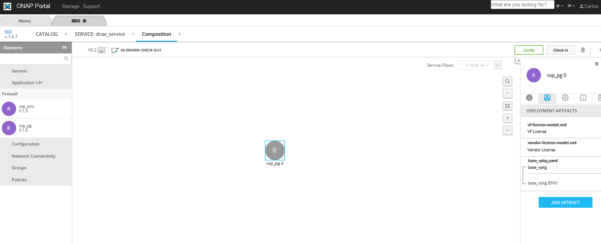

.. This work is licensed under a Creative Commons Attribution 4.0
.. International License. http://creativecommons.org/licenses/by/4.0
.. Copyright © 2017-2020 Aarna Networks, Inc.

vFWCL Design Tutorial
#####################

The instructions in this section will enable you to design the vFW Control Loop. The prerequisite for this tutorial is that the
vFW_service design/deployment/instantiation should be completed.

Control Loop Flow
=================

This section describes the vFW control loop flow and the modules involved. Following is the list of modules
that are involved in designing and deploying the vFW CL

 1) SDC: The first step of the procedure is to distribute the DCAE (TCA microservice) blueprint. That is done through ONAP SDC.
 2) CLAMP: This is a tool for designing the policy and configuring the TCA threshold. CLAMP, along with DCAE, can also be used
    to manage the lifecycle of CLs
 3) DCAE (platform and micro services): Multiple components of the DCAE module get involved in the overall lifecycle of the CL.
 4) TCA: The CDAP threshold controlling application is a DCAE microservice.
 5) ONAP Policy engine: The output of DCAE is sent to the Policy engine as an input event. We will use the DROOLS Policy engine.
 6) APPC : The last hop in the CL, which takes the config action on the vPG on the output of the Policy engine.

Distribute DCAE blueprints
==========================

In order to distribute the DCAE microservice blueprints we need to create a dummy service. The DCAE blueprint will be added as an artifact
to the VF inside the service during service composition time.

Follow the below steps to upload the blueprint for the TCA (Threshold Checking Application) DCAE microservice and Distribute the service to the CLAMP

The following screenshot of the setup shows where “dcae_service” has been created and is in the composition phase.

.. note::
  The service name should not contain any spaces. The DCAE policy fails to fetch the service from PDP if the name has a space.
  For example ‘dcae1’ will work and ‘dcae 1’ will not.

1. Login as DESIGNER (cs0008) and create the service, checkin and certify

|image16|

2. Add any VNF (ex: vfw_pg) that was already created during the SDC design phase

In the composition canvas drag and drop a resource of type VF from the abstract section in the Elements section (left hand side panel)

|image15|

3. Download the required DCAE MS blueprint to be attached to the service

Use the sample TCA blueprint located here:
https://git.onap.org/dcaegen2/platform/blueprints/tree/blueprints/k8s-tcagen2-clampnode.yaml

.. note::
  * Check if the version of the plugin used in the blueprint is different from existing, then update the blueprint import to match
  * To check the version run this: `cfy plugins list | grep k8splugin`

4. Now upload the Control Loop Artifact. The procedure to upload the artifact is

 * Click on the VF, as in the picture above the ‘vsp_pg 0’ is selected
 * Click on ‘DEPLOYMENT ARTIFACTS’  and then click on “Add Artifact”

 |image5|

 * Fill the details and in the type select DCAE_INVENTORY_BLUEPRINT, then click on Done as in the picture shown below

 |image13|

5. After uploading the DCAE artifact to the SDC Service, attach the policy model to the Service. From the left drop down,
select TCA policy under Policies, and click on the Add policy

|image1|

6. Click on Checkin on top right corner then click OK

|image12|

7. Search and select the same service from CATALOG and click on Certify on top right corner

|image14|

8. Click Distribute to distribute the service, then click on Distribution in the left hand side panel and monitor until
the distribution is complete. We should see artifacts deployed in CLAMP and Policy engine, as can be seen in the picture below

|image19|

At this point we can open the CLAMP GUI and verify that the DCAE microservice design template is in place

DCAE MS design in CLAMP
=======================

CLAMP is a GUI tool which enables the users to design the policies, distribute them to the DROOLS engine and eventually deploy
the DCAE microservices. In this section we are going to design, distribute and deploy the BRMS (DROOLS) and TCA policy.

Clamp uses AAF to authenticate the user and get the different permissions. In order to access the CLAMP GUI we will need to add the certificate.

1. Add the necessary certificates in the browser

The default certificate can be found here: https://gerrit.onap.org/r/gitweb?p=clamp.git;a=blob;f=src/main/resources/clds/aaf/org.onap.clamp.p12;h=268aa1a3ce56e01448f8043cc0b05b5fceb5a47d;hb=HEAD

The password is:  "China in the Spring"
The certificate must be loaded into your favorite browser before trying to load the CLAMP UI.

Ex: In case of Firefox browser, below is the procedure on how to add the certificate

Open firefox browser and go to Preferences and search for Certificate Manager and Select “View Certificates“ button.
This will open the following dialog to import certificate files from Your certificates menu.

You need to go in options->Privacy & Security-> Scroll down to Certificates options a View Certificates Button
and then Your certificates Tab -> Then Import button

|image6|

2. After the certificate is added, the CLAMP GUI can be accessed at:
`https://<host_IP>:30258` (host_IP is the node IP where CLAMP is running)

3. Before designing the policy we need to undeploy the default tca policy.
To undeploy default policy execute the below commands on control node

.. code-block::

  > kubectl get deployments -n onap | grep "dep-dcae-tca-analytics\|dcaegen2-analytics-tca" | awk '{print $1}' |
    xargs kubectl delete deployments -n onap
  > kubectl get svc -n onap | grep "dcae-tca-analytics\|dcaegen2-analytics-tca" | awk '{print $1}' |
    xargs kubectl delete svc -n onap
    To Verify there are no dcae-analytics POD, run the below command
  > kubectl get pods -n onap | grep 'analytics'

4. If the service has been distributed correctly, following is how the service design templates
listed in the Loop Templates as below

|image7|

Available Policy Models

|image10|

5. Create the loop from the templates distributed by SDC

|image4|

|image20|

6. Add the Operational Policy
Click on Loop Instance drop down and select Modify then click, select the policy model type then click Add

|image9|

|image3|

7. Click on the MS application box and configure
Fill the details in the pop up window and click on the save changes button.
 A. Click on app and Edit the Policy details, fill the below details
  * eventName: vFirewallBroadcastPackets
  * policyScope: DCAE
  * policyVersion: v0.0.1
  * Select controlLoopSchemaType as VM
  * policyName: DCAE.Config_tca-hi-lo
  * Select Pdp Group Info from the drop down as defaultGroup & xacm

 |image17|

 B. Click on the Add monitoring threshold1 button and fill the below details
  * version : 1.0.2
  * closedLoopControlName : name of the CL (ex: LOOP_TEMPLATE_mytest_srv_v1_0_vsp_pg0_k8s-tca)
  * select the direction from dropdown (ex: LESS)

 |image11|

 C. Click on the Add monitoring threshold2 button and fill the details same as above then click on Save Changes button

 |image24|

8. Click on the Operational policy box and configure
Fill the details in the pop window then click on save changes

|image22|

|image18|

9. Submit the control loop to the policy
From Loop Operations drop down select SUBMIT and click

|image23|

10. Deploy the control loop to DCAE
From Loop Operations drop down select DEPLOY and click, verify the details and click Deploy

|image2|

|image8|

Status Logs

|image21|

A successful deployment will make the service as DEPLOYED

11. You can login into the control node and verify whether your new analytics application got deployed using below command

.. code-block::

  > kubectl get pods -n onap | grep analytics
  Sample output
  dep-dcae-tca-analytics-7fccbf459-xkxlq             2/2     Running      0          6m15s

  > cfy deployment  list | grep CLAMP
  Sample output
  | CLAMP_615bb47a-ea3e-4a02-8928-0564df900826 | CLAMP_615bb47a-ea3e-4a02-8928-0564df900826 | 2020-11-10 19:23:22.286  |
  2020-11-10 19:23:22.286  |   tenant   |   default_tenant |   admin    |

.. |image16| image:: media/image16.png
.. |image15| image:: media/image15.png

.. |image13| image:: media/image13.png
.. |image1| image:: media/image1.png
.. |image12| image:: media/image12.png
.. |image14| image:: media/image14.png
.. |image19| image:: media/image19.png

.. |image7| image:: media/image7.png

.. |image20| image:: media/image20.png

.. |image3| image:: media/image3.png
.. |image17| image:: media/image17.png
.. |image11| image:: media/image11.png
.. |image24| image:: media/image24.png
.. |image22| image:: media/image22.png

.. |image2| image:: media/image2.png
.. |image8| image:: media/image8.png

