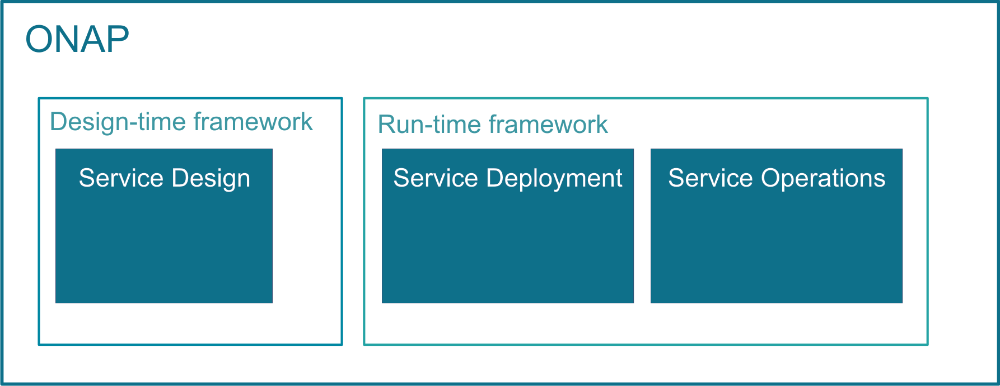

.. This work is licensed under a Creative Commons Attribution
.. 4.0 International License.
.. http://creativecommons.org/licenses/by/4.0
.. Copyright 2019 Nokia; Copyright 2017-2018 Huawei Technologies Co., Ltd.;
.. Copyright 2017 AT&T Intellectual Property

Open Network Automation Platform Overview
=========================================

The Open Network Automation Platform (ONAP) project addresses the
rising need for a **common automation platform for telecommunication, cable,
and cloud service providers**—and their solution providers— that enables the
**automation of different lifecycle processes**, to deliver differentiated
network services on demand, profitably and competitively, while leveraging
existing investments.

Prior to ONAP, telecommunication network operators had to keep up with the
scale and cost of manual changes required to implement new service offerings,
from installing new data center equipment to, in some cases, upgrading
customer equipment on-premises. Many operators are seeking to exploit
Software Defined Network (SDN) and Network Function Virtualization (NFV)
to improve service velocity, simplify equipment interoperability and
integration, and reduce overall CapEx and OpEx costs. In addition, the
current, highly fragmented management landscape makes it difficult to
monitor and guarantee service-level agreements (SLAs).

ONAP is addressing these challenges by developing global and massive
scale (multi-site and multi-Virtual Infrastructure Manager (VIM))
automation capabilities for both physical and virtual network elements.
It facilitates service agility by supporting data models for rapid
service and resource deployment, by providing a common set of Northbound
REST APIs that are open and interoperable, and by supporting model
driven interfaces to the networks. ONAP’s modular and layered nature
improves interoperability and simplifies integration, allowing it to
support multiple VNF environments by integrating with multiple VIMs,
virtualized network function managers (VNFMs), SDN Controllers, and
even legacy equipment. ONAP’s consolidated VNF requirements enable
commercial development of ONAP-compliant VNFs. This approach allows
network and cloud operators to optimize their physical and virtual
infrastructure for cost and performance; at the same time, ONAP’s
use of standard models reduces integration and deployment costs of
heterogeneous equipment, while minimizing management fragmentation.

Scope of ONAP
-------------

ONAP enables end user organizations and their network or cloud providers
to collaboratively instantiate network elements and services in a dynamic,
closed control loop process, with real-time response to actionable events.

ONAP’s major activities, that is designing, deploying and operating
services, are provided based on ONAP’s two major frameworks, namely on
Design-time framework and Run-time framework:

In order to design, deploy and operate services and assure these dynamic
services, ONAP activities are built up as follows:

* **Service design** – Service design is built on a robust design framework
  that allows specification of the service in all aspects – modeling the
  resources and relationships that make up the service, specifying the policy
  rules that guide the service behavior, specifying the applications, analytic
  and closed control loop events needed for the elastic management of the
  service.
* **Service deployment** – Service deployment is built on an orchestration
  and control framework that is policy-driven (Service Orchestrator and
  Controllers) to provide automated instantiation of the service when
  needed and managing service demands in an elastic manner.
* **Service operations** – Service operations are built on an analytic
  framework that closely monitors the service behavior during the service
  lifecycle based on the specified design, analytics and policies to enable
  response as required from the control framework, to deal with situations
  ranging from those that require healing to those that require scaling
  of the resources to elastically adjust to demand variations.

ONAP enables product- or service-independent capabilities for design,
deployment and operation, in accordance with the following foundational
principles:

1. Ability to dynamically introduce full service lifecycle orchestration
   (design, provisioning and operation) and service API for new services
   and technologies without the need for new platform software releases
   or without affecting operations for the existing services

2. Carrier-grade scalability including horizontal scaling (linear scale-out)
   and distribution to support large number of services and large networks

3. Metadata-driven and policy-driven architecture to ensure flexible and
   automated ways in which capabilities are used and delivered

4. The architecture shall enable sourcing best-in-class components

5. Common capabilities are ‘developed’ once and ‘used’ many times

6. Core capabilities shall support many diverse services and infrastructures

7. The architecture shall support elastic scaling as needs grow or shrink

Functional overview of ONAP
===========================

The following guidelines show the main ONAP activities in a chronological
order, presenting ONAP's functional structure:

1. **Service design** - ONAP supports Service Design operations, using the
TOSCA approach.
These service design activities are built up of the following subtasks:

 a. Planning VNF onboarding – checking which VNFs will be necessary for the
    required environment and features
 b. Creating resources, composing services
 c. Distributing services - Distributing services constitutes of 2 subtasks:

    * TOSCA C-SAR package is stored in the Catalog
    * new service notification is published

2. **Service orchestration and deployment**

  a. Defining which VNFs are necessary for the service
  b. Defining orchestration steps
  c. Selecting valid cloud region
  d. Service orchestration calling cloud APIs to deploy VNFs

   * The onboarding and instantiation of VNFs in ONAP is represented via
     the example of onboarding and instantiating a virtual network function
     (VNF), the virtual Firewall (vFirewall). Following the guidelines and
     steps of this example, any other VNF can be similarly onboarded
     and instantiated to ONAP.

  e. Controllers applying configuration on VNFs

3. **Service operations**

  a. Closed Loop design and deployment
  b. Collecting and evaluating event data

Benefits of ONAP
================

Open Network Automation Platform provides the following benefits:

* common automation platform, which enables common management of services and
  connectivity, while the applications run separately
* a unified operating framework for vendor-agnostic, policy-driven service
  design, implementation, analytics and lifecycle management for
  large-scale workloads and services
* orchestration for both virtual and physical network functions
* ONAP offers Service or VNF Configuration capability, in contrast to other
  open-source orchestration platforms
* the model-driven approach enables ONAP to support services, that are using
  different VNFs, as a common service block
* service modelling enables operators to use the same deployment and management
  mechanisms, beside also using the same platform

ONAP Release information
========================

ONAP is enhanced with numerous features from release to release. Each release
is named after a city.

+----------------------+----------------+----------------------+-----------------------------------------------------------+
|Release Name          |Release version |Release Date          |Features delivered                                         |
+======================+================+======================+===========================================================+
|Guilin                |7.0.0           | 3 Deember 2020       |                                                           |
+----------------------+----------------+----------------------+-----------------------------------------------------------+
|Frankfurt             |6.0.0           | 11 June 2020         |                                                           |
+----------------------+----------------+----------------------+-----------------------------------------------------------+
|El Alto               |5.0.1           | 24 October 2019      |                                                           |
+----------------------+----------------+----------------------+-----------------------------------------------------------+
|Dublin                |4.0.0           | 9 July 2019          |                                                           |
+----------------------+----------------+----------------------+-----------------------------------------------------------+
|Casablanca            |* 3.0.2         |* 31 January 2019     |                                                           |
|                      |* 3.0.1         |* 30 November 2018    |                                                           |
|                      |* 3.0.0         |* 15 April 2019       |                                                           |
+----------------------+----------------+----------------------+-----------------------------------------------------------+
|Beijing               |2.0.0           |7 June 2018           |                                                           +
+----------------------+----------------+----------------------+-----------------------------------------------------------+
|Amsterdam             |1.0.0           |16 November 2017      |                                                           +
+----------------------+----------------+----------------------+-----------------------------------------------------------+

ONAP Blueprints and environments
================================

ONAP is able to deploy and operate VNFs running OpenStack based Centralized
Private Cloud Instances, as well as Mobile Edge Cloud instances.
ONAP has been tested in the following network environments:

* Voice Over LTE (VoLTE)
* Customer Premise Equipment (CPE)
* 5G
* Cross Domain and Cross Layer VPN (CCVPN)
* Broadband Service (BBS)

Licenses
========

Open Network Automation Platform (ONAP) is an open source project hosted by the
Linux Foundation.

ONAP Source Code is licensed under the `Apache Version 2 License <http://www.apache.org/licenses/LICENSE-2.0>`_.
ONAP Documentation is licensed under the `Creative Commons Attribution 4.0
International License <http://creativecommons.org/licenses/by/4.0>`_.
