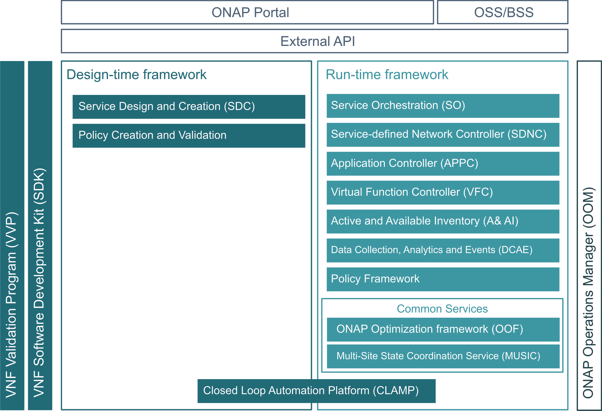

.. This work is licensed under a
   Creative Commons Attribution 4.0 International License.

.. _master_index:

Open Network Automation Platform
================================

Open Network Automation Platform (ONAP) is an open source project hosted by
the Linux Foundation.

ONAP provides a comprehensive platform for real-time, policy-driven service
orchestration and automation. ONAP enables service providers and developers
to rapidly automate the instantiation and configuration of physical and
virtual network functions and to support complete life cycle management
activities. By unifying the resources of open source members, ONAP enables
the acceleration of the development of a vibrant ecosystem around a globally
shared architecture and the implementation of network automation faster than
any product could on its own.

The ONAP Platform architecture is built on the highly efficient cooperation of
Design-time Framework activities with the functions provided by the
Run-time Framework. The Design-time Framework defines resources, services
and products, creates and manages processes and policies, provides a single
platform for deploying and defining instantiation management besides many
other activities. The Run-time framework manages the full lifecycle of
networks, services, resources, topology, orchestrates delivery, provides
monitoring via analytics and controls activities for applications and
virtual functions.

ONAP platform activities are supported by the Microservices support
system and by the ONAP Portal.

The following figure presents the high-level architecture of ONAP:

For more details, see :ref:`ONAP Documentation <onap-documentation>`

.. toctree::
   :maxdepth: 1
   :hidden:

   release/index
   guides/onap-developer/index
   guides/onap-user/index
   guides/onap-provider/index

